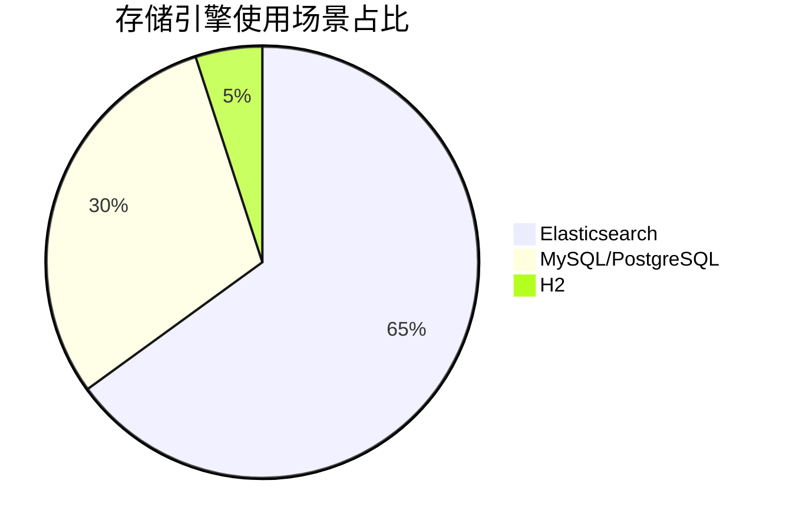
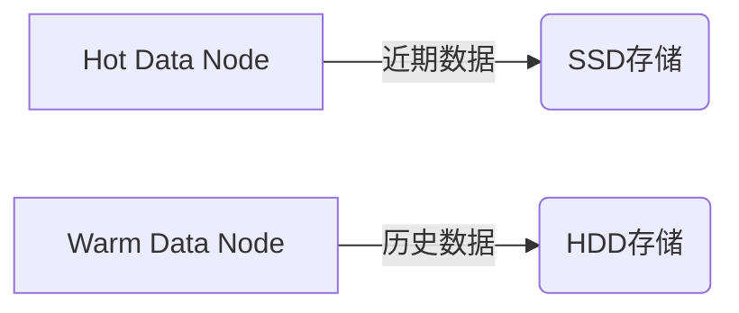

# SkyWalking 存储性能优化

## 介绍

SkyWalking作为一款分布式系统的应用性能监控工具，其存储性能直接影响查询效率和系统稳定性。后端存储优化是提升SkyWalking整体性能的关键环节，尤其在大规模数据场景下。本章将介绍如何通过配置调整、索引优化和存储策略选择来提升SkyWalking的存储性能。

:::note
存储性能优化的核心目标是：**降低写入延迟**、**提高查询速度**、**减少资源消耗**。
:::

---

## 1. 存储引擎选择与配置

### 1.1 存储引擎对比
SkyWalking支持多种存储后端：
- **Elasticsearch**（适合大规模集群）
- **MySQL/PostgreSQL**（适合小规模部署）
- **H2**（仅用于测试环境）



### 1.2 Elasticsearch 关键配置
修改 `application.yml` 中的存储配置：

```yaml
storage:
  elasticsearch:
    nameSpace: ${SW_NAMESPACE:""}
    clusterNodes: ${SW_STORAGE_ES_CLUSTER_NODES:localhost:9200}
    indexShardsNumber: ${SW_STORAGE_ES_INDEX_SHARDS_NUMBER:2}       # 分片数
    indexReplicasNumber: ${SW_STORAGE_ES_INDEX_REPLICAS_NUMBER:0}   # 副本数
    bulkActions: ${SW_STORAGE_ES_BULK_ACTIONS:1000}                 # 批量写入条数
    flushInterval: ${SW_STORAGE_ES_FLUSH_INTERVAL:10}               # 刷新间隔(秒)
```

:::tip
生产环境中建议：
- 分片数 = 数据节点数量
- 批量写入条数（bulkActions）根据网络延迟调整
:::

---

## 2. 索引优化策略

### 2.1 索引滚动(Index Rolling)
SkyWalking默认按天创建索引，可通过以下配置调整：

```yaml
storage:
  elasticsearch:
    dayStep: ${SW_STORAGE_DAY_STEP:1}           # 索引保留天数
    indexShardsNumber: ${SW_STORAGE_ES_INDEX_SHARDS_NUMBER:2}
```

### 2.2 冷热数据分离


配置示例：
```yaml
storage:
  elasticsearch:
    advanced: ${SW_STORAGE_ES_ADVANCED:""}
    # 添加ILM策略
    indexSettings:
      index.lifecycle.name: "skywalking_policy"
```

---

## 3. 查询性能优化

### 3.1 聚合查询优化
避免大时间范围查询：
```sql
-- 不推荐（查询30天数据）
SELECT * FROM endpoint_traces WHERE time > NOW() - 30d

-- 推荐（分页查询）
SELECT * FROM endpoint_traces 
WHERE time > NOW() - 1d 
LIMIT 1000
```

### 3.2 使用降采样(Downsampling)
```yaml
# 在oap-server配置中启用降采样
downsampling:
  - Hour
  - Day
```

---

## 4. 实际案例

### 案例：电商平台优化实践
**问题**：日均10亿级Span数据，查询响应超时<br />
**解决方案**：
1. 将ES集群从3节点扩展到8节点（2主+6数据）
2. 调整分片数为6，匹配数据节点数
3. 启用冷热数据分离策略
4. 设置7天自动降采样

**结果**：
- 写入延迟从2s降至200ms
- 99%的查询在1s内返回

---

## 总结

| 优化方向       | 关键措施                          | 预期效果               |
|----------------|-----------------------------------|-----------------------|
| 存储配置       | 调整分片/副本数、批量参数         | 提高写入吞吐量        |
| 索引管理       | 滚动索引、冷热分离                | 降低存储成本          |
| 查询优化       | 分页查询、降采样                  | 加速查询响应          |

## 延伸学习

1. [Elasticsearch官方性能调优指南](https://www.elastic.co/guide/en/elasticsearch/reference/current/tune-for-indexing-speed.html)
2. SkyWalking源码中的`storage-elasticsearch`模块
3. 练习：在测试环境调整`bulkActions`参数，观察写入性能变化

:::warning
修改生产环境配置前，务必在测试环境验证！
:::