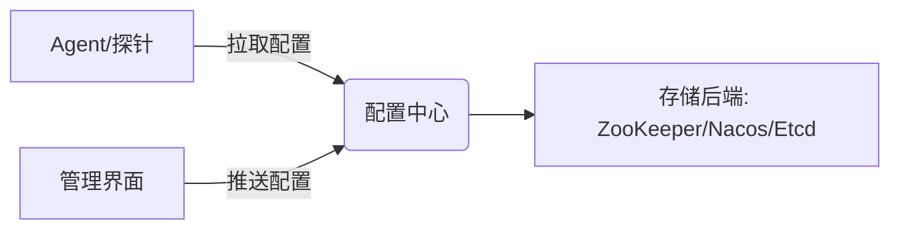

# SkyWalking 配置中心介绍

## 概述
SkyWalking配置中心是分布式系统的动态配置管理核心组件，允许在不重启服务的情况下动态调整探针、后端收集器及其他模块的配置参数。它解决了传统静态配置文件需要频繁部署的痛点，特别适合云原生环境下的微服务架构。

:::tip 为什么需要配置中心？
- 实时生效：修改配置无需重启服务
- 集中管理：统一维护多环境配置
- 版本控制：支持配置变更历史追踪
:::

## 核心架构



## 配置类型详解

### 1. 动态服务配置
通过`service`维度动态调整采样率等参数：

```yaml
# 配置格式示例
service: payment-service
config:
  sample_rate: 0.5
  ignore_suffix: ".jpg,.css"
```

### 2. 全局配置
影响所有服务的公共参数：

```properties
# agent.config
agent.force_tls=true
collector.backend_service=127.0.0.1:11800
```

## 实战案例：动态调整采样率

### 初始状态
假设当前采样率为100%（全量采集），造成存储压力：

```bash
# 查看当前配置
curl http://config-center:8090/config/service/order-service
```

**输出**：
```json
{
  "sample_rate": 1.0
}
```

### 动态调整
将采样率降为30%：

```bash
curl -X POST http://config-center:8090/config \
-H "Content-Type: application/json" \
-d '{"service":"order-service", "config":{"sample_rate":0.3}}'
```

### 验证变更
```bash
# 10秒后生效
curl http://config-center:8090/config/service/order-service
```

**输出**：
```json
{
  "sample_rate": 0.3
}
```

## 集成第三方配置中心

### 与Nacos集成示例
修改`application.yml`：

```yaml
configuration:
  selector: ${SW_CONFIGURATION:nacos}
  nacos:
    serverAddr: 127.0.0.1:8848
    namespace: skywalking
    group: DEFAULT_GROUP
```

:::caution 注意事项
1. 确保配置中心高可用
2. 变更后观察监控指标
3. 生产环境建议启用配置加密
:::

## 最佳实践

1. **分级配置**：全局配置 + 服务特有配置
2. **变更审计**：记录所有配置修改操作
3. **回滚机制**：保留最近5个配置版本
4. **权限控制**：区分读写权限

## 总结

SkyWalking配置中心通过解耦配置与运行时，显著提升了分布式系统的可维护性。关键要点：

- 支持多级配置覆盖策略
- 提供REST API和管理界面两种操作方式
- 可与主流配置中心无缝集成

## 扩展学习

1. [官方配置中心文档](https://skywalking.apache.org/docs/)
2. 实验：尝试通过配置中心关闭特定服务的监控
3. 思考题：如何实现配置变更的灰度发布？