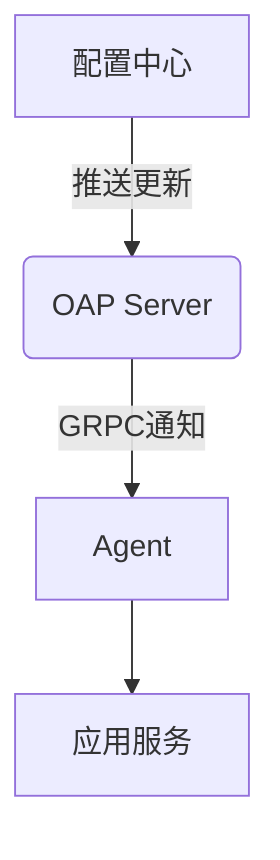

# SkyWalking 动态配置机制

## 介绍

动态配置是SkyWalking的核心功能之一，它允许运维人员在不重启服务的情况下，通过配置中心实时调整探针(Agent)的行为和系统参数。这种机制对于生产环境中的故障排查、性能调优和紧急熔断等场景尤为重要。

:::tip 为什么需要动态配置？
- 避免频繁重启影响业务连续性
- 快速响应线上问题（如日志级别调整）
- 实现A/B测试等高级监控场景
```

## 工作原理

SkyWalking的动态配置机制基于"配置中心+推送"的模式工作：



1. **配置存储**：所有动态配置存储在配置中心（如Zookeeper、Nacos等）
2. **变更检测**：OAP Server监听配置中心变化
3. **配置分发**：通过GRPC将变更推送给相关Agent
4. **热生效**：Agent接收新配置并立即应用

## 配置示例

### 1. 日志级别动态调整

通过修改 `agent.config` 动态调整日志级别：

```yaml
# 在配置中心修改以下内容
agent:
  logging:
    level: DEBUG
```

应用后，所有Agent将在1分钟内更新日志级别，无需重启。

### 2. 采样率控制

动态调整链路采样率（1.0表示100%采集）：

```yaml
agent:
  sample:
    rate: 0.5
```

## 实际案例

### 案例：线上问题诊断

**场景**：生产环境突然出现性能下降，需要快速定位问题

**解决方案**：
1. 动态开启DEBUG日志级别
2. 临时提高采样率到100%
3. 添加特定服务的追踪标签

```yaml
agent:
  logging:
    level: DEBUG
  sample:
    rate: 1.0
  trace:
    tags: env=prod,version=1.2.3
```

:::warning 注意事项
高采样率和DEBUG日志会显著增加系统负载，问题解决后应及时恢复默认配置！
:::

## 配置中心集成

SkyWalking支持多种配置中心，以下是常见集成方式：

1. **Zookeeper**配置示例：
```properties
configuration:
  selector: ${SW_CONFIGURATION:zookeeper}
  zookeeper:
    namespace: skywalking
    hostPort: localhost:2181
```

2. **Nacos**配置示例：
```properties
configuration:
  selector: ${SW_CONFIGURATION:nacos}
  nacos:
    serverAddr: 127.0.0.1:8848
    namespace: skywalking
```

## 最佳实践

1. **变更记录**：所有配置变更应该记录操作人和时间
2. **灰度发布**：先在小范围Agent测试新配置
3. **监控影响**：观察配置变更后的系统指标变化
4. **回滚方案**：准备快速回滚的配置版本

:::note 配置版本控制建议
使用配置中心的版本管理功能，或通过GitOps方式管理配置变更
:::

## 总结

SkyWalking的动态配置机制提供了强大的运行时调整能力，使监控系统具备更好的灵活性和响应速度。关键要点包括：

- 理解配置中心的工作模式
- 掌握常见配置项的调整方法
- 遵循变更管理的最佳实践

## 延伸学习

1. 尝试在本地环境搭建Zookeeper并测试动态配置
2. 练习修改采样率观察链路数据变化
3. 研究SkyWalking官方文档中的[动态配置API](https://skywalking.apache.org/docs/)