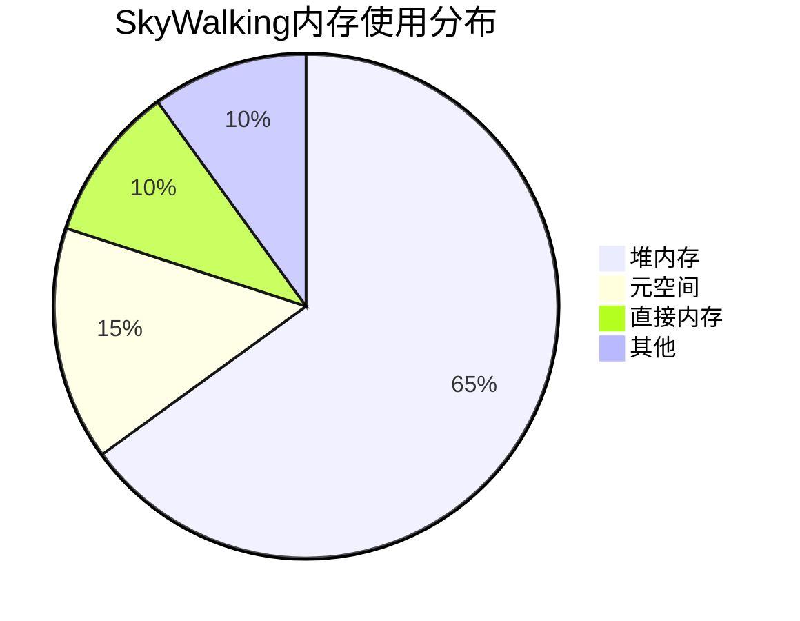

# SkyWalking 内存优化

## 介绍

SkyWalking作为一款分布式系统的应用性能监控工具，在处理大量数据时可能会占用较多内存。合理的内存优化不仅能提升SkyWalking的性能，还能降低资源消耗，使其在资源有限的环境中运行更加高效。本章将介绍SkyWalking内存优化的关键策略和配置方法。

## 为什么需要内存优化？

SkyWalking的核心功能包括数据收集、存储和分析，这些操作通常需要大量内存。如果内存配置不当，可能会导致：

- 频繁的垃圾回收（GC），影响性能
- 内存溢出（OOM）错误
- 系统响应变慢

通过合理的内存优化，可以避免这些问题，使SkyWalking运行更加稳定。

## 内存优化策略

### 1. 调整JVM堆内存

SkyWalking是基于Java的应用，因此JVM堆内存的配置至关重要。可以通过以下参数调整：

```bash
# 在启动脚本中设置JVM参数
SW_OAP_OPTS="-Xms4g -Xmx4g -XX:MaxMetaspaceSize=512m"
```

:::tip
建议将 `-Xms` 和 `-Xmx` 设置为相同值，避免堆内存动态调整带来的性能开销。
:::

### 2. 优化存储配置

SkyWalking默认使用内存和磁盘混合存储模式。可以通过以下配置减少内存占用：

```yaml
# config/application.yml
storage:
  selector: ${SW_STORAGE:h2}
  h2:
    maxSizeOfArrayColumn: 10000  # 减少数组列的最大大小
    numOfSearchableValuesPerTag: 2  # 限制每个标签的可搜索值数量
```

### 3. 调整数据采样率

降低数据采样率可以减少内存使用，但会损失部分数据精度：

```yaml
# config/application.yml
agent-analyzer:
  sampleRate: ${SW_AGENT_ANALYZER_SAMPLE_RATE:10000}  # 默认10000，表示采样率1/10000
```

### 4. 优化Trace数据存储

Trace数据通常占用大量内存。可以通过以下配置限制Trace数据的存储量：

```yaml
# config/application.yml
storage:
  trace:
    segment: 
      maxSize: ${SW_STORAGE_MAX_SIZE_OF_SEGMENT:500}  # 单个Segment的最大大小(KB)
    dataTTL: ${SW_STORAGE_DATA_TTL:3}  # 数据保留天数
```

## 实际案例

### 案例1：小型部署优化

对于资源有限的开发环境（如4GB内存），可以采用以下优化配置：

```bash
# 启动参数
SW_OAP_OPTS="-Xms1g -Xmx1g -XX:MaxMetaspaceSize=256m"
```

```yaml
# config/application.yml
storage:
  selector: ${SW_STORAGE:h2}
  h2:
    maxSizeOfArrayColumn: 5000
    numOfSearchableValuesPerTag: 1
agent-analyzer:
  sampleRate: ${SW_AGENT_ANALYZER_SAMPLE_RATE:5000}
```

### 案例2：生产环境优化

对于生产环境（16GB内存），可以采用更平衡的配置：

```bash
# 启动参数
SW_OAP_OPTS="-Xms8g -Xmx8g -XX:MaxMetaspaceSize=512m"
```

```yaml
# config/application.yml
storage:
  selector: ${SW_STORAGE:elasticsearch}
  elasticsearch:
    bulkActions: 2000  # 减少批量操作大小
    bulkSize: 10  # MB
    flushInterval: 10  # 秒
```

## 内存监控与调优

使用以下命令监控SkyWalking的内存使用情况：

```bash
# 查看JVM内存状态
jstat -gc <pid> 1000
```



:::caution
监控发现频繁Full GC时，应考虑增加堆内存或优化代码。
:::

## 总结

SkyWalking内存优化是一个持续的过程，需要根据实际负载和资源情况进行调整。关键点包括：

1. 合理配置JVM堆内存
2. 优化存储设置
3. 调整数据采样率
4. 监控内存使用情况

## 附加资源

- [SkyWalking官方文档 - 性能调优](https://skywalking.apache.org/docs/)
- [JVM调优指南](https://docs.oracle.com/en/java/javase/11/gctuning/)
- [Elasticsearch性能优化](https://www.elastic.co/guide/en/elasticsearch/reference/current/tune-for-indexing-speed.html)

## 练习

1. 尝试在自己的环境中调整SkyWalking的内存配置，观察性能变化
2. 使用`jstat`命令监控GC情况，分析是否需要进一步优化
3. 比较不同采样率下的内存使用和数据分析精度