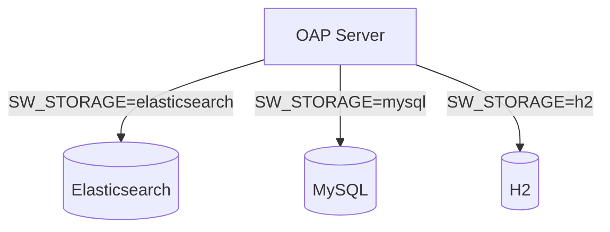

# SkyWalking 系统环境变量

## 介绍

环境变量是配置SkyWalking组件行为的强大方式，尤其适合容器化部署和需要动态调整参数的场景。通过环境变量，您可以无需修改配置文件即可控制SkyWalking代理、OAP服务器和UI的行为。

:::tip 为什么使用环境变量？
- **灵活性**：在不同环境（开发/测试/生产）间轻松切换配置
- **安全性**：避免将敏感信息硬编码在配置文件中
- **容器友好**：与Docker、Kubernetes等编排工具完美集成
:::

## 核心环境变量

### 1. 代理(Agent)相关变量

| 变量名 | 默认值 | 描述 |
|--------|--------|------|
| `SW_AGENT_NAME` | 无 | 服务在SkyWalking中显示的名称 |
| `SW_AGENT_COLLECTOR_BACKEND_SERVICES` | 127.0.0.1:11800 | OAP服务器地址 |
| `SW_AGENT_SPAN_LIMIT` | 300 | 单个请求的最大span数量 |

示例启动Java应用时设置环境变量：
```bash
export SW_AGENT_NAME=inventory-service
export SW_AGENT_COLLECTOR_BACKEND_SERVICES=oap:11800
java -javaagent:/path/to/skywalking-agent.jar -jar your-app.jar
```

### 2. OAP服务器变量

| 变量名 | 默认值 | 描述 |
|--------|--------|------|
| `SW_STORAGE` | h2 | 存储类型(h2,elasticsearch,mysql等) |
| `SW_STORAGE_ES_CLUSTER_NODES` | localhost:9200 | Elasticsearch节点地址 |
| `SW_CORE_REST_HOST` | 0.0.0.0 | OAP REST服务绑定地址 |
| `SW_CORE_GRPC_HOST` | 0.0.0.0 | OAP gRPC服务绑定地址 |



### 3. UI相关变量

| 变量名 | 默认值 | 描述 |
|--------|--------|------|
| `SW_OAP_ADDRESS` | http://localhost:12800 | 连接的OAP服务器地址 |
| `SW_SERVER_PORT` | 8080 | UI服务监听端口 |

## 实际应用案例

### 案例1：Kubernetes部署配置

在Kubernetes部署中，通过ConfigMap和环境变量结合配置：

```yaml
apiVersion: apps/v1
kind: Deployment
metadata:
  name: skywalking-oap
spec:
  template:
    spec:
      containers:
      - name: oap
        image: apache/skywalking-oap-server:9.4.0
        env:
        - name: SW_STORAGE
          value: "elasticsearch"
        - name: SW_STORAGE_ES_CLUSTER_NODES
          value: "elasticsearch:9200"
        - name: SW_CORE_GRPC_HOST
          value: "0.0.0.0"
```

### 案例2：多环境配置

使用`.env`文件管理不同环境配置：

```ini
# 开发环境.env
SW_AGENT_NAME=dev-service
SW_AGENT_COLLECTOR_BACKEND_SERVICES=dev-oap:11800

# 生产环境.env
SW_AGENT_NAME=prod-service
SW_AGENT_COLLECTOR_BACKEND_SERVICES=prod-oap-cluster:11800
```

## 高级技巧

### 变量优先级

SkyWalking配置加载顺序：
1. 系统环境变量
2. `agent.config` 或 `application.yml` 配置文件
3. 默认值

:::caution 注意
环境变量通常优先级最高，会覆盖配置文件中的相同配置项
:::

### 变量命名转换

配置文件中的配置项通常可以转换为环境变量：
- 点(.)转换为下划线(_)
- 全部大写

例如：
- 配置文件：`receiver.sharing.server.port=12800`
- 环境变量：`RECEIVER_SHARING_SERVER_PORT=12800`

## 总结

通过环境变量配置SkyWalking提供了极大的灵活性和可维护性，特别是在云原生环境中。关键点包括：

1. 理解不同组件的核心环境变量
2. 掌握变量优先级规则
3. 学会将配置文件项转换为环境变量格式

## 延伸学习

- 官方文档：[SkyWalking环境变量配置](https://skywalking.apache.org/docs/)
- 实践练习：
  1. 尝试通过环境变量启用SkyWalking的日志收集功能
  2. 使用不同环境变量值部署两个代理，观察UI中的区别
  3. 研究如何通过环境变量配置告警规则

:::note 小挑战
在不修改任何配置文件的情况下，仅通过环境变量实现：
- 将代理数据发送到远程OAP服务器
- 更改服务名为"test-service"
- 限制每秒最大span数量为100
:::