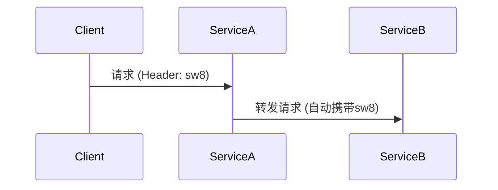

## 概述

SkyWalking的高级调试选项是开发者和运维人员在复杂分布式系统中进行问题诊断和性能调优的关键工具。这些选项允许你精细化控制监控行为，获取更详尽的追踪数据，同时平衡系统性能开销。对于初学者而言，理解这些配置将帮助你从"能用"进阶到"会用"阶段。

## 核心调试选项

### 1. 日志级别调整

通过修改日志级别，可以获取SkyWalking组件的详细运行时信息。配置文件通常位于 `config/log4j2.xml`：

```xml
<Root level="DEBUG">  <!-- 默认INFO，调整为DEBUG获取更多日志 -->
    <AppenderRef ref="Console" />
</Root>
```

**输出示例**：
```
DEBUG 2023-08-20 14:00:00 SkyWalkingAgent : Tracing segment created...
```

:::tip
生产环境建议保持`INFO`级别，仅在调试时临时启用`DEBUG`以避免日志爆炸。
:::

### 2. 采样率配置

在 `agent.config` 中控制数据上报频率：

```properties
agent.sample_n_per_3_secs=10  # 每3秒采样10个请求
```

**应用场景**：
- 高流量服务：降低采样率（如1-3）减少网络开销
- 调试阶段：设为`-1`全量采样

### 3. 慢查询阈值

定义慢请求的判断标准（单位毫秒）：

```properties
agent.span_slow_threshold=500  # 超过500ms的请求标记为慢查询
```

## 高级特性详解

### 追踪上下文传播

通过以下配置启用跨进程的上下文增强传播：

```properties
agent.propagate_head=true  # 启用HTTP头传播
agent.ignore_suffix=.jpg,.css  # 忽略静态资源
```



### 自定义追踪标签

在代码中添加业务维度标签：

```java
ActiveSpan.tag("user_id", "12345");
ActiveSpan.tag("transaction_type", "payment");
```

**输出效果**：
```json
{
  "tags": [
    {"key": "user_id", "value": "12345"},
    {"key": "transaction_type", "value": "payment"}
  ]
}
```

## 实战案例：电商系统调试

**问题场景**：订单提交延迟高但无法定位瓶颈

1. **启用全量采样**：
   ```properties
   agent.sample_n_per_3_secs=-1
   ```

2. **设置慢查询阈值**：
   ```properties
   agent.span_slow_threshold=300
   ```

3. **添加自定义标签**：
   ```java
   // 在订单服务中添加
   ActiveSpan.tag("order_type", "flash_sale");
   ```

4. **分析结果**：
   - 发现支付服务调用第三方接口平均耗时800ms
   - 抢购订单比普通订单慢3倍

## 总结与进阶

**关键收获**：
- 调试配置需要根据场景动态调整
- 标签系统可增强业务可观测性
- 采样率直接影响监控精度和系统负载

**推荐练习**：
1. 在你的测试环境中启用DEBUG日志并分析输出
2. 为你的业务代码添加至少2个自定义标签
3. 尝试不同采样率观察UI数据变化

**延伸阅读**：
- SkyWalking官方文档：Debugging Practices章节
- 《分布式系统观测性实战》第5章
``` 

注意：实际使用时请移除代码块外层的