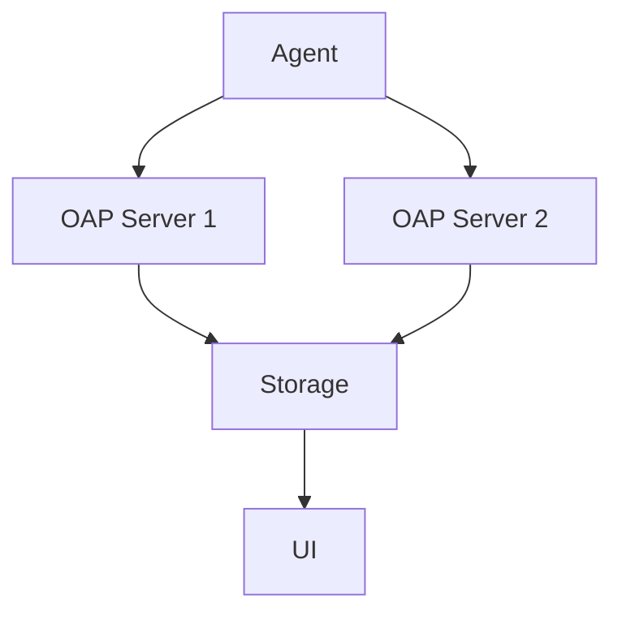
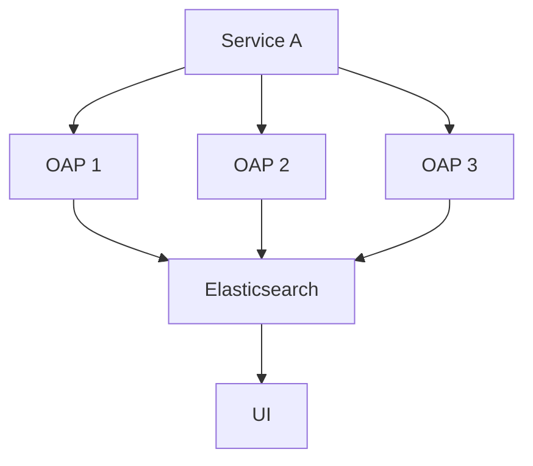

# SkyWalking 集群配置

## 介绍

SkyWalking是一个开源的APM（应用性能监控）系统，用于分布式系统的监控、跟踪和诊断。在生产环境中，单个SkyWalking实例可能无法满足高可用性和性能需求，因此需要配置集群。本文将详细介绍如何配置SkyWalking集群，包括必要的组件、配置步骤和实际案例。

## 集群架构

SkyWalking集群主要由以下组件组成：
1. **OAP（Observability Analysis Platform）**：负责数据收集、分析和存储。
2. **Storage**：存储收集的数据，支持Elasticsearch、MySQL、TiDB等。
3. **UI**：提供可视化界面。



## 配置步骤

### 1. 配置OAP集群

OAP集群通过共享存储和协调服务（如ZooKeeper）实现高可用性。以下是配置OAP集群的关键步骤：

#### 修改 `application.yml`

在SkyWalking的配置文件中，启用集群模式并配置协调服务：

```yaml
cluster:
  selector: ${SW_CLUSTER:standalone}
  standalone:
  zookeeper:
    nameSpace: ${SW_NAMESPACE:""}
    hostPort: ${SW_CLUSTER_ZK_HOST_PORT:localhost:2181}
    # 其他ZooKeeper配置
```

#### 启动多个OAP实例

启动多个OAP实例时，确保它们共享相同的存储和协调服务：

```bash
# 启动第一个OAP实例
bin/oapService.sh

# 启动第二个OAP实例（在不同机器或端口）
bin/oapService.sh
```

### 2. 配置存储

SkyWalking支持多种存储后端。以下是配置Elasticsearch为存储后端的示例：

```yaml
storage:
  selector: ${SW_STORAGE:elasticsearch}
  elasticsearch:
    nameSpace: ${SW_NAMESPACE:""}
    clusterNodes: ${SW_STORAGE_ES_CLUSTER_NODES:localhost:9200}
    # 其他Elasticsearch配置
```

### 3. 配置UI

UI需要指向OAP集群的地址。修改 `webapp.yml`：

```yaml
server:
  port: 8080
collector:
  path: /graphql
  ribbon:
    listOfServers: ${SW_COLLECTOR_RIBBON_LISTOFSERVERS:localhost:12800,localhost:12801}
```

## 实际案例

### 案例：电商平台的SkyWalking集群配置

假设一个电商平台需要监控其微服务架构。以下是配置步骤：
1. **部署3个OAP实例**：分别运行在不同的服务器上，使用ZooKeeper协调。
2. **配置Elasticsearch集群**：作为存储后端，确保数据高可用。
3. **部署UI**：指向OAP集群的地址。



## 总结

配置SkyWalking集群可以提高系统的可用性和扩展性。关键步骤包括：
1. 配置OAP集群并启用协调服务。
2. 选择合适的存储后端并配置。
3. 部署UI并指向OAP集群。

:::tip
在生产环境中，建议使用ZooKeeper或Kubernetes等协调服务来管理OAP集群。
:::

## 附加资源

1. [SkyWalking官方文档](https://skywalking.apache.org/docs/)
2. [Elasticsearch集群配置指南](https://www.elastic.co/guide/en/elasticsearch/reference/current/setup.html)
3. [ZooKeeper官方文档](https://zookeeper.apache.org/doc/current/)

## 练习

1. 尝试在本地环境中部署一个包含2个OAP实例的SkyWalking集群。
2. 配置Elasticsearch作为存储后端，并验证数据是否同步。
3. 部署UI并检查监控数据是否正常显示。