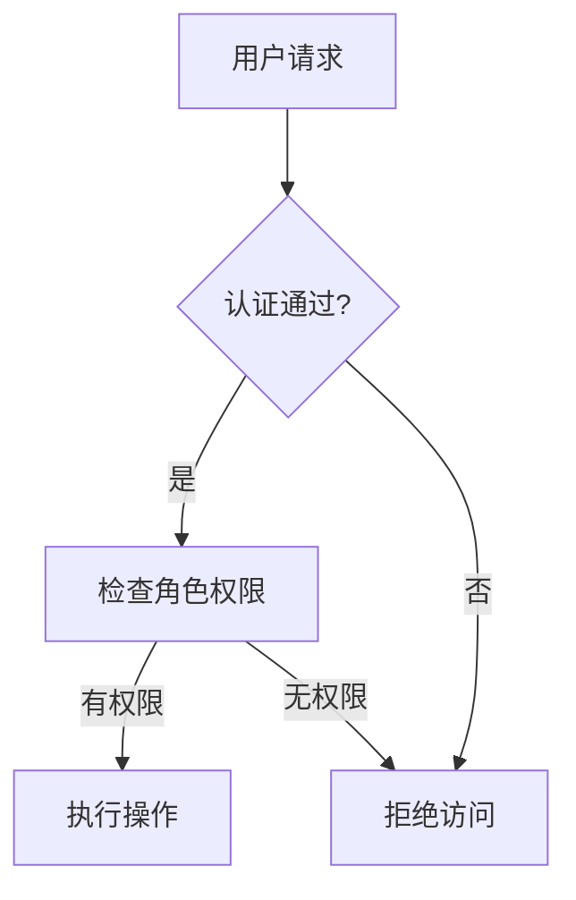

# SkyWalking 安全设置

## 介绍

SkyWalking作为一款强大的分布式系统监控工具，在生产环境中运行时需要确保其安全性。本章将详细介绍如何配置SkyWalking的安全功能，包括：

1. 用户认证（Authentication）
2. 访问授权（Authorization）
3. 数据传输加密（TLS/SSL）
4. 敏感信息保护

## 用户认证配置

SkyWalking支持基于用户名和密码的基本认证方式。以下是配置步骤：

1. 修改 `application.yml` 文件：

```yaml
security:
  user:
    admin:
      password: ${SW_ADMIN_PASSWORD} # 推荐使用环境变量
    readonly:
      password: ${SW_READONLY_PASSWORD}
```

2. 设置环境变量（以Linux为例）：

```bash
export SW_ADMIN_PASSWORD=your_secure_password
export SW_READONLY_PASSWORD=another_secure_password
```

:::note
生产环境中切勿使用明文密码，建议通过环境变量或密钥管理工具注入密码。
:::

## 基于角色的访问控制

SkyWalking支持基于角色的权限管理：

```yaml
security:
  roles:
    - name: admin
      permissions: ["*"]
    - name: viewer
      permissions: ["read"]
```

## TLS/SSL加密配置

确保SkyWalking组件间通信安全：

1. 生成密钥和证书（示例使用OpenSSL）：

```bash
openssl req -x509 -newkey rsa:4096 -keyout key.pem -out cert.pem -days 365 -nodes
```

2. 配置OAP服务器使用TLS：

```yaml
core:
  rest:
    ssl:
      enabled: true
      key_path: /path/to/key.pem
      cert_path: /path/to/cert.pem
```

## 实际案例：保护生产环境SkyWalking

假设我们有一个电商平台使用SkyWalking监控，以下是安全配置方案：

1. **认证层**：为开发、运维和业务团队创建不同账户
2. **授权层**：
   - 运维团队：admin角色
   - 开发团队：读写权限
   - 业务团队：只读权限
3. **网络层**：
   - 只允许内网访问UI
   - 组件间通信使用TLS加密
4. **审计日志**：记录所有配置变更



## 高级安全配置

### JWT认证

对于需要与第三方系统集成的场景，可以启用JWT认证：

```yaml
security:
  jwt:
    enabled: true
    issuer: skywalking
    secret: ${SW_JWT_SECRET}
    expiration: 3600 # 1小时
```

### IP白名单

限制可访问SkyWalking的IP范围：

```yaml
security:
  ipRestriction:
    enabled: true
    allowedIPs: ["192.168.1.0/24", "10.0.0.1"]
```

## 总结

通过本章学习，您应该已经掌握：

1. 如何配置SkyWalking的基本认证和授权
2. 如何启用TLS加密保护数据传输
3. 如何根据实际需求设计安全方案
4. 高级安全功能如JWT和IP白名单的使用

## 延伸学习

1. 实践练习：
   - 为您的SkyWalking实例配置双因素认证
   - 设置不同团队的角色和权限
2. 推荐阅读：
   - SkyWalking官方安全文档
   - OAuth 2.0与SkyWalking集成
   - Kubernetes中SkyWalking的安全部署

:::tip
定期审查和更新您的安全配置，特别是密码和证书，是保持系统安全的重要实践。
:::