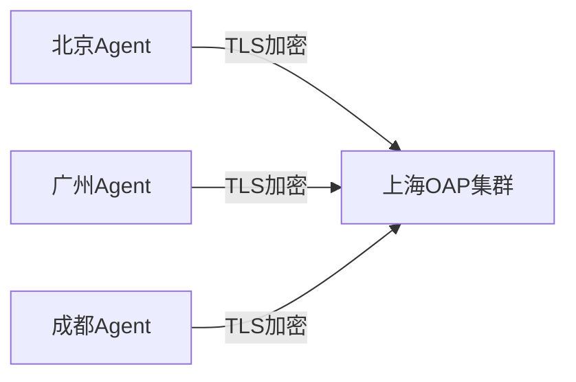

# SkyWalking TLS配置

## 简介

传输层安全协议(TLS)是SkyWalking中保障组件间通信安全的核心机制。通过TLS加密，可以防止监控数据在传输过程中被窃听或篡改。本指南将详细介绍如何在SkyWalking的不同组件中启用和配置TLS。

:::note TLS的重要性
在分布式系统中，所有组件间的通信都应考虑安全性，特别是当部署在公有云或跨数据中心时。
:::

## 基础概念

### 1. TLS证书组成
- **证书文件(.crt/.pem)**: 包含公钥和身份信息
- **私钥文件(.key)**: 必须保密的加密密钥
- **CA证书**: 证书颁发机构的根证书

### 2. SkyWalking中的TLS应用场景
- OAP服务器集群内部通信
- Agent与OAP之间的数据传输
- UI与OAP的API通信

## 配置步骤

### 1. 生成证书(示例)

```bash
# 生成CA私钥和自签名证书
openssl req -x509 -newkey rsa:4096 -sha256 -nodes -keyout ca.key -out ca.crt -subj "/CN=SkyWalking CA" -days 3650

# 生成服务器证书
openssl req -newkey rsa:4096 -sha256 -nodes -keyout server.key -out server.csr -subj "/CN=skywalking-oap"
openssl x509 -req -CA ca.crt -CAkey ca.key -CAcreateserial -in server.csr -out server.crt -days 3650
```

### 2. OAP服务器配置

修改`config/application.yml`:

```yaml
core:
  restHost: ${SW_CORE_REST_HOST:0.0.0.0}
  restPort: ${SW_CORE_REST_PORT:12800}
  restSslEnabled: ${SW_CORE_REST_SSL_ENABLED:true}
  restSslKeyPath: ${SW_CORE_REST_SSL_KEY_PATH:server.key}
  restSslCertChainPath: ${SW_CORE_REST_SSL_CERT_CHAIN_PATH:server.crt}
```

### 3. Agent端配置

在agent配置文件中添加:

```properties
# 启用TLS
agent.force_tls=true

# 证书配置
agent.ca=ca.crt
```

## 实际案例

### 场景：跨数据中心部署



配置要点：
1. 所有OAP节点使用同一套证书
2. 在所有Agent中分发CA证书
3. 设置合理的证书有效期

## 验证配置

检查OAP日志应出现：
```
INFO  [] - TLS enabled for gRPC server
```

使用openssl验证连接：
```bash
openssl s_client -connect oap-server:11800 -CAfile ca.crt
```

## 常见问题解决

:::caution 证书问题
若出现`SSLHandshakeException`，检查：
1. 证书有效期
2. CA证书是否一致
3. 主机名(CN)是否匹配
:::

## 高级配置

### 双向TLS认证

在OAP配置中添加：
```yaml
grpc:
  sslClientAuth: true
```

Agent端需额外配置：
```properties
agent.cert=agent.crt
agent.key=agent.key
```

## 总结

通过本指南，你已学会：
- TLS在SkyWalking中的重要性 ✓
- 证书生成与管理 ✓
- 单/双向TLS配置 ✓
- 实际部署验证 ✓

## 扩展学习

- [OpenSSL官方文档](https://www.openssl.org/docs/)
- SkyWalking官方TLS配置指南
- 练习：尝试在本地Docker环境部署TLS加密的SkyWalking集群