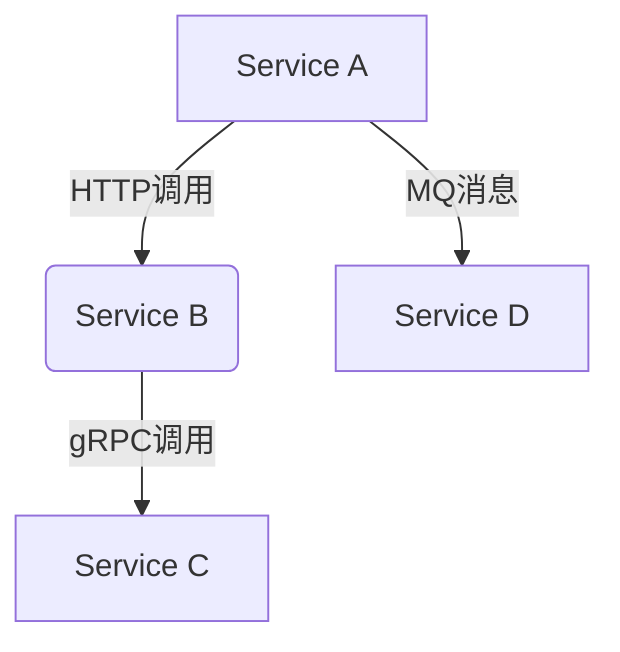

# SkyWalking 代理设置

## 介绍

SkyWalking代理（Agent）是部署在应用服务中的轻量级组件，负责收集应用的性能指标、追踪数据并上报给SkyWalking后端。正确配置代理是实现高效监控的关键步骤。本章将详细讲解代理的配置方法、核心参数及最佳实践。

---

## 基础配置

### 1. 代理安装与启动

SkyWalking代理通常以Java Agent形式启动。在应用启动命令中添加以下JVM参数：

```bash
-javaagent:/path/to/skywalking-agent.jar
```

### 2. 核心配置文件

代理的主要配置文件是 `config/agent.config`。关键配置项如下：

```properties
# 服务名称（必填）
agent.service_name=your-application-name

# SkyWalking 后端地址（OAP服务器）
collector.backend_service=127.0.0.1:11800

# 采样率（0-1，1表示100%采样）
agent.sample_n_per_3_secs=1
```

:::tip
使用环境变量覆盖配置（优先级更高）：
```bash
export SW_AGENT_NAME="your-service-name"
```
:::

---

## 高级配置

### 1. 跨进程追踪配置

通过以下配置启用HTTP/gRPC等跨进程追踪：

```properties
# 启用HTTP追踪
plugin.toolkit.use_qualified_name_as_endpoint_name=true

# 忽略特定路径（如健康检查）
plugin.springmvc.ignore_path=/health
```

### 2. 日志关联

将业务日志与追踪ID关联：

```java
// 在日志模式中添加 %tid
logback.xml示例：
<pattern>%d{yyyy-MM-dd HH:mm:ss} [%tid] %-5level %logger{36} - %msg%n</pattern>
```

### 3. 自定义增强点

通过自定义配置文件扩展监控能力（示例文件：`/path/to/optional-plugins/apm-customize-enhance-plugin.xml`）：

```xml
<enhanced>
    <class class_name="com.example.MyController">
        <method method="getUserInfo" static="false">
            <operation_name>GET:/user/{id}</operation_name>
        </method>
    </class>
</enhanced>
```

---

## 实际案例

### 案例：微服务架构配置



对应代理配置：

1. **Service A**:
   ```properties
   agent.service_name=service-a
   plugin.jdbc.trace_sql_parameters=true
   ```

2. **Service B**:
   ```properties
   agent.service_name=service-b
   plugin.springmvc.collect_http_params=true
   ```

3. **所有服务公共配置**:
   ```properties
   collector.backend_service=skywalking-oap:11800
   agent.ignore_suffix=.jpg,.css,.js
   ```

---

## 常见问题解决

:::caution 问题排查清单
1. **无数据上报**：
   - 检查后端服务地址
   - 验证网络连通性
   - 检查采样率配置

2. **高开销**：
   - 降低采样率
   - 排除静态资源监控
   - 优化自定义增强点
:::

---

## 总结与练习

### 总结
- 代理配置主要通过 `agent.config` 文件管理
- 支持环境变量动态覆盖配置
- 可通过插件机制扩展监控能力

### 练习
1. 在本地Spring Boot应用中添加SkyWalking代理
2. 配置忽略 `/actuator` 端点的监控
3. 实现日志与追踪ID的关联

### 扩展阅读
- [SkyWalking官方文档：高级代理配置](https://skywalking.apache.org/docs/)
- [代理性能调优指南](https://github.com/apache/skywalking/blob/master/docs/en/guides/Java-Plugin-Development-Guide.md)