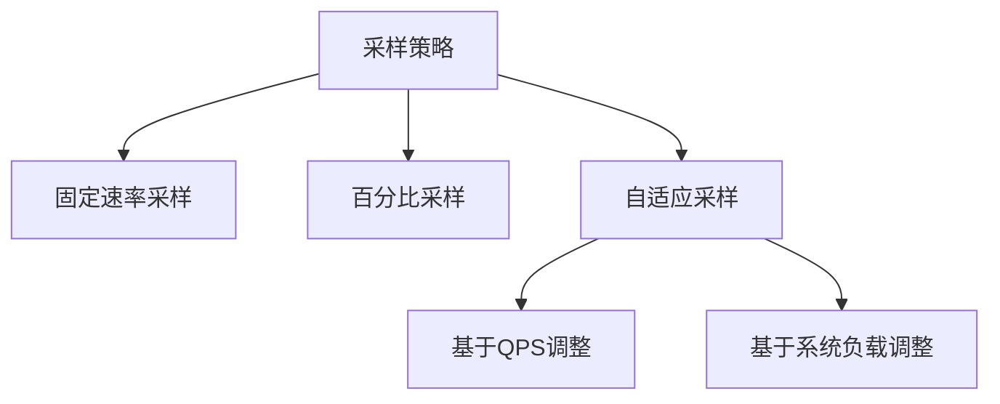

# SkyWalking 采样率调整

## 什么是采样率？

在分布式系统监控中，**采样率(Sampling Rate)** 指系统收集和上报的追踪数据占全部请求的百分比。SkyWalking默认会对所有请求进行监控，但在高流量场景下，这可能导致：

1. 存储成本急剧上升
2. 网络传输压力增大
3. 后端处理性能下降

通过调整采样率，我们可以在监控精度和系统开销之间找到平衡点。

## 采样率配置方式

### 1. 动态配置（推荐）

在SkyWalking 8.4.0+版本中，可以通过动态配置中心调整采样率：

```yaml
# agent.config
agent.sample_n_per_3_secs=10  # 每3秒最多采样10个请求
```

或使用百分比模式：
```yaml
agent.sample_percentage=50  # 50%的请求会被采样
```

:::tip 动态生效
修改这些配置后，大多数情况下不需要重启服务，配置会在1分钟内生效
:::

### 2. 静态配置

对于旧版本，需要在agent启动时指定JVM参数：

```bash
-javaagent:/path/to/skywalking-agent.jar=agent.sample_n_per_3_secs=10
```

## 采样策略详解

SkyWalking支持多种采样策略：



### 固定速率采样

配置示例：
```properties
# 限制采样总量
agent.sample_n_per_3_secs=20
```

### 百分比采样

配置示例：
```properties
# 采样30%的请求
agent.sample_percentage=30
```

### 自适应采样（高级）

```yaml
agent.adaptive_sampling.enabled=true
agent.adaptive_sampling.target_sample_count_per_sec=100
```

## 实际案例

### 电商大促场景

某电商平台在双11期间面临以下挑战：
- 日常QPS：5,000
- 大促QPS：50,000
- 存储成本增长10倍

解决方案：
```yaml
# 日常配置
agent.sample_percentage=100  # 全量采样

# 大促前调整为
agent.sample_percentage=20  # 采样20%
agent.adaptive_sampling.enabled=true  # 启用自适应
```

效果：
- 存储成本降低80%
- 关键路径监控保持完整
- 异常请求仍100%采样（SkyWalking自动机制）

## 最佳实践

1. **开发环境**：建议100%采样，便于调试
2. **生产环境**：根据流量调整，通常10-30%
3. **关键业务**：可单独配置更高采样率
4. **异常请求**：SkyWalking会自动全采样错误请求

:::caution 注意事项
采样率过低可能导致：
- 监控数据不完整
- 问题排查困难
- 指标统计偏差
:::

## 验证配置

通过SkyWalking UI可以验证采样效果：

1. 进入`Trace`页面
2. 观察`Sampled`标签
3. 检查不同服务的采样比例

## 总结

采样率调整是SkyWalking性能优化的关键手段，需要根据实际业务场景平衡监控精度和系统开销。建议：

1. 从默认配置开始
2. 逐步调整并观察效果
3. 结合自适应采样功能
4. 定期评估采样策略

## 扩展学习

- 官方文档：[Sampling Strategies](https://skywalking.apache.org/docs/)
- 实践建议：在不同流量模式下测试采样效果
- 进阶话题：如何实现自定义采样策略