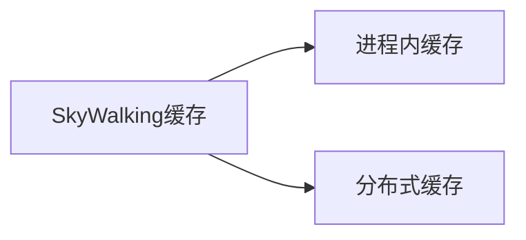

# SkyWalking 缓存配置

## 介绍

在分布式系统监控工具SkyWalking中，缓存是提升性能的关键组件。合理的缓存配置能显著减少数据库压力，加快查询响应速度。本章将详细介绍SkyWalking支持的缓存类型、配置方法以及实际应用场景。

:::note 缓存的作用
- 减少重复计算
- 降低数据库I/O
- 加速高频数据访问
:::

## 缓存类型

SkyWalking主要使用两种缓存机制：



### 1. 进程内缓存
默认启用，存储在OAP服务器内存中，适合单节点部署。

### 2. 分布式缓存
基于Redis等外部存储，适合集群部署场景。

## 基础配置

修改 `application.yml` 配置文件：

```yaml
core:
  default:
    # 进程内缓存配置
    activeCache: guava
    guavaCacheSize: 10000
    guavaCacheExpire: 60
```

:::tip 参数说明
- `guavaCacheSize`: 缓存最大条目数
- `guavaCacheExpire`: 缓存过期时间(分钟)
:::

## 高级Redis配置

集群环境下建议使用Redis缓存：

```yaml
storage:
  redis:
    host: ${REDIS_HOST:localhost}
    port: ${REDIS_PORT:6379}
    clusterNodes: ${REDIS_CLUSTER_NODES:}
    password: ${REDIS_PASSWORD:}
    # 缓存有效期(秒)
    expireTime: 604800
```

## 实际案例

### 场景：高频率指标查询
某电商平台在促销期间需要频繁查询以下指标：

```java
// 伪代码示例：查询服务响应时间P99
MetricsQuery query = new MetricsQuery("service_resp_time")
    .setEntity("order-service")
    .setPercentile(99);
```

**优化前**：每次查询都访问数据库<br />
**优化后**：首次查询后结果缓存10分钟

配置示例：
```yaml
core:
  default:
    guavaCacheExpire: 10  # 10分钟过期
```

## 缓存监控

通过SkyWalking UI查看缓存命中率：

1. 进入 `OAP Server` 仪表盘
2. 查看 `Cache Hit Rate` 指标
3. 理想值应保持在80%以上

:::caution 注意事项
- 缓存过期时间不宜过短（导致缓存穿透）
- 也不宜过长（数据新鲜度下降）
- 生产环境建议使用分布式缓存
:::

## 总结

| 配置项 | 单机建议值 | 集群建议值 |
|--------|------------|------------|
| 缓存类型 | Guava | Redis |
| 缓存大小 | 10,000 | 50,000+ |
| 过期时间 | 10-30分钟 | 1-7天 |

## 扩展练习

1. 在本地环境测试不同缓存大小对内存的影响
2. 使用JConsole监控缓存内存占用
3. 尝试配置Redis集群缓存

## 附加资源

- [SkyWalking官方缓存文档](https://skywalking.apache.org/docs/)
- [Redis缓存最佳实践](https://redis.io/docs/manual/client-side-caching/)