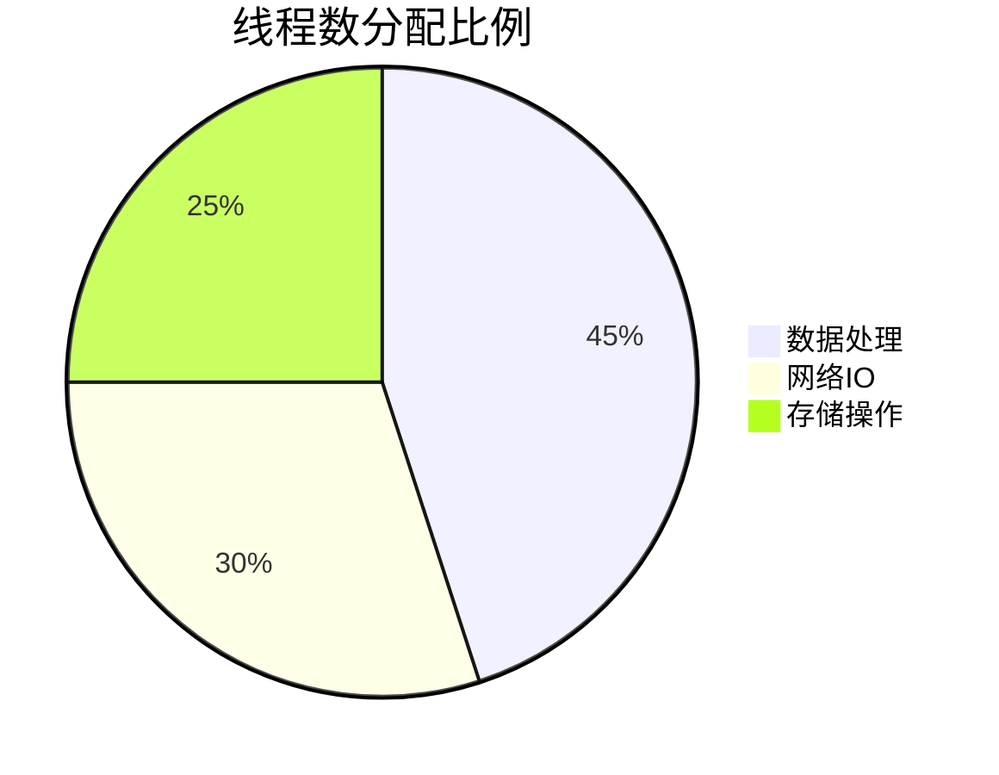

# SkyWalking 线程池调优

## 介绍

在SkyWalking中，线程池是处理监控数据收集、分析和存储的核心组件之一。合理的线程池配置可以显著提升SkyWalking的性能，避免资源浪费或线程饥饿问题。本章将介绍如何调优SkyWalking中的线程池，包括关键参数、配置示例和实际场景分析。

:::note
线程池调优需要根据实际业务负载和硬件资源进行调整，建议在测试环境中验证后再应用到生产环境。
:::

## 线程池基础

SkyWalking主要使用线程池处理以下任务：
- 监控数据的接收和处理
- 分析和聚合
- 存储操作

### 关键参数

以下是线程池调优中需要关注的参数：

| 参数 | 描述 | 默认值 |
|------|------|--------|
| `corePoolSize` | 核心线程数 | 根据模块不同 |
| `maxPoolSize` | 最大线程数 | 通常大于核心数 |
| `queueCapacity` | 任务队列容量 | 可变 |
| `keepAliveTime` | 空闲线程存活时间 | 60秒 |

## 配置示例

### 修改OAP服务器的线程池配置

在SkyWalking的`application.yml`中，可以找到线程池相关配置：

```yaml
core:
  default:
    # GRPC服务线程池
    gRPCHandlerThreadPoolSize: ${SW_CORE_GRPC_HANDLER_THREAD_POOL_SIZE:200}
    gRPCHandlerThreadPoolQueueSize: ${SW_CORE_GRPC_HANDLER_THREAD_POOL_QUEUE_SIZE:0}
    
    # 持久化线程池
    persistentPoolSize: ${SW_CORE_PERSISTENT_POOL_SIZE:2}
    persistentPeriod: ${SW_CORE_PERSISTENT_PERIOD:25}
```

:::tip
对于高负载环境，建议逐步增加`gRPCHandlerThreadPoolSize`并监控性能变化。
:::

## 调优策略

### 1. 确定合适的线程数

可以使用以下公式作为起点：

```
理想线程数 = CPU核心数 * (1 + 等待时间/计算时间)
```



### 2. 队列容量选择

- **CPU密集型任务**：使用较小的队列（甚至0）以减少延迟
- **IO密集型任务**：适当增加队列大小

### 3. 监控与调整

使用SkyWalking自带的监控功能观察线程池状态：

```
线程活跃数、队列大小、拒绝任务数
```

## 实际案例

### 案例1：高并发场景

某电商平台在大促期间遇到SkyWalking响应变慢的问题，通过以下调整解决：

1. 将`gRPCHandlerThreadPoolSize`从200增加到300
2. 设置`gRPCHandlerThreadPoolQueueSize`为1000
3. 增加`keepAliveTime`为120秒

调整后，吞吐量提升了40%，且没有出现任务拒绝。

### 案例2：资源受限环境

在2核4G的测试环境中，配置如下：

```yaml
core:
  default:
    gRPCHandlerThreadPoolSize: 50
    gRPCHandlerThreadPoolQueueSize: 200
    persistentPoolSize: 1
```

这样避免了资源竞争，同时保证了基本功能。

## 常见问题

:::caution
1. **线程数过多**：会导致上下文切换开销增加
2. **队列过大**：可能掩盖性能问题，导致响应延迟
3. **线程泄漏**：注意任务执行时间异常情况
:::

## 总结

SkyWalking线程池调优需要综合考虑：
- 硬件资源（CPU、内存）
- 业务负载特点
- 性能监控数据

建议采用渐进式调整策略，每次只修改一个参数并观察效果。

## 进一步学习

1. 使用SkyWalking的`/metrics`端点监控线程池状态
2. 学习Java线程池原理（`ThreadPoolExecutor`）
3. 实践不同负载下的配置测试

:::warning
生产环境修改前务必备份原配置，并在非高峰时段进行变更。
:::