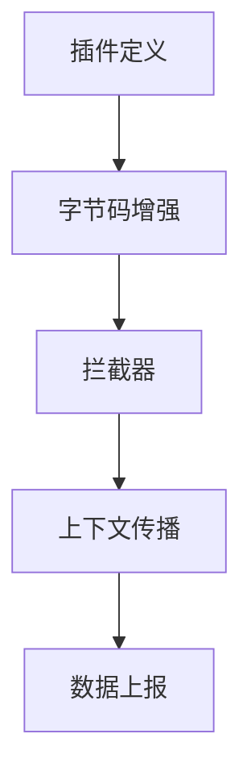

## 介绍

SkyWalking的插件系统是其可扩展性的核心，允许开发者通过编写插件来支持新的框架、数据库或其他组件。插件系统基于Java的SPI（Service Provider Interface）机制实现，通过动态字节码增强技术（如Byte Buddy或Javassist）在运行时修改目标类的行为，从而实现监控数据的采集。

## 插件系统架构

SkyWalking插件系统主要由以下组件构成：



1. **插件定义**：通过配置文件声明插件支持的类和方法。
2. **字节码增强**：在目标方法前后插入监控逻辑。
3. **拦截器**：处理增强后的逻辑，如生成Span、记录指标等。
4. **上下文传播**：跨线程/进程传递Trace信息。
5. **数据上报**：将监控数据发送至SkyWalking后端。

## 插件开发基础

### 1. 插件声明
每个插件需要在 `resources/META-INF/services/` 下提供SPI配置文件。例如，一个MySQL插件的声明文件：

```plaintext
# org.apache.skywalking.apm.plugin.jdbc.mysql.define.MySQLInstrumentation
```

### 2. 定义增强类
通过继承 `ClassInstanceMethodsEnhancePluginDefine` 来指定目标类和方法：

```java
public class MySQLInstrumentation extends ClassInstanceMethodsEnhancePluginDefine {
    @Override
    protected ClassMatch enhanceClass() {
        return byName("com.mysql.jdbc.ConnectionImpl");
    }

    @Override
    public ConstructorInterceptPoint[] getConstructorsInterceptPoints() {
        // ...
    }

    @Override
    public InstanceMethodsInterceptPoint[] getInstanceMethodsInterceptPoints() {
        return new InstanceMethodsInterceptPoint[] {
            new InstanceMethodsInterceptPoint() {
                @Override
                public ElementMatcher<MethodDescription> getMethodsMatcher() {
                    return named("prepareStatement");
                }
                // ...
            }
        };
    }
}
```

### 3. 实现拦截器
拦截器处理实际监控逻辑。以下是记录SQL执行时间的示例：

```java
public class PrepareStatementInterceptor implements InstanceMethodsAroundInterceptor {
    @Override
    public void beforeMethod(EnhancedInstance objInst, Method method, 
                           Object[] allArguments, Class<?>[] parameterTypes,
                           MethodInterceptResult result) {
        // 创建Span
        Span span = ContextManager.createLocalSpan("MySQL/PrepareStatement");
        span.setComponent(ComponentsDefine.MYSQL);
    }

    @Override
    public Object afterMethod(EnhancedInstance objInst, Method method,
                           Object[] allArguments, Class<?>[] parameterTypes,
                           Object ret) {
        // 结束Span
        ContextManager.stopSpan();
        return ret;
    }
}
```

## 实际案例：自定义Redis插件

假设我们需要监控一个Redis客户端库的`get`操作：

1. **定义增强目标**：
```java
protected ClassMatch enhanceClass() {
    return byName("com.example.redis.client.RedisClient");
}
```

2. **拦截关键方法**：
```java
public InstanceMethodsInterceptPoint[] getInstanceMethodsInterceptPoints() {
    return new InstanceMethodsInterceptPoint[] {
        new InstanceMethodsInterceptPoint() {
            @Override
            public ElementMatcher<MethodDescription> getMethodsMatcher() {
                return named("get");
            }
            @Override
            public String getMethodsInterceptor() {
                return "com.example.skywalking.redis.RedisGetInterceptor";
            }
        }
    };
}
```

3. **实现拦截器逻辑**：
```java
public class RedisGetInterceptor implements InstanceMethodsAroundInterceptor {
    @Override
    public void beforeMethod(...) {
        Span span = ContextManager.createExitSpan("Redis/GET", "redis://" + objInst.getRedisHost());
        Tags.DB_TYPE.set(span, "Redis");
    }

    @Override
    public Object afterMethod(...) {
        ContextManager.stopSpan();
        return ret;
    }
}
```

## 调试与测试

:::tip 插件调试技巧
1. 使用 `-Dskywalking.agent.is_open_debugging_class=true` 输出增强后的类
2. 通过 `plugins` 文件夹热加载插件（开发模式）
3. 检查 `logs/skywalking-api.log` 查看插件加载情况
:::

## 总结

SkyWalking插件系统通过：
- 基于SPI的插件发现机制
- 动态字节码增强技术
- 标准化的拦截器接口
实现了对各类组件的无缝监控支持。

## 扩展资源

1. [SkyWalking官方插件开发指南](https://skywalking.apache.org/docs/)
2. Byte Buddy官方文档（字节码操作库）
3. 实践练习：尝试为MongoDB客户端编写一个简单插件