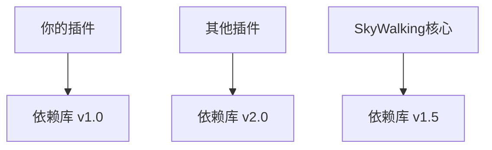

# SkyWalking 插件冲突解决

## 引言

在开发SkyWalking插件时，你可能会遇到各种冲突问题。这些冲突通常源于类加载机制、依赖版本不匹配或拦截点重复定义。本文将带你逐步理解这些冲突的成因，并通过实际案例演示解决方案。

## 插件冲突类型

### 1. 类加载冲突

SkyWalking使用独立的类加载器隔离每个插件的类。当插件尝试加载同一个类的不同版本时，就会发生冲突。

```java
// 示例：插件A和插件B都依赖了不同版本的Guava
Plugin A: guava-20.0.jar
Plugin B: guava-30.0.jar
```

:::warning
类加载冲突可能导致`NoSuchMethodError`或`ClassNotFoundException`
:::

### 2. 依赖冲突

当多个插件引入相同的依赖但版本不同时，可能引发运行时异常。



### 3. 拦截点冲突

多个插件尝试拦截同一个类方法时，可能产生不可预期的行为。

## 解决方案

### 类加载冲突解决

1. **使用插件依赖隔离**：
   ```xml
   <!-- pom.xml -->
   <dependency>
       <groupId>com.google.guava</groupId>
       <artifactId>guava</artifactId>
       <version>30.0-jre</version>
       <scope>provided</scope>
   </dependency>
   ```

2. **重命名冲突包**：
   ```xml
   <plugin>
       <groupId>org.apache.maven.plugins</groupId>
       <artifactId>maven-shade-plugin</artifactId>
       <executions>
           <execution>
               <phase>package</phase>
               <goals>
                   <goal>shade</goal>
               </goals>
               <configuration>
                   <relocations>
                       <relocation>
                           <pattern>com.google.common</pattern>
                           <shadedPattern>your.plugin.shaded.com.google.common</shadedPattern>
                       </relocation>
                   </relocations>
               </configuration>
           </execution>
       </executions>
   </plugin>
   ```

### 依赖冲突解决

1. **依赖排除**：
   ```xml
   <dependency>
       <groupId>org.example</groupId>
       <artifactId>example-library</artifactId>
       <exclusions>
           <exclusion>
               <groupId>com.fasterxml.jackson.core</groupId>
               <artifactId>jackson-databind</artifactId>
           </exclusion>
       </exclusions>
   </dependency>
   ```

2. **统一依赖版本**：
   ```xml
   <dependencyManagement>
       <dependencies>
           <dependency>
               <groupId>com.fasterxml.jackson.core</groupId>
               <artifactId>jackson-databind</artifactId>
               <version>2.12.3</version>
           </dependency>
       </dependencies>
   </dependencyManagement>
   ```

### 拦截点冲突解决

1. **检查现有插件**：
   ```bash
   # 查看已加载插件
   ls skywalking/agent/plugins/
   ```

2. **定义精确拦截点**：
   ```java
   public class MyInstrumentation extends ClassInstanceMethodsEnhancePluginDefine {
       @Override
       protected ClassMatch enhanceClass() {
           return byName("org.example.TargetClass");  // 精确匹配类名
       }
   }
   ```

## 实际案例

**案例：解决Dubbo插件与Spring Cloud插件冲突**

1. **问题现象**：
   - 同时启用dubbo和spring-cloud插件时，某些RPC调用未被正确追踪

2. **诊断步骤**：
   ```java
   // 检查插件加载顺序
   -Dskywalking.agent.is_cache_enhanced_class=true
   -Dskywalking.agent.class_cache_path=/tmp/classCache
   ```

3. **解决方案**：
   ```yaml
   # agent.config
   plugin.dubbo.enable=true
   plugin.springcloud.enable=true
   plugin.dubbo.priority=100  # 调整优先级
   ```

## 总结

解决SkyWalking插件冲突的关键步骤：

1. 识别冲突类型（类加载/依赖/拦截点）
2. 使用工具诊断（日志分析/类加载追踪）
3. 应用适当解决方案（隔离/排除/优先级调整）
4. 充分测试验证

## 扩展资源

- [SkyWalking官方插件开发指南](https://skywalking.apache.org/docs/)
- [Java类加载机制详解](https://docs.oracle.com/javase/specs/jvms/se16/html/jvms-5.html)
- [Maven依赖管理最佳实践](https://maven.apache.org/guides/introduction/introduction-to-dependency-mechanism.html)

## 练习

1. 创建一个简单的SkyWalking插件，故意引入Guava依赖冲突并解决它
2. 尝试拦截一个已被其他插件拦截的方法，观察行为并调整优先级
3. 使用maven-shade-plugin重命名一个常用库的包路径