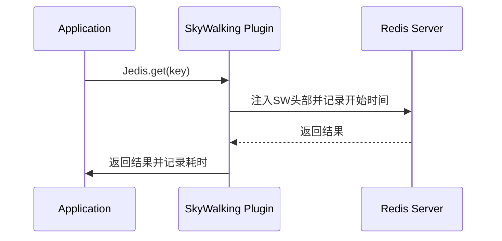

## 介绍

SkyWalking插件是扩展SkyWalking监控能力的关键组件，它们通过拦截目标框架/库的特定方法，自动采集分布式链路和指标数据。本文将介绍开发SkyWalking插件时的最佳实践，帮助初学者避免常见陷阱并提升代码质量。

:::note
SkyWalking插件基于Java Agent的字节码增强技术（Byte Buddy/ASM），无需修改目标应用代码即可实现监控。
:::

## 核心原则

### 1. 插件结构规范
每个插件应遵循标准目录结构：
```
your-plugin
├── src/main/java
│   └── org.apache.skywalking.apm.plugin
│       ├── YourPluginInstrumentation.java  // 定义拦截点
│       └── YourPluginInterceptor.java      // 实现拦截逻辑
└── src/main/resources
    └── skywalking-plugin.def               // 插件声明文件
```

### 2. 高效拦截点选择
优先拦截关键生命周期方法而非每个方法调用。例如对于HTTP客户端插件：

```java
public static class Instrumentation extends ClassInstanceMethodsEnhancePluginDefine {
    @Override protected ClassMatch enhanceClass() {
        return byName("org.apache.http.client.HttpClient"); 
    }
    
    @Override public ConstructorInterceptPoint[] getConstructorsInterceptPoints() {
        return null;
    }
    
    @Override public InstanceMethodsInterceptPoint[] getInstanceMethodsInterceptPoints() {
        return new InstanceMethodsInterceptPoint[] {
            new InstanceMethodsInterceptPoint() {
                @Override public ElementMatcher<MethodDescription> getMethodsMatcher() {
                    return named("execute"); // 只拦截核心execute方法
                }
            }
        };
    }
}
```

### 3. 上下文传播实践
使用`ContextManager`正确传播上下文：

```java
public class HttpClientInterceptor implements InstanceMethodsAroundInterceptor {
    @Override
    public void beforeMethod(EnhancedInstance objInst, Method method, 
                           Object[] allArguments, Class<?>[] argumentsTypes,
                           MethodInterceptResult result) {
        // 创建退出跨度的正确方式
        ContextCarrier carrier = new ContextCarrier();
        AbstractSpan span = ContextManager.createExitSpan(
            "HTTP/" + request.getURI().getPath(), 
            carrier,
            request.getURI().getHost()
        );
        
        // 注入头部
        request.setHeader(carrier.items());
    }
}
```

## 性能优化技巧

### 1. 减少内存分配
避免在拦截器中频繁创建对象：

```java
// 反模式 - 每次调用都创建新对象
String operationName = "HTTP/" + new URL(path).getPath();

// 正确做法 - 使用缓存
private final ConcurrentHashMap<String, String> nameCache = new ConcurrentHashMap<>();

String operationName = nameCache.computeIfAbsent(path, p -> "HTTP/" + p);
```

### 2. 选择性采样
对高流量服务实施采样：

```java
if (samplingRate > 0 && ThreadLocalRandom.current().nextDouble() < samplingRate) {
    ContextManager.createLocalSpan("operation");
} else {
    ContextManager.createNonSampledLocalSpan("operation");
}
```

## 调试与测试

### 1. 单元测试配置
使用`PluginTestFramework`进行测试：

```java
@RunWith(SkyWalkingTestRunner.class)
@SkyWalkingTestConfig("skywalking-plugin-test.yml")
public class HttpClientPluginTest {
    
    @Rule public AgentServiceRule rule = new AgentServiceRule();
    
    @Test public void testSimpleRequest() {
        HttpClient client = new DefaultHttpClient();
        // 执行测试断言...
    }
}
```

### 2. 日志调试
启用Agent调试日志：
```properties
# agent.config
logging.level=DEBUG
```

## 实际案例：Redis插件开发

以下是Redis Jedis客户端插件的关键实现片段：



对应拦截器实现：
```java
public class JedisInterceptor implements InstanceMethodsAroundInterceptor {
    @Override public void beforeMethod(...) {
        ContextCarrier carrier = new ContextCarrier();
        Span span = ContextManager.createExitSpan("Redis/" + method.getName(), 
                                               carrier, 
                                               remotePeer);
        // 对于无参数的Redis命令
        if (allArguments.length > 0) {
            span.tag("redis.params", Arrays.toString(allArguments));
        }
    }
    
    @Override public Object afterMethod(...) {
        if (throwable != null) {
            span.log(throwable);
        }
        ContextManager.stopSpan();
        return ret;
    }
}
```

## 总结与进阶

### 关键要点
- 保持插件轻量级，避免性能损耗
- 正确处理上下文传播和跨线程场景
- 为所有Span设置有意义的操作名称和标签
- 实现完善的错误处理

### 推荐练习
1. 为常用数据库驱动（如MySQL JDBC）开发简单插件
2. 实现一个支持采样率的插件配置
3. 使用`@Trace`注解手动增强特定方法

### 扩展资源
- [SkyWalking插件开发指南](https://skywalking.apache.org/docs/)
- [Byte Buddy官方文档](https://bytebuddy.net/)
- [OpenTelemetry语义约定](https://github.com/open-telemetry/semantic-conventions)