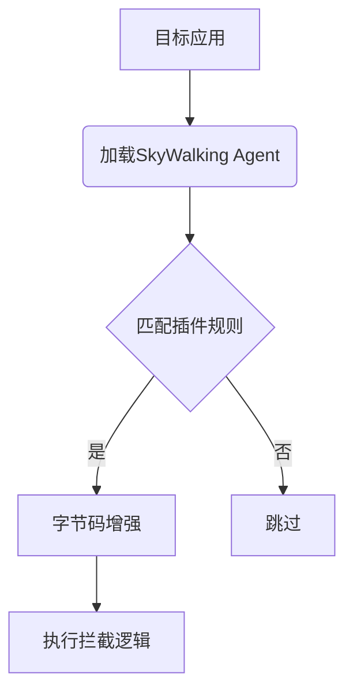

## 介绍

SkyWalking插件是扩展其监控能力的核心组件，允许开发者对特定框架或库进行链路追踪。本指南将带你了解插件开发全流程，并通过实际案例演示如何贡献代码到Apache SkyWalking开源项目。

:::tip 先决条件
- 熟悉Java基础
- 了解SkyWalking基本架构
- 已配置Java开发环境（JDK 8+）
:::

## 开发环境准备

### 1. 获取源代码
```bash
git clone https://github.com/apache/skywalking.git
cd skywalking
```

### 2. 项目结构说明
关键目录：
```
/apm-sniffer
  ├── apm-sdk-plugin/       # 插件开发目录
  ├── apm-agent-core/        # 核心拦截逻辑
  └── config/               # 插件配置文件
```

## 插件开发基础

### 插件工作原理
SkyWalking通过Java Agent机制，在运行时修改目标类的字节码实现监控。典型插件包含：
1. **Instrumentation**：定义要拦截的类和方法
2. **Interceptor**：实现具体监控逻辑



### 创建简单插件示例
以下是一个监控`DemoService`的插件实现：

**1. 定义Instrumentation**
```java
public class DemoInstrumentation extends ClassInstanceMethodsEnhancePluginDefine {
    @Override protected ClassMatch enhanceClass() {
        return byName("com.example.DemoService"); // 拦截指定类
    }

    @Override public ConstructorInterceptPoint[] getConstructorsInterceptPoints() {
        return new ConstructorInterceptPoint[0]; // 不拦截构造方法
    }

    @Override public InstanceMethodsInterceptPoint[] getInstanceMethodsInterceptPoints() {
        return new InstanceMethodsInterceptPoint[] {
            new InstanceMethodsInterceptPoint() {
                @Override public ElementMatcher<MethodDescription> getMethodsMatcher() {
                    return named("execute"); // 拦截execute方法
                }
                @Override public String getMethodsInterceptor() {
                    return "org.apache.skywalking.DemoInterceptor"; // 指定拦截器
                }
            }
        };
    }
}
```

**2. 实现Interceptor**
```java
public class DemoInterceptor implements InstanceMethodsAroundInterceptor {
    @Override
    public void beforeMethod(EnhancedInstance objInst, Method method, 
                           Object[] allArguments, Class<?>[] argumentsTypes,
                           MethodInterceptResult result) {
        // 方法执行前逻辑
        ContextManager.createLocalSpan("DemoService/execute");
    }

    @Override
    public Object afterMethod(EnhancedInstance objInst, Method method,
                             Object[] allArguments, Class<?>[] argumentsTypes,
                             Object ret) {
        // 方法执行后逻辑
        ContextManager.stopSpan();
        return ret;
    }

    @Override public void handleMethodException(...) {
        // 异常处理
    }
}
```

## 完整开发流程

### 1. 编写插件测试
每个插件必须包含集成测试：
```java
public class DemoPluginTest {
    @Test
    public void testInstrumentation() throws Exception {
        TomcatHelper helper = new TomcatHelper();
        helper.start("/your-webapp");
        
        // 验证追踪数据是否生成
        assertTrue(TraceHelper.verify("DemoService/execute"));
    }
}
```

### 2. 添加插件配置
在`/resources/META-INF/services/`目录下创建文件：
```
org.apache.skywalking.apm.agent.core.plugin.interceptor.enhance.InstanceMethodsAroundInterceptor
org.apache.skywalking.DemoInterceptor
```

### 3. 文档更新
修改对应框架的支持列表文档：
```markdown
| 框架 | 支持版本 | 插件开发者 |
|------|---------|------------|
| Demo | 1.x     | YourName   |
```

## 贡献流程

1. 在GitHub创建Issue描述插件计划
2. 开发完成后执行完整测试：
```bash
./mvnw clean test
```
3. 提交Pull Request并关联Issue
4. 根据社区反馈进行修改

:::caution 注意事项
- 确保不引入第三方依赖
- 遵循Apache License 2.0规范
- 代码覆盖率需达到80%以上
:::

## 真实案例：Redis插件开发

**需求场景**：监控Jedis客户端的命令执行耗时。关键实现步骤：

1. 拦截`redis.clients.jedis.Jedis`类
2. 捕获`get/set`等方法的执行
3. 将Redis命令作为span的operation name

```java
// 在Interceptor中捕获命令信息
String operationName = "Redis/" + method.getName();
if (allArguments.length > 0) {
    operationName += " " + allArguments[0];
}
ContextManager.createExitSpan(operationName, redisServerAddress);
```

## 总结与资源

### 关键要点
- 插件通过字节码增强实现无侵入监控
- 必须包含完整的测试用例
- 需要遵循社区贡献规范

### 扩展学习
- [Byte Buddy官方文档](https://bytebuddy.net)
- [Java Agent技术指南](https://www.baeldung.com/java-instrumentation)
- [SkyWalking插件设计规范](https://github.com/apache/skywalking/blob/master/docs/en/guides/Java-Plugin-Development-Guide.md)

### 练习建议
1. 尝试为简单的HTTP客户端开发插件
2. 在本地验证插件是否影响目标应用性能
3. 学习使用SkyWalking测试框架编写集成测试