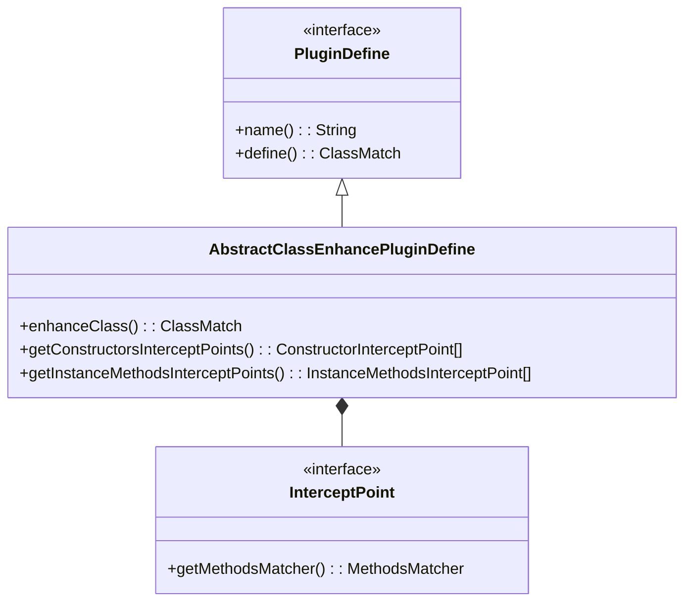
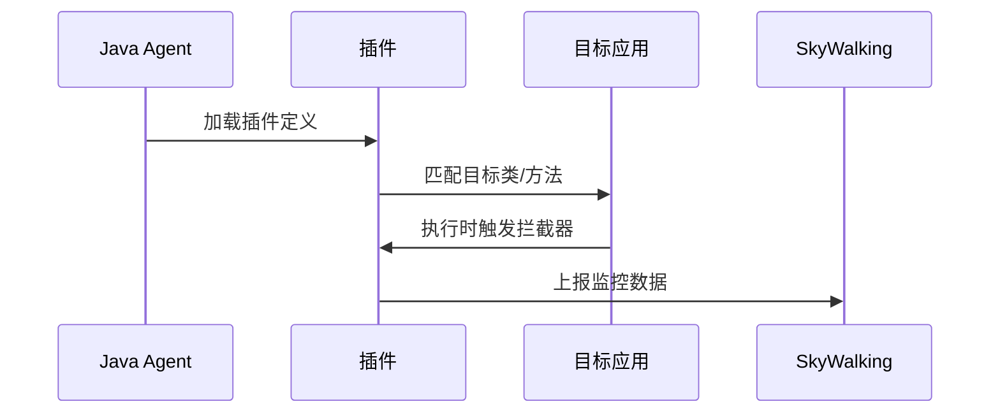

# SkyWalking 插件基础结构

## 介绍

SkyWalking插件是扩展SkyWalking监控能力的核心组件，它们通过字节码增强技术（如Java Agent）或服务网格集成实现对各类框架、协议的观测支持。插件开发需要理解其基础结构，包括定义方式、拦截机制和上下文传播原理。

## 插件核心组成

一个标准的SkyWalking插件由以下关键部分组成：



### 1. 插件定义类

每个插件必须实现 `PluginDefine` 接口或继承 `AbstractClassEnhancePluginDefine` 抽象类。基础结构示例：

```java
public class MyPlugin extends AbstractClassEnhancePluginDefine {
    @Override
    protected ClassMatch enhanceClass() {
        return byName("com.example.TargetClass");
    }

    @Override
    public ConstructorInterceptPoint[] getConstructorsInterceptPoints() {
        return new ConstructorInterceptPoint[0];
    }

    @Override
    public InstanceMethodsInterceptPoint[] getInstanceMethodsInterceptPoints() {
        return new InstanceMethodsInterceptPoint[]{
            new InstanceMethodsInterceptPoint() {
                @Override
                public ElementMatcher<MethodDescription> getMethodsMatcher() {
                    return named("targetMethod");
                }
                // 其他必要方法实现...
            }
        };
    }
}
```

:::note
插件类必须声明在 `skywalking-plugin.def` 文件中才能被加载：
```
my_plugin=com.mycompany.MyPlugin
```
:::

### 2. 拦截点(InterceptPoint)

定义需要增强的具体方法，包含三种类型：
- **构造方法拦截点**：ConstructorInterceptPoint
- **实例方法拦截点**：InstanceMethodsInterceptPoint
- **静态方法拦截点**：StaticMethodsInterceptPoint

### 3. 拦截器(Interceptor)

实际执行增强逻辑的类，典型结构：

```java
public class MyInterceptor implements InstanceMethodsAroundInterceptor {
    @Override
    public void beforeMethod(EnhancedInstance objInst, Method method, 
                           Object[] allArguments, Class<?>[] argumentsTypes,
                           MethodInterceptResult result) {
        // 前置处理逻辑
    }

    @Override
    public Object afterMethod(EnhancedInstance objInst, Method method,
                            Object[] allArguments, Class<?>[] argumentsTypes,
                            Object ret) {
        // 后置处理逻辑
        return ret;
    }

    @Override
    public void handleMethodException(EnhancedInstance objInst, Method method,
                                    Object[] allArguments, Class<?>[] argumentsTypes,
                                    Throwable t) {
        // 异常处理
    }
}
```

## 工作原理

SkyWalking插件通过以下流程工作：



## 实际案例：HTTP客户端插件

以开发一个简单的HTTP客户端插件为例：

1. **定义目标方法拦截**：
```java
public class HttpClientPlugin extends AbstractClassEnhancePluginDefine {
    @Override
    protected ClassMatch enhanceClass() {
        return byName("org.apache.http.client.HttpClient");
    }

    @Override
    public InstanceMethodsInterceptPoint[] getInstanceMethodsInterceptPoints() {
        return new InstanceMethodsInterceptPoint[]{
            new InstanceMethodsInterceptPoint() {
                @Override
                public ElementMatcher<MethodDescription> getMethodsMatcher() {
                    return named("execute");
                }
                @Override
                public String getMethodsInterceptor() {
                    return "com.my.HttpClientInterceptor";
                }
                // 其他配置...
            }
        };
    }
}
```

2. **实现拦截器逻辑**：
```java
public class HttpClientInterceptor implements InstanceMethodsAroundInterceptor {
    @Override
    public void beforeMethod(EnhancedInstance objInst, Method method,
                           Object[] allArguments, Class<?>[] argumentsTypes,
                           MethodInterceptResult result) {
        HttpRequest request = (HttpRequest)allArguments[0];
        ContextManager.createLocalSpan("HTTP/" + request.getMethod());
    }

    @Override
    public Object afterMethod(EnhancedInstance objInst, Method method,
                            Object[] allArguments, Class<?>[] argumentsTypes,
                            Object ret) {
        HttpResponse response = (HttpResponse)ret;
        AbstractSpan span = ContextManager.activeSpan();
        span.tag("status", String.valueOf(response.getStatus()));
        ContextManager.stopSpan();
        return ret;
    }
}
```

:::tip 最佳实践
- 使用 `@Override` 确保正确实现接口方法
- 在拦截器中做好null检查
- 避免在拦截器中执行耗时操作
:::

## 上下文传播

SkyWalking通过 `ContextManager` 实现跨线程的上下文传播：

```java
// 在拦截器中获取当前上下文
AbstractSpan span = ContextManager.activeSpan();

// 跨线程传播
Runnable task = ContextManager.capture(() -> {
    // 异步任务代码
});
new Thread(task).start();
```

## 总结

SkyWalking插件基础结构核心要点：
1. 通过继承 `AbstractClassEnhancePluginDefine` 定义插件
2. 使用拦截点精确定位需要增强的方法
3. 拦截器实现具体监控逻辑
4. 通过 `ContextManager` 管理追踪上下文

## 扩展学习

推荐练习：
1. 尝试为常见数据库驱动开发简单插件
2. 实现一个方法执行时间统计的拦截器
3. 研究如何在不同线程间传递上下文

官方资源：
- [SkyWalking插件开发指南](https://skywalking.apache.org/docs/)
- [ByteBuddy文档](https://bytebuddy.net/) (SkyWalking使用的字节码增强库)