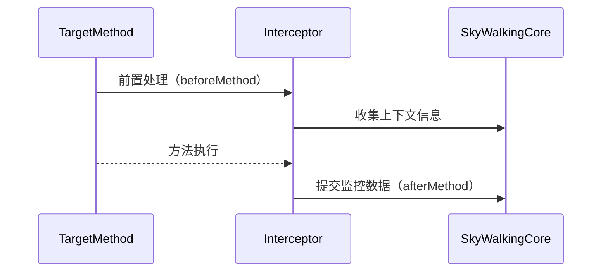

# SkyWalking 拦截器开发

## 介绍

SkyWalking拦截器（Interceptor）是插件开发中的核心组件，用于在目标方法执行前后插入自定义逻辑，实现监控数据的采集、修改或过滤。拦截器通常用于跟踪方法调用、记录参数或耗时，是扩展SkyWalking功能的关键手段。

## 拦截器基础

### 拦截器工作原理
SkyWalking通过字节码增强技术（如Java Agent）在运行时动态修改目标类，插入拦截器代码。拦截器遵循以下流程：



### 核心接口
Java插件中最常用的拦截器接口是 `InstanceMethodsAroundInterceptor` 和 `StaticMethodsAroundInterceptor`：
- `beforeMethod`: 方法执行前调用
- `afterMethod`: 方法执行后调用
- `handleMethodException`: 异常处理

## 开发步骤

### 1. 创建拦截器类
```java
public class MyInterceptor implements InstanceMethodsAroundInterceptor {
    @Override
    public void beforeMethod(EnhancedInstance objInst, Method method, 
                           Object[] allArguments, Class<?>[] argumentsTypes,
                           MethodInterceptResult result) {
        // 前置处理逻辑
        ContextManager.createLocalSpan("my_operation");
    }

    @Override
    public Object afterMethod(EnhancedInstance objInst, Method method,
                            Object[] allArguments, Class<?>[] argumentsTypes,
                            Object ret) {
        // 后置处理逻辑
        AbstractSpan span = ContextManager.activeSpan();
        span.tag("result", ret.toString());
        ContextManager.stopSpan();
        return ret;
    }

    @Override
    public void handleMethodException(EnhancedInstance objInst, Method method,
                                    Object[] allArguments, Class<?>[] argumentsTypes,
                                    Throwable t) {
        // 异常处理
        AbstractSpan span = ContextManager.activeSpan();
        span.log(t);
        span.errorOccurred();
    }
}
```

### 2. 注册拦截器
在插件定义类中关联目标方法与拦截器：
```java
public class MyPlugin extends AbstractClassEnhancePluginDefine {
    @Override
    protected ClassMatch enhanceClass() {
        return byName("com.example.TargetClass");
    }

    @Override
    public ConstructorInterceptPoint[] getConstructorsInterceptPoints() {
        return null;
    }

    @Override
    public InstanceMethodsInterceptPoint[] getInstanceMethodsInterceptPoints() {
        return new InstanceMethodsInterceptPoint[]{
            new InstanceMethodsInterceptPoint() {
                @Override
                public ElementMatcher<MethodDescription> getMethodsMatcher() {
                    return named("targetMethod");
                }

                @Override
                public String getMethodsInterceptor() {
                    return "org.example.MyInterceptor";
                }
            }
        };
    }
}
```

## 实际案例：数据库调用监控

### 场景需求
监控JDBC `PreparedStatement.execute()` 方法的执行耗时和SQL语句。

### 实现代码
```java
public class JdbcInterceptor implements InstanceMethodsAroundInterceptor {
    @Override
    public void beforeMethod(EnhancedInstance objInst, Method method,
                           Object[] allArguments, Class<?>[] argumentsTypes,
                           MethodInterceptResult result) {
        Span span = ContextManager.createLocalSpan("DB/PreparedStatement");
        span.setComponent(ComponentsDefine.JDBC);
        
        if (objInst instanceof PreparedStatementCacheGetter) {
            String sql = ((PreparedStatementCacheGetter)objInst).getPS();
            span.tag(Tags.DB_STATEMENT, sql);
        }
    }

    @Override
    public Object afterMethod(EnhancedInstance objInst, Method method,
                            Object[] allArguments, Class<?>[] argumentsTypes,
                            Object ret) {
        ContextManager.stopSpan();
        return ret;
    }
}
```

:::tip 最佳实践
1. 在 `beforeMethod` 中尽量只做必要操作，避免性能开销
2. 使用 `ContextManager.activeSpan()` 获取当前Span避免创建新实例
3. 异常处理中记录堆栈但不要吞没异常
:::

## 调试与测试

### 单元测试示例
```java
public class MyInterceptorTest {
    @Test
    public void testInterceptor() {
        MyInterceptor interceptor = new MyInterceptor();
        EnhancedInstance instance = new EnhancedInstance() { /*...*/ };
        
        // 测试前置处理
        interceptor.beforeMethod(instance, null, null, null, null);
        assertNotNull(ContextManager.activeSpan());
        
        // 测试后置处理
        interceptor.afterMethod(instance, null, null, null, "result");
        assertNull(ContextManager.activeSpan());
    }
}
```

## 总结

SkyWalking拦截器开发需要理解：
- 字节码增强基本原理
- SkyWalking上下文管理机制
- 监控数据的采集和上报流程

通过合理使用拦截器，可以实现：
✓ 自定义监控指标采集
✓ 业务方法链路追踪
✓ 异常行为监控

## 扩展学习

1. 阅读SkyWalking官方插件源码（如dubbo、httpclient插件）
2. 尝试为常用框架（如Spring RestTemplate）开发拦截器
3. 学习使用SkyWalking注解方式开发插件（@Trace等）

:::warning 注意事项
1. 拦截器类必须实现对应接口的全部方法
2. 确保线程安全，避免使用实例变量
3. 注意类加载器隔离问题
:::