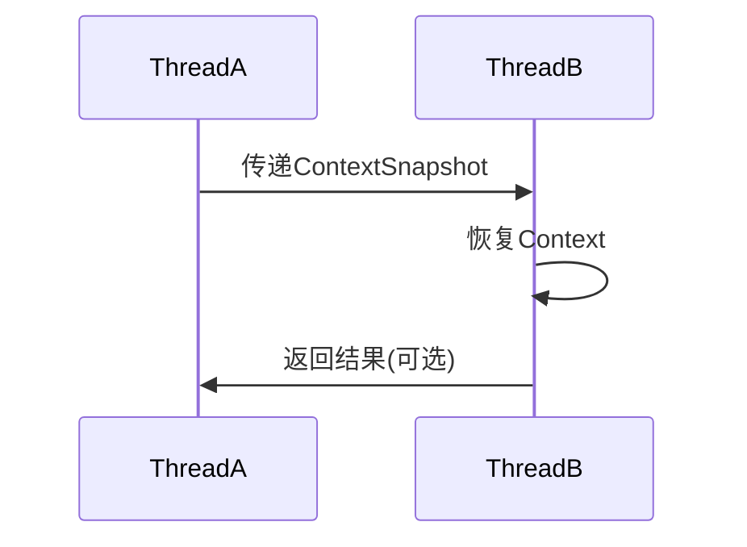

## 介绍

在分布式系统中，跨线程追踪是确保调用链完整性的关键技术。SkyWalking通过`TraceContext`的传播机制，能够在异步或多线程场景下保持追踪上下文的一致性。本文将介绍如何通过SkyWalking插件实现跨线程追踪，包括核心API的使用和实际案例演示。

---

## 核心概念

### 1. TraceContext传播
SkyWalking的`ContextManager`负责管理当前线程的`TraceContext`。跨线程时需要手动传递以下关键对象：
- **TraceContext**: 包含TraceID、SpanID等链路标识
- **ContextSnapshot**: 上下文快照，用于跨线程恢复

### 2. 跨线程模式


---

## 实现步骤

### 步骤1：创建上下文快照
在父线程中捕获当前上下文：
```java
// 在原始线程中
ContextSnapshot snapshot = ContextManager.capture();
```

### 步骤2：跨线程恢复
在子线程中恢复上下文：
```java
// 在新线程中
Runnable task = () -> {
    ContextManager.continued(snapshot);
    // 业务逻辑
    Span span = ContextManager.createLocalSpan("async-task");
    try {
        // 执行操作...
    } finally {
        span.end();
    }
};
new Thread(task).start();
```

:::tip 最佳实践
使用`try-finally`确保Span正确关闭，避免上下文泄漏。
:::

---

## 实际案例

### 线程池场景实现
```java
ExecutorService executor = Executors.newFixedThreadPool(5);

// 提交任务时传递上下文
Future<?> future = executor.submit(() -> {
    ContextManager.continued(snapshot);
    Span span = ContextManager.createLocalSpan("pooled-task");
    try {
        // 数据库操作示例
        return queryDatabase();
    } finally {
        span.end();
    }
});
```

### 异步框架集成（以CompletableFuture为例）
```java
ContextSnapshot snapshot = ContextManager.capture();

CompletableFuture.supplyAsync(() -> {
    ContextManager.continued(snapshot);
    Span span = ContextManager.createLocalSpan("async-supply");
    try {
        return processData();
    } finally {
        span.end();
    }
}).thenAccept(result -> {
    // 后续处理仍保持上下文
});
```

---

## 常见问题排查

### 上下文丢失场景
1. **未正确传递Snapshot**：检查是否在所有线程切换点都调用了`continued()`
2. **线程池复用污染**：确保每次任务执行前都重新恢复上下文
3. **框架兼容性问题**：某些异步框架可能需要特殊适配器

:::caution 警告
不要在多线程间共享`ActiveSpan`对象，这会导致追踪数据混乱！
:::

---

## 总结

跨线程追踪的实现关键在于：
1. 使用`ContextManager.capture()`捕获当前上下文
2. 通过`continued()`在新线程恢复上下文
3. 保证每个异步操作的Span正确关闭

---

## 扩展练习
1. 尝试在Spring的`@Async`方法中实现上下文传递
2. 观察线程池中不传递Snapshot时的链路断裂现象
3. 比较不同线程池实现（ForkJoinPool vs FixedThreadPool）的追踪差异

## 延伸阅读
- SkyWalking官方文档：Context Propagation机制
- OpenTracing跨线程规范
- Java并发编程中的ThreadLocal原理