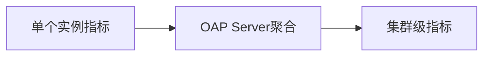

# SkyWalking 自定义指标收集

## 介绍

SkyWalking是一个开源的APM（应用性能监控）系统，支持通过插件机制扩展其监控能力。自定义指标收集允许开发者根据业务需求，采集特定的性能数据或业务指标（如订单处理延迟、缓存命中率等）。本文将指导你从零开始实现一个自定义指标收集插件。

:::note 核心概念
- **指标（Metric）**: 数值型监控数据（如请求量、错误率）。
- **插件（Plugin）**: 通过Java Agent或SDK扩展SkyWalking功能的模块。
- **上下文（Context）**: 指标采集时的环境信息（如服务名称、实例ID）。
:::

---

## 基础实现步骤

### 1. 创建插件项目结构

```plaintext
my-metrics-plugin/
├── pom.xml
└── src/
    └── main/
        ├── resources/
        │   └── skywalking-plugin.def
        └── java/
            └── org/
                └── my/
                    └── plugin/
                        └── CustomMetricPlugin.java
```

### 2. 定义插件（skywalking-plugin.def）

```properties
custom-metric=org.my.plugin.CustomMetricPlugin
```

### 3. 实现插件类

```java
package org.my.plugin;

import org.apache.skywalking.apm.agent.core.meter.MeterFactory;
import org.apache.skywalking.apm.agent.core.plugin.interceptor.enhance.InstanceMethodsAroundInterceptor;

public class CustomMetricPlugin implements InstanceMethodsAroundInterceptor {
    @Override
    public void beforeMethod(EnhancedInstance objInst, Method method, 
                           Object[] allArguments, Class<?>[] argumentsTypes) {
        // 创建指标（示例：计数器）
        MeterFactory.counter("my_metric")
                   .tag("service", "order-service")
                   .build()
                   .increment();
    }
}
```

---

## 实际案例：订单处理延迟监控

### 场景描述
监控电商系统中订单创建方法的执行耗时，当延迟超过500ms时触发告警。

### 代码实现

```java
public class OrderMonitorPlugin implements InstanceMethodsAroundInterceptor {
    private static final HistogramMetric HISTOGRAM = MeterFactory.histogram("order_process_time")
        .tag("unit", "ms")
        .steps(100, 500, 1000)  // 定义统计区间
        .build();

    @Override
    public Object afterMethod(EnhancedInstance objInst, Method method,
                            Object[] allArguments, Object ret, long cost) {
        HISTOGRAM.addValue(cost);  // 记录耗时
        return ret;
    }
}
```

### 输出效果
在SkyWalking UI中将看到：
```plaintext
order_process_time
  - P99: 320ms
  - 超时率(>500ms): 2.3%
```

---

## 高级配置

### 动态标签
通过上下文添加动态标签：
```java
counter.tag("user_id", ContextManager.getUserId()).increment();
```

### 指标聚合
使用```mermaid


---

## 常见问题

:::warning 注意事项
1. 指标名称需全局唯一
2. 避免高频指标（>1万次/分钟）
3. 标签值不宜过多（防止基数爆炸）
:::

---

## 总结与练习

### 关键点回顾
- 通过实现```InstanceMethodsAroundInterceptor```接口创建插件
- 使用```MeterFactory```创建计数器/直方图等指标
- 合理使用标签维度

### 扩展练习
1. 尝试监控一个Spring Controller的QPS
2. 实现当错误率超过5%时自动发送HTTP通知

### 附加资源
- [SkyWalking官方插件开发指南](https://skywalking.apache.org/docs/)
- [OpenTelemetry指标规范](https://opentelemetry.io/docs/concepts/metrics/)