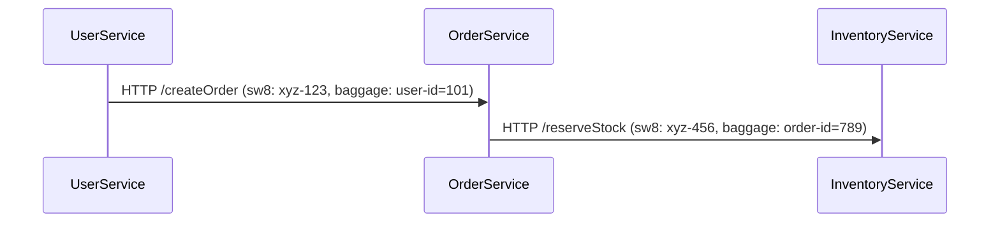

# SkyWalking 上下文传播

## 介绍

在分布式系统中，**上下文传播（Context Propagation）**是追踪请求跨服务边界传递的关键机制。SkyWalking通过上下文传播将**TraceID**、**SpanID**、** baggage**（自定义元数据）等信息在服务间传递，确保分布式事务的完整追踪。

:::tip 核心概念
- **TraceID**：唯一标识一个分布式请求链。
- **SpanID**：标识请求链中的单个操作（如HTTP调用）。
- **Baggage**：可跨服务传递的自定义键值对（如用户ID）。
:::

## 传播机制

SkyWalking支持以下传播协议：
1. **HTTP Headers**（默认）
2. **gRPC Metadata**
3. **MQ Headers**（如Kafka、RocketMQ）

### HTTP传播示例
当服务A调用服务B时，SkyWalking自动注入以下Header：
```http
sw8: [TraceID]-[ParentSpanID]-[ServiceInstance]
sw8-correlation: [key1=value1,key2=value2]
```

## 代码示例

### 手动传播上下文（Java Agent场景）
```java
import org.apache.skywalking.apm.toolkit.trace.TraceContext;

// 获取当前TraceID
String traceId = TraceContext.traceId();

// 添加Baggage（跨服务传递）
TraceContext.putCorrelation("user-id", "12345");
```

### 跨服务读取Baggage
```java
String userId = TraceContext.getCorrelation("user-id");
// 返回: "12345"
```

## 实际案例

### 场景：电商订单流程
1. 用户服务 → 订单服务（传递`user-id`）
2. 订单服务 → 库存服务（传递`order-id`）
3. 库存服务 → 支付服务



## 调试技巧

:::caution 常见问题
- **Header丢失**：确保网络代理不会过滤`sw8*`头。
- **版本兼容**：Agent与OAP Server版本需匹配。
:::

使用以下命令测试Header传播：
```bash
curl -H "sw8: 1-TestTraceID-0-0-0" http://your-service/api
```

## 总结

| 关键点                | 说明                          |
|-----------------------|-----------------------------|
| 自动传播             | Agent自动处理HTTP/gRPC上下文 |
| 手动干预             | 通过`TraceContext`API操作    |
| 可视化依赖           | 在SkyWalking UI查看完整链路  |

## 扩展练习
1. 尝试在Python服务中通过`sw8`头手动传递TraceID。
2. 使用SkyWalking UI检查Baggage是否跨服务显示。
