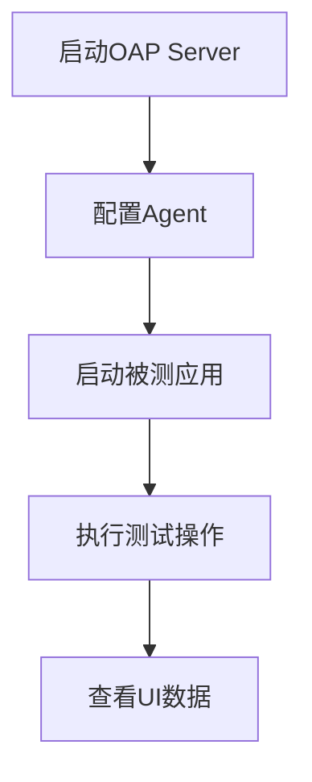

## 介绍

SkyWalking插件开发完成后，测试是确保其功能正确性和稳定性的关键步骤。本章将介绍三种主要的测试方法：**单元测试**、**集成测试**和**真实场景验证**，帮助初学者掌握完整的插件测试流程。

:::tip
测试的核心目标是验证插件能否正确拦截目标方法并生成预期的追踪数据。
:::

---

## 单元测试

单元测试用于验证插件的**核心拦截逻辑**。SkyWalking提供了`@PluginTest`注解和`PluginTestVerifier`工具类来简化测试。

### 示例：测试JDBC插件的Statement拦截

```java
@PluginTest(JdbcStatementInstrumentation.class)
public class JdbcStatementPluginTest {

    @Test
    public void testStatementExecute() throws Exception {
        // 1. 创建测试类实例
        Statement statement = mock(Statement.class);
        
        // 2. 模拟方法调用
        PluginTestVerifier verifier = PluginTestVerifier.INSTANCE;
        verifier.testMethod(statement, "execute", "SELECT * FROM users");
        
        // 3. 验证生成的Span
        verifier.verifySpan(span -> 
            span.getOperationName().equals("JDBI/Statement/execute") &&
            span.getTags().containsKey("sql"));
    }
}
```

**关键验证点**：
- 是否生成正确命名的Span（如`JDBI/Statement/execute`）
- SQL语句是否被正确捕获为Tag
- 耗时计算是否准确

---

## 集成测试

集成测试验证插件在**完整SkyWalking环境**中的行为，需要启动OAPServer和Agent。

### 测试步骤
1. 使用`SkyWalkingAgentTestRunner`启动测试环境
2. 执行目标应用程序代码
3. 通过OAP API验证追踪数据

```java
public class JdbcPluginIT {
    @Test
    public void testJdbcTracing() throws Exception {
        // 1. 启动测试环境
        SkyWalkingAgentTestRunner runner = new SkyWalkingAgentTestRunner();
        runner.start();
        
        // 2. 执行测试代码
        try (Connection connection = DriverManager.getConnection(url)) {
            Statement stmt = connection.createStatement();
            stmt.execute("SELECT 1");
        }
        
        // 3. 验证数据
        List<Trace> traces = runner.getOAPClient().getTraces();
        assertThat(traces).anyMatch(t -> 
            t.getSpans().stream().anyMatch(s ->
                s.getOperationName().equals("JDBI/Statement/execute")));
    }
}
```

---

## 真实场景验证

在本地开发环境中通过**实际应用**验证插件：

### 验证流程


1. 修改`agent.config`启用插件：
```properties
plugin.jdbc.trace_sql_parameters=true
```

2. 通过SkyWalking UI检查：
- 拓扑图中是否出现新节点
- 追踪详情是否包含预期Span
- 指标数据是否正确统计

:::caution
真实场景测试时，建议先在小流量环境验证，避免错误插件影响生产系统。
:::

---

## 实际案例：Redis插件测试

假设我们开发了一个Redis Lettuce客户端插件：

1. **单元测试**验证命令拦截：
```java
verifier.testMethod(redisClient, "get", "user:1");
verifier.verifySpan(span -> 
    span.getOperationName().equals("Redis/Lettuce/get"));
```

2. **集成测试**验证完整链路：
```java
// 执行Redis操作
redisClient.set("key", "value");
String result = redisClient.get("key");

// 验证
assertThat(getTraces()).haveAtLeastOne(
    span("Redis/Lettuce/set").followedBy(
    span("Redis/Lettuce/get")));
```

3. **真实验证**通过本地Redis实例和SkyWalking Docker环境测试。

---

## 总结

| 测试类型       | 适用阶段       | 验证目标                  | 工具类               |
|----------------|----------------|---------------------------|----------------------|
| 单元测试       | 开发早期       | 核心拦截逻辑              | `PluginTestVerifier` |
| 集成测试       | 功能完成后     | 与SkyWalking的集成        | `SkyWalkingAgentTestRunner` |
| 真实场景验证   | 发布前         | 生产环境兼容性            | SkyWalking Docker    |

**推荐练习**：
1. 为示例插件添加异常场景测试
2. 尝试在Spring Boot应用中测试自定义插件
3. 对比不同版本插件的性能影响

---

## 扩展资源
- [SkyWalking插件开发指南](https://skywalking.apache.org/docs/)
- [Java Agent调试技巧](https://skywalking.apache.org/blog/2021-04-19-debug-java-agent/)
- [测试框架源码](https://github.com/apache/skywalking-java/tree/main/test-plugin)