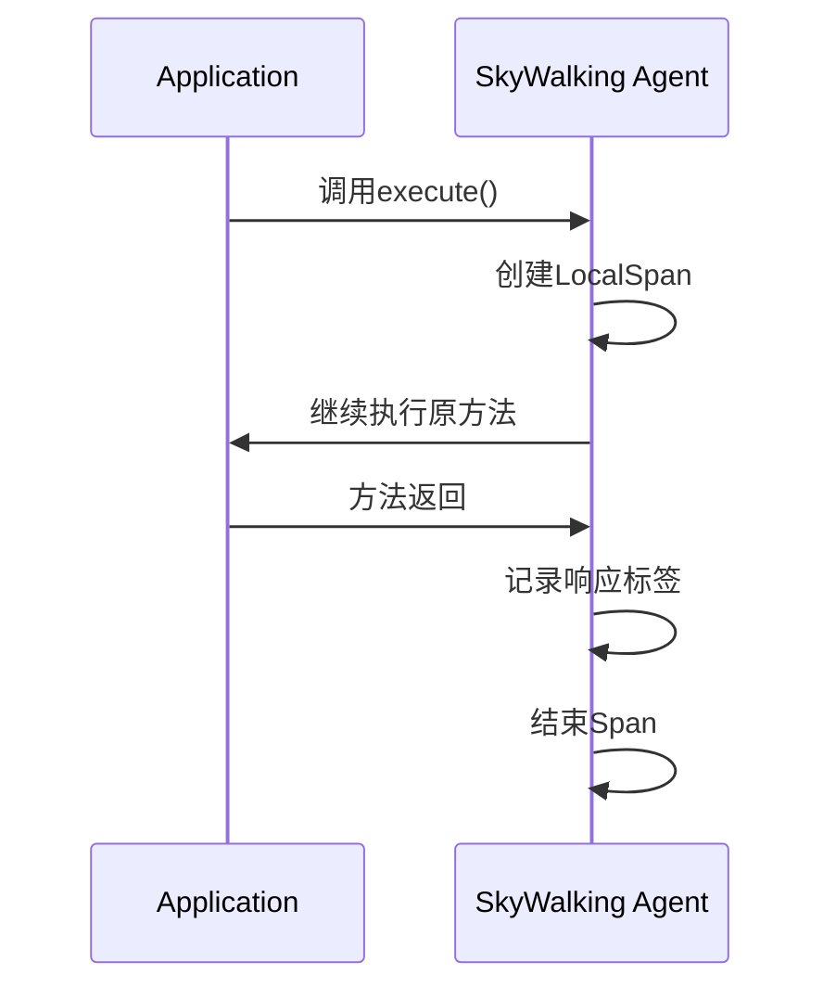

## 介绍

SkyWalking插件机制允许开发者通过编写自定义插件来扩展其监控能力。当SkyWalking官方未提供对某组件的支持时（如内部框架或小众技术栈），自定义插件便能填补这一空白。插件通过拦截目标组件的关键操作（如方法调用、请求发送）来收集遥测数据。

:::note 核心概念
- **插件类型**：分为引导类插件（Bootstrap Class Plugin）和普通插件
- **插桩点**：在目标组件的特定位置插入监控逻辑
- **上下文传播**：跨进程/线程的TraceID传递
:::

## 插件开发基础

### 1. 项目结构

典型的插件项目结构如下：

```
my-plugin/
├── src/main/java/
│   └── org.apache.skywalking.apm.plugin/
│       └── myplugin/
│           ├── MyPluginInstrumentation.java
│           ├── MyInterceptor.java
│           └── ... 
├── pom.xml
└── skywalking-plugin.def
```

### 2. 核心文件说明

**skywalking-plugin.def**（插件声明文件）：
```properties
myplugin=org.apache.skywalking.apm.plugin.myplugin.MyPluginInstrumentation
```

**pom.xml** 关键依赖：
```xml
<dependency>
    <groupId>org.apache.skywalking</groupId>
    <artifactId>apm-agent-core</artifactId>
    <version>${skywalking.version}</version>
    <scope>provided</scope>
</dependency>
```

## 开发实战：HTTP客户端插件

### 案例：监控自定义HTTP客户端

假设我们需要监控一个内部HTTP客户端 `MyHttpClient` 的请求：

```java
// 目标类示例
public class MyHttpClient {
    public Response execute(Request request) {
        // 实际HTTP请求逻辑
    }
}
```

#### 步骤1：创建插桩类

```java
public class HttpClientInstrumentation extends ClassInstanceMethodsEnhancePluginDefine {
    
    @Override
    protected ClassMatch enhanceClass() {
        return byName("com.company.MyHttpClient");
    }

    @Override
    public ConstructorInterceptPoint[] getConstructorsInterceptPoints() {
        return null;
    }

    @Override
    public InstanceMethodsInterceptPoint[] getInstanceMethodsInterceptPoints() {
        return new InstanceMethodsInterceptPoint[] {
            new InstanceMethodsInterceptPoint() {
                @Override
                public ElementMatcher<MethodDescription> getMethodsMatcher() {
                    return named("execute");
                }

                @Override
                public String getMethodsInterceptor() {
                    return "org.apache.skywalking.apm.plugin.myplugin.HttpClientInterceptor";
                }
            }
        };
    }
}
```

#### 步骤2：实现拦截器

```java
public class HttpClientInterceptor implements InstanceMethodsAroundInterceptor {
    
    @Override
    public void beforeMethod(EnhancedInstance objInst, Method method, 
                           Object[] allArguments, Class<?>[] argumentsTypes,
                           MethodInterceptResult result) {
        // 1. 创建Span
        ContextManager.createLocalSpan("MyHttpClient/execute");
        
        // 2. 从请求中提取URL作为操作名
        Request request = (Request)allArguments[0];
        ContextManager.activeSpan().tag("url", request.getUrl());
    }

    @Override
    public Object afterMethod(EnhancedInstance objInst, Method method,
                            Object[] allArguments, Class<?>[] argumentsTypes,
                            Object ret) {
        // 3. 记录响应状态
        Response response = (Response)ret;
        ContextManager.activeSpan().tag("status", response.getStatus());
        
        // 4. 结束Span
        ContextManager.stopSpan();
        return ret;
    }

    @Override
    public void handleMethodException(...) {
        // 异常处理
        ContextManager.activeSpan().log(e);
    }
}
```

### 测试验证

部署插件后，调用 `MyHttpClient` 的监控效果：



## 高级主题

### 上下文传播

跨线程场景示例：

```java
// 在父线程保存上下文
ContextSnapshot snapshot = ContextManager.capture();

// 在子线程恢复上下文
Runnable task = () -> {
    ContextManager.continued(snapshot);
    try {
        // 监控逻辑
    } finally {
        ContextManager.stopSpan();
    }
};
```

### 插件配置

通过 `apm-agent.config` 添加配置：

```properties
plugin.myplugin.enabled=true
plugin.myplugin.sample_rate=0.5
```

在插件中读取配置：

```java
@Config("plugin.myplugin.sample_rate")
public static double SAMPLE_RATE;
```

## 最佳实践

:::tip 插件开发建议
1. **精确匹配**：使用全限定类名而非模糊匹配
2. **轻量拦截**：避免在拦截器中执行耗时操作
3. **异常处理**：确保所有路径都会结束Span
4. **版本兼容**：考虑目标组件的不同版本
:::

## 总结

通过自定义插件，你可以：
- 监控任何Java组件
- 收集业务特定指标
- 扩展SkyWalking的生态系统

## 扩展练习

1. 为数据库连接池实现一个插件，监控连接获取时间
2. 尝试在拦截器中添加自定义业务标签
3. 研究如何跨进程传播上下文（如通过Kafka消息头）

## 更多资源

- [SkyWalking 插件开发指南](https://skywalking.apache.org/docs/)
- [ByteBuddy 文档](https://bytebuddy.net/)（SkyWalking使用的字节码增强工具）
- [OpenTelemetry 语义约定](https://github.com/open-telemetry/semantic-conventions)（标签命名参考）