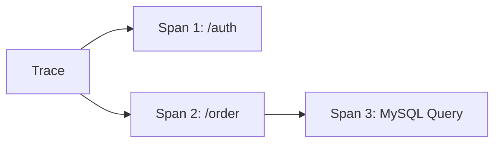

# SkyWalking 协议概述

## 引言

SkyWalking是一个开源的**应用性能监控（APM）**和**分布式追踪系统**，其核心功能依赖于高效的协议设计。协议定义了数据如何被收集、传输和存储，是不同组件间通信的桥梁。本章将介绍SkyWalking协议的核心概念、数据格式及典型应用场景。

---

## 协议基础

SkyWalking协议主要分为两类：
1. **探针协议**：用于Agent与后端（OAP Server）之间的通信。
2. **跨服务协议**：支持服务间上下文传递（如HTTP头注入）。

### 1. 探针协议（Agent Protocol）
Agent通过gRPC或HTTP协议将监控数据上报至OAP Server，数据格式通常为JSON或Protocol Buffers（高效二进制格式）。

#### 示例：Span数据上报
```json
{
  "traceId": "a1b2c3d4",
  "service": "order-service",
  "operation": "/createOrder",
  "startTime": 1620000000000,
  "duration": 200,
  "tags": {
    "http.method": "POST",
    "http.status": 200
  }
}
```

### 2. 跨服务协议（Context Propagation）
通过HTTP头或RPC框架传递追踪上下文，例如：
```plaintext
sw8: 1-a1b2c3d4-e5f6g7h8-9i0j1k2l-3m4n5o6p
```

---

## 核心协议详解

### 1. 追踪数据协议（Trace Data Protocol）
- **Trace**：代表一个完整的请求链路。
- **Span**：Trace中的单个操作节点，包含：
  - `operationName`：如API路径。
  - `component`：如SpringMVC、MySQL。
  - `tags`：键值对元数据（如`user.id=123`）。



### 2. 指标数据协议（Metrics Protocol）
用于上报JVM、CPU等指标，数据格式示例：
```json
{
  "service": "payment-service",
  "metric": "jvm.cpu.usage",
  "value": 0.75,
  "timestamp": 1620000000
}
```

---

## 实际案例

### 场景：电商订单链路追踪
1. **用户请求**：通过`sw8`头传递Trace ID。
2. **服务间调用**：
   - 订单服务调用支付服务时，自动注入追踪头。
   - SkyWalking Agent上报Span数据至OAP Server。
3. **可视化**：在UI中查看完整的调用链。

:::tip 上下文传递示例
```java
// 手动注入HTTP头（以Spring Boot为例）
@GetMapping("/order")
public String createOrder(@RequestHeader HttpHeaders headers) {
  headers.add("sw8", "1-a1b2c3d4...");
  return paymentService.call(headers);
}
```
:::

---

## 总结

- SkyWalking协议分为**探针协议**和**跨服务协议**。
- 数据格式支持JSON和Protocol Buffers，兼顾可读性与效率。
- 通过`Trace ID`和`Span`构建分布式链路。

### 扩展练习
1. 使用SkyWalking Agent捕获一个Spring Boot应用的HTTP请求链路。
2. 尝试通过`curl`命令手动注入`sw8`头并观察UI变化。

### 附加资源
- [SkyWalking官方协议文档](https://skywalking.apache.org/docs/)
- 《分布式系统追踪技术详解》（书籍推荐）