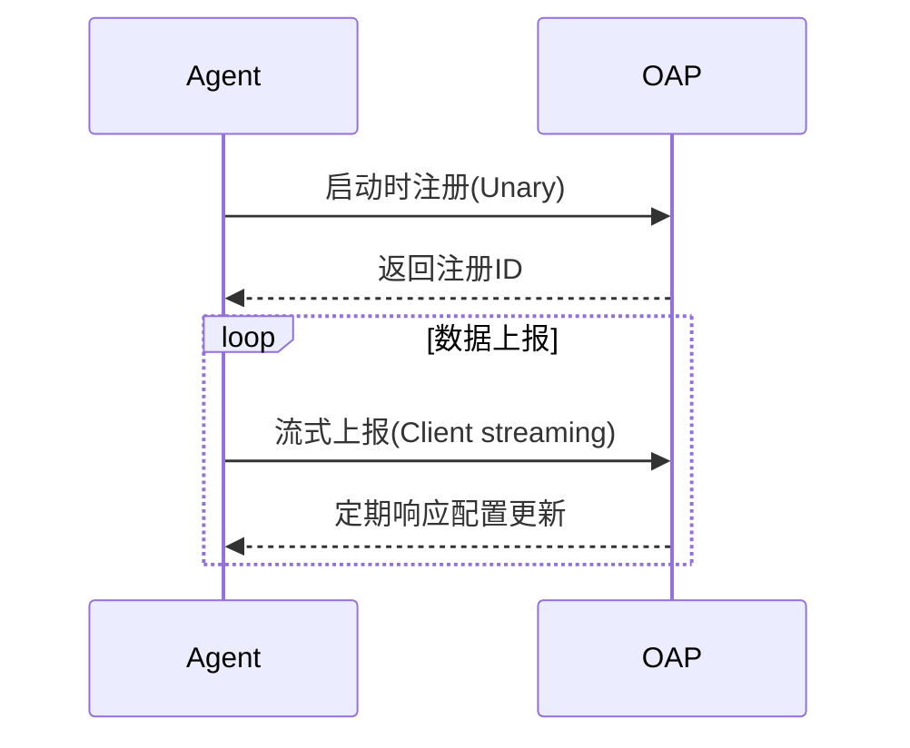

# SkyWalking gRPC协议

## 介绍

SkyWalking是一个开源的分布式系统性能监控工具，其核心组件之间的通信大量依赖**gRPC协议**。gRPC是一种高性能、跨语言的远程过程调用（RPC）框架，基于HTTP/2和Protocol Buffers（protobuf）实现。在SkyWalking中，gRPC协议主要用于：

- Agent与后端OAP（Observability Analysis Platform）服务的数据上报
- OAP集群内部节点间的通信
- UI与OAP服务的查询交互

:::tip 为什么选择gRPC？
gRPC提供了低延迟、高吞吐量的二进制通信，完美契合SkyWalking对大规模分布式系统监控的需求。
:::

## 核心概念

### 1. Protocol Buffers定义

SkyWalking的gRPC接口通过`.proto`文件定义。例如，数据上报的协议定义片段如下：

```protobuf
service TraceSegmentReportService {
  rpc collect (stream SegmentObject) returns (Commands) {}
}

message SegmentObject {
  string traceId = 1;
  string traceSegmentId = 2;
  repeated SpanObject spans = 3;
  // 更多字段...
}
```

### 2. 通信模式

SkyWalking主要使用三种gRPC通信模式：

1. **Unary RPC**：简单请求-响应（如配置拉取）
2. **Server streaming**：服务端推送流（如告警通知）
3. **Client streaming**：客户端上传流（如链路数据上报）



## 实际应用

### Agent端配置示例

在SkyWalking Agent的`agent.config`中配置gRPC连接：

```properties
# OAP服务器地址
collector.backend_service=${SW_GRPC_SERVER:127.0.0.1:11800}

# gRPC连接参数
plugin.grpc.ssl_enabled=false
plugin.grpc.channel_check_interval=30
```

### Java客户端示例

以下是手动通过gRPC上报数据的Java代码片段：

```java
ManagedChannel channel = ManagedChannelBuilder.forAddress("localhost", 11800)
    .usePlaintext()
    .build();

MetricReportServiceGrpc.MetricReportServiceBlockingStub stub = 
    MetricReportServiceGrpc.newBlockingStub(channel);

Metrics.Builder metrics = Metrics.newBuilder()
    .setService("your-service")
    .addAllData(Collections.singletonList(
        MetricData.newBuilder()
            .setName("cpu_usage")
            .setValue(0.85)
            .build()
    ));

stub.collect(metrics.build());
```

## 性能优化实践

SkyWalking对gRPC做了多项优化：

1. **连接复用**：长连接避免频繁握手
2. **批量上报**：Agent端数据聚合后发送
3. **压缩传输**：启用gzip压缩减少带宽

:::caution 注意
生产环境建议启用TLS加密：
```properties
plugin.grpc.ssl_enabled=true
plugin.grpc.ssl_trusted_ca_path=/path/to/ca.pem
```
:::

## 总结

SkyWalking的gRPC协议是其高性能监控能力的基石，通过：
- 二进制protobuf编码实现高效序列化
- HTTP/2多路复用支持高并发
- 流式传输适应大规模数据场景

## 扩展学习

1. 官方proto文件：[skywalking-data-collect-protocol](https://github.com/apache/skywalking-data-collect-protocol)
2. 实践练习：使用`grpcurl`工具测试OAP服务接口
```bash
grpcurl -plaintext localhost:11800 list
```
3. 深入阅读：[gRPC官方文档](https://grpc.io/docs/)