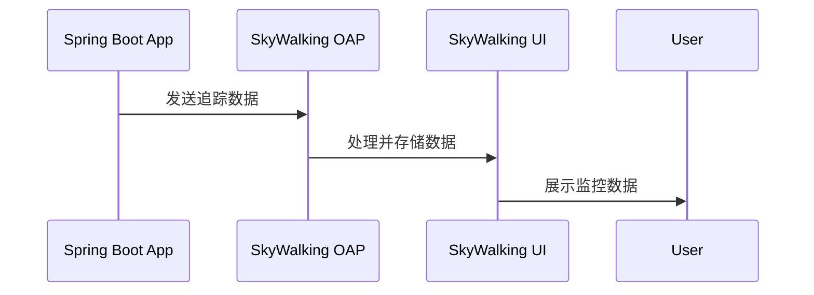

# SkyWalking 与Kubernetes集成

## 介绍

SkyWalking是一个开源的APM（应用性能监控）系统，特别适用于云原生环境下的微服务架构。Kubernetes（K8s）是当前最流行的容器编排平台之一。将SkyWalking与Kubernetes集成，可以帮助开发者实时监控和追踪运行在Kubernetes集群中的微服务应用，快速定位性能瓶颈和故障。

在本章节中，你将学习如何：
- 在Kubernetes集群中部署SkyWalking
- 配置SkyWalking以监控Kubernetes中的服务
- 理解SkyWalking与Kubernetes集成的核心概念

## 前置知识

在开始之前，请确保你已经具备以下基础知识：
- 基本的Kubernetes概念（如Pod、Deployment、Service等）
- 了解SkyWalking的基本架构和组件
- 拥有一个可操作的Kubernetes集群

## 部署SkyWalking到Kubernetes

### 1. 使用Helm部署SkyWalking

Helm是Kubernetes的包管理工具，我们可以使用它来快速部署SkyWalking。

```bash
# 添加SkyWalking的Helm仓库
helm repo add skywalking https://apache.jfrog.io/artifactory/skywalking-helm

# 更新仓库
helm repo update

# 安装SkyWalking
helm install skywalking skywalking/skywalking -n skywalking --create-namespace
```

### 2. 验证安装

安装完成后，检查Pod是否正常运行：

```bash
kubectl get pods -n skywalking
```

预期输出应该显示类似以下内容：

```
NAME                              READY   STATUS    RESTARTS   AGE
skywalking-oap-7d8d5c9c6d-4j5k2   1/1     Running   0          2m
skywalking-ui-6f8d7b8d6d-9k2m4    1/1     Running   0          2m
```

## 配置SkyWalking监控Kubernetes服务

### 1. 自动发现Kubernetes服务

SkyWalking可以通过Kubernetes的服务发现机制自动监控集群中的服务。在SkyWalking的OAP（Observability Analysis Platform）配置中，启用Kubernetes集群监控：

```yaml
# 修改skywalking-oap的ConfigMap
kubectl edit configmap skywalking-oap-config -n skywalking
```

添加或修改以下配置：

```yaml
cluster:
  kubernetes:
    serviceName: ${SW_SERVICE_NAME:"SkyWalking_OAP_Cluster"}
    namespace: ${SW_NAMESPACE:"skywalking"}
    labelSelector: ${SW_LABEL_SELECTOR:"app=skywalking"}
    uidEnvName: ${SW_UID_ENV_NAME:"SKYWALKING_OAP_UID"}
```

### 2. 配置应用接入SkyWalking

对于需要被监控的应用，需要在应用的Deployment中添加SkyWalking的Java Agent。以下是一个示例：

```yaml
apiVersion: apps/v1
kind: Deployment
metadata:
  name: demo-app
spec:
  template:
    spec:
      containers:
      - name: demo-app
        image: your-app-image
        env:
        - name: SW_AGENT_NAME
          value: "demo-app"
        - name: SW_AGENT_COLLECTOR_BACKEND_SERVICES
          value: "skywalking-oap.skywalking.svc:11800"
        volumeMounts:
        - name: skywalking-agent
          mountPath: /skywalking/agent
      initContainers:
      - name: init-skywalking-agent
        image: apache/skywalking-java-agent:8.8.0-java8
        command: ['sh', '-c', 'cp -r /skywalking/agent/* /skywalking-agent']
        volumeMounts:
        - name: skywalking-agent
          mountPath: /skywalking-agent
      volumes:
      - name: skywalking-agent
        emptyDir: {}
```

## 实际案例

### 案例：监控Spring Boot微服务

假设你有一个运行在Kubernetes上的Spring Boot微服务，以下是完整的集成步骤：

1. 准备Docker镜像，确保包含SkyWalking Java Agent
2. 创建如上所示的Deployment配置
3. 部署应用到Kubernetes集群
4. 访问SkyWalking UI查看监控数据



## 常见问题与解决方案

:::tip 问题1：无法连接到SkyWalking OAP
**解决方案**：
1. 检查OAP服务是否正常运行：`kubectl get svc -n skywalking`
2. 验证网络策略是否允许应用Pod访问OAP服务
3. 检查应用的环境变量配置是否正确
:::

:::caution 问题2：监控数据不显示
**解决方案**：
1. 确认Java Agent是否正确加载
2. 检查OAP日志是否有错误：`kubectl logs -f <oap-pod-name> -n skywalking`
3. 验证应用是否生成了追踪数据
:::

## 总结

通过本章节的学习，你应该已经掌握了：
- 如何在Kubernetes中部署SkyWalking
- 如何配置应用接入SkyWalking监控
- 解决常见集成问题的方法

SkyWalking与Kubernetes的集成为云原生应用提供了强大的监控能力，帮助你更好地理解和优化系统性能。

## 附加资源

1. [SkyWalking官方文档](https://skywalking.apache.org/docs/)
2. [Kubernetes官方文档](https://kubernetes.io/docs/home/)
3. [SkyWalking GitHub仓库](https://github.com/apache/skywalking)

## 练习

1. 在你的Kubernetes集群中部署SkyWalking
2. 配置一个简单的Spring Boot应用接入SkyWalking监控
3. 在SkyWalking UI中查看应用的监控数据
4. 尝试创建一个自定义告警规则