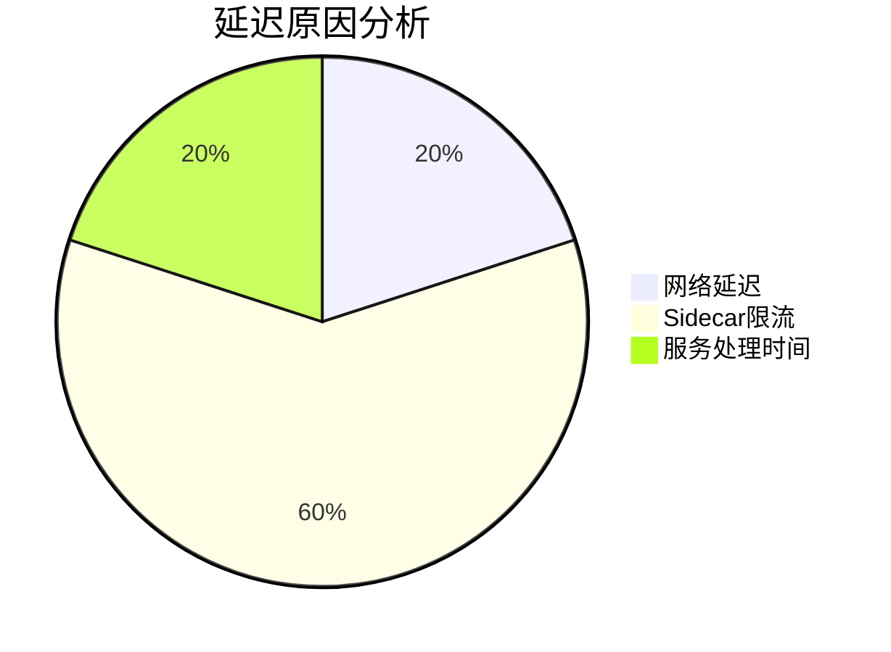

## 介绍

服务网格（Service Mesh）是现代微服务架构中的关键组件，负责处理服务间的通信、安全性和可观测性。SkyWalking作为分布式系统的APM（应用性能监控）工具，可以与服务网格集成，提供端到端的链路追踪、指标监控和告警能力。本章将介绍如何将SkyWalking与主流服务网格（如Istio、Linkerd）集成，并展示实际应用场景。

:::note
**关键概念**  
- **服务网格**：通过Sidecar代理管理服务间通信的基础设施层。  
- **SkyWalking**：开源APM系统，支持分布式追踪、指标分析和拓扑图展示。  
:::

---

## 集成原理

SkyWalking通过以下方式与服务网格集成：  
1. **数据采集**：从服务网格的Sidecar（如Envoy）收集追踪和指标数据。  
2. **协议适配**：将服务网格的数据格式（如OpenTelemetry或Zipkin）转换为SkyWalking协议。  
3. **数据存储与分析**：SkyWalking OAP（Observability Analysis Platform）处理数据并生成可视化报告。


---

## 集成步骤

### 1. 与Istio集成

**前置条件**：  
- 已部署Istio（启用Envoy访问日志和追踪）。  
- 已安装SkyWalking OAP和UI。

**配置步骤**：  
1. 修改Istio配置，将追踪数据发送到SkyWalking OAP：  
   ```yaml
   apiVersion: install.istio.io/v1alpha1
   kind: IstioOperator
   spec:
     meshConfig:
       enableTracing: true
       defaultConfig:
         tracing:
           sampling: 100%
           zipkin:
             address: skywalking-oap.skywalking.svc:11800
   ```

2. 重启Istio Sidecar注入器：  
   ```bash
   kubectl rollout restart deployment/istiod -n istio-system
   ```

3. 验证数据是否出现在SkyWalking UI的拓扑图中。

:::tip
使用 `kubectl logs <istio-sidecar-pod>` 检查Envoy是否成功连接SkyWalking OAP。
:::

---

### 2. 与Linkerd集成

Linkerd默认使用OpenTelemetry协议，需通过SkyWalking的OpenTelemetry Receiver适配：  
1. 启用Linkerd的追踪功能：  
   ```bash
   linkerd install --tracing | kubectl apply -f -
   ```

2. 配置SkyWalking OAP接收OpenTelemetry数据：  
   ```yaml
   # config/application.yml
   receiver-otel:
     default:
       enabled: true
       port: 11800
   ```

---

## 实际案例

### 场景：电商平台的支付服务监控  
**问题**：支付服务通过Istio管理，但无法定位跨服务的延迟问题。  
**解决方案**：  
1. 集成SkyWalking后，发现支付服务到库存服务的调用存在500ms延迟。  
2. SkyWalking拓扑图显示问题源于Envoy Sidecar的限流配置。  
3. 调整Istio的 `DestinationRule` 后延迟降低至50ms。



---

## 总结

- **核心价值**：SkyWalking与服务网格集成可提供全栈可观测性，尤其适合微服务环境。  
- **关键步骤**：配置服务网格的追踪导出器，并确保SkyWalking OAP支持对应协议。  
- **扩展性**：可通过SkyWalking插件支持更多服务网格（如Kuma、Consul）。

---

## 附加资源

1. **练习**：在Minikube中部署Istio + SkyWalking，模拟服务调用并分析追踪数据。  
2. **文档**：  
   - [SkyWalking官方文档](https://skywalking.apache.org/docs/)  
   - [Istio追踪配置指南](https://istio.io/latest/docs/tasks/observability/distributed-tracing/)  
3. **工具**：使用 `swctl`（SkyWalking CLI）查询服务依赖关系。

:::caution
确保服务网格和SkyWalking的版本兼容性，避免协议不匹配问题。
:::