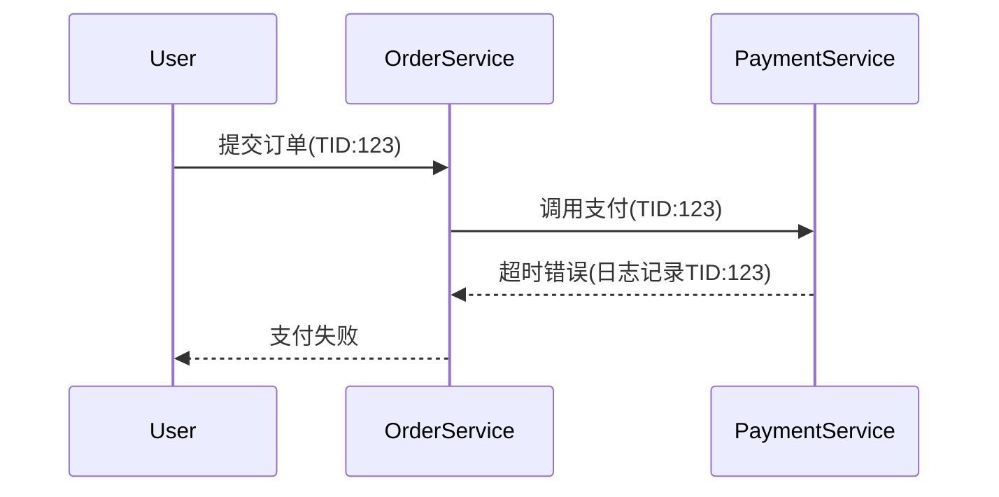

## 介绍

在现代分布式系统中，日志和链路追踪是两种关键的监控手段。SkyWalking作为一款优秀的APM（应用性能监控）工具，支持与日志系统的深度集成，能够将追踪ID（Trace ID）注入日志中，实现链路与日志的关联分析。本教程将介绍集成原理、配置方法及实际应用场景。

## 核心概念

### 1. Trace ID注入
SkyWalking通过探针（Agent）自动为每个请求生成全局唯一的`Trace ID`。将该ID注入到应用日志中，即可通过日志快速定位对应的链路数据。

### 2. 日志框架适配
支持主流日志框架（如Log4j、Logback、Log4j2）的MDC（Mapped Diagnostic Context）注入。

## 集成步骤

### 步骤1：配置SkyWalking Agent
确保Agent已正确接入应用，并在`agent.config`中启用日志集成：
```properties
# 启用Trace ID注入
plugin.toolkit.loggr.reporter.active=true
```

### 步骤2：日志框架配置示例

#### Logback 示例
```xml
<configuration>
  <appender name="STDOUT" class="ch.qos.logback.core.ConsoleAppender">
    <encoder>
      <pattern>%d{yyyy-MM-dd HH:mm:ss} [%X{tid}] %-5level %logger{36} - %msg%n</pattern>
    </encoder>
  </appender>
  <root level="INFO">
    <appender-ref ref="STDOUT" />
  </root>
</configuration>
```

#### Log4j2 示例
```xml
<Configuration>
  <Appenders>
    <Console name="Console" target="SYSTEM_OUT">
      <PatternLayout pattern="%d{yyyy-MM-dd HH:mm:ss} [%X{tid}] %-5level %logger{36} - %msg%n" />
    </Console>
  </Appenders>
  <Loggers>
    <Root level="info">
      <AppenderRef ref="Console" />
    </Root>
  </Loggers>
</Configuration>
```

### 步骤3：验证输出
应用日志将显示如下格式，其中`[TID:ac1234...]`为SkyWalking注入的Trace ID：
```
2023-01-01 12:00:00 [TID:ac1234567890] INFO  com.example.Service - Processing request
```

## 实际案例

### 场景：电商订单异常排查
当用户投诉"订单支付失败"时：
1. 通过日志中的`Trace ID`快速定位到具体链路
2. 在SkyWalking UI中查看该链路的拓扑图与跨度详情
3. 发现支付服务调用超时的根本原因



:::tip 最佳实践
建议在错误日志中额外记录以下信息：
- `Trace ID`（自动注入）
- 关键参数（如用户ID、订单号）
- 错误堆栈（如有）
:::

## 高级配置

### 自定义日志字段
通过`OpenTelemetry Resources`添加业务标签：
```java
import org.apache.skywalking.apm.toolkit.opentelemetry.SkyWalkingExtension;

SkyWalkingExtension.addCustomTag("order_id", "ORD-123");
```

### 日志转发至SkyWalking
配置`logback-spring.xml`将错误日志上报：
```xml
<appender name="SW_LOG" class="org.apache.skywalking.apm.toolkit.log.logback.v1.x.log.GRPCLogClientAppender">
  <encoder>
    <pattern>%msg</pattern>
  </encoder>
</appender>
```

## 总结

通过本教程，你已学会：
- SkyWalking Trace ID的日志注入原理
- 主流日志框架的集成配置方法
- 如何利用Trace ID关联日志与链路数据

## 扩展学习

1. 官方文档：[SkyWalking Log Integration](https://skywalking.apache.org/docs/)
2. 实战练习：尝试在Spring Boot项目中集成Logback与SkyWalking Agent
3. 思考题：如何通过ELK收集已注入Trace ID的日志，并与SkyWalking联动分析？