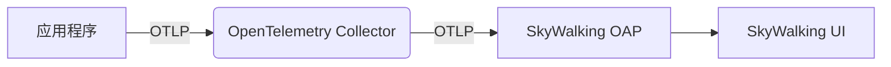
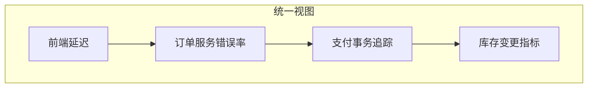

# SkyWalking 外部系统数据导入

## 介绍

SkyWalking作为一款优秀的应用性能监控(APM)工具，支持通过多种协议将外部系统的监控数据导入到其分析平台中。这种能力使得用户可以在SkyWalking的统一界面中查看来自不同数据源的监控指标，实现跨系统的全链路观测。

:::tip 为什么需要数据导入？
现代系统架构通常由多个异构组件构成，这些组件可能使用不同的监控方案。通过将数据导入SkyWalking，您可以：
- 获得统一的监控视图
- 实现跨系统的关联分析
- 减少监控工具的切换成本
:::

## 主要导入方式

SkyWalking支持以下几种主要的数据导入方式：

1. **OpenTelemetry协议** - 通过OTLP接收数据
2. **Prometheus远程写入** - 接收Prometheus格式指标
3. **Zipkin/Jaeger格式** - 接收分布式追踪数据
4. **服务网格数据** - 如Istio等服务的指标
5. **自定义数据源** - 通过SkyWalking原生协议接入

## OpenTelemetry数据导入

OpenTelemetry(OTel)已成为云原生观测的事实标准，SkyWalking提供了对OTLP协议的原生支持。

### 配置示例

以下是一个通过OpenTelemetry Collector将数据转发到SkyWalking的配置示例：

```yaml
# otel-collector-config.yaml
receivers:
  otlp:
    protocols:
      grpc:
      http:

exporters:
  otlp/skywalking:
    endpoint: "skywalking-oap:11800" # SkyWalking OAP服务地址
    tls:
      insecure: true

service:
  pipelines:
    traces:
      receivers: [otlp]
      exporters: [otlp/skywalking]
    metrics:
      receivers: [otlp]
      exporters: [otlp/skywalking]
    logs:
      receivers: [otlp]
      exporters: [otlp/skywalking]
```

### 数据流示意图



## Prometheus数据导入

对于使用Prometheus监控的系统，可以通过远程写入功能将数据导入SkyWalking。

### 配置步骤

1. 在Prometheus配置中添加远程写入：

```yaml
# prometheus.yml
remote_write:
  - url: "http://skywalking-oap:1234/receive"
    queue_config:
      max_samples_per_send: 1000
```

2. SkyWalking OAP需要启用Prometheus接收器：

```yaml
# application.yml
receiver-prometheus:
  default:
    enabled: true
    host: ${SW_RECEIVER_PROMETHEUS_HOST:0.0.0.0}
    port: ${SW_RECEIVER_PROMETHEUS_PORT:1234}
```

:::caution 注意事项
Prometheus指标导入后，SkyWalking会将其转换为自己的指标模型，部分标签可能会被重新映射。
:::

## 实际案例：电商平台监控整合

假设一个电商平台有以下组件：
- 前端Web应用（使用SkyWalking Agent）
- 订单服务（使用Prometheus）
- 支付服务（使用OpenTelemetry）
- 库存服务（使用Zipkin）

通过数据导入，可以在SkyWalking中实现：



### 实现步骤

1. 配置各组件数据导出到SkyWalking
2. 在SkyWalking中设置服务关联
3. 创建统一的仪表盘查看所有指标

## 自定义数据源导入

对于特殊系统，可以使用SkyWalking原生协议通过HTTP或gRPC导入数据。

### HTTP API示例

```bash
curl -X POST http://skywalking-oap:12800/v3/segment \
  -H 'Content-Type: application/json' \
  -d '{
    "traceId": "a1b2c3d4...",
    "service": "your-service",
    "serviceInstance": "instance-1",
    "spans": [...]
  }'
```

## 总结

通过SkyWalking的外部数据导入功能，您可以：

✓ 整合异构系统的监控数据<br />
✓ 减少监控工具的碎片化<br />
✓ 实现真正的全链路可观测性<br />
✓ 利用SkyWalking强大的分析能力处理所有数据

## 延伸学习

- 尝试将您的一个现有系统的监控数据导入SkyWalking
- 比较不同协议导入的数据在SkyWalking中的表现差异
- 探索SkyWalking的指标转换规则

:::note 进一步阅读
- [SkyWalking官方文档 - 数据接收](https://skywalking.apache.org/docs/)
- [OpenTelemetry Collector配置指南](https://opentelemetry.io/docs/collector/)
- [Prometheus远程写入规范](https://prometheus.io/docs/practices/remote_write/)
:::