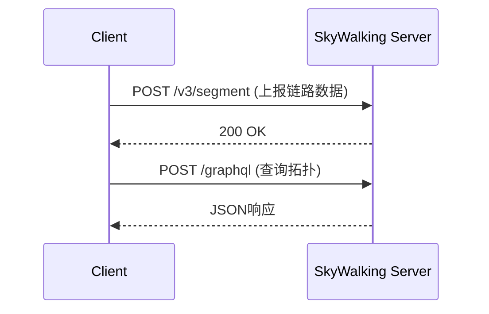

# SkyWalking HTTP协议

## 介绍

SkyWalking HTTP协议是SkyWalking分布式系统观测平台的核心通信协议之一，它允许开发者通过HTTP请求与SkyWalking后端服务进行交互。无论是上报监控数据、查询追踪信息，还是管理配置，HTTP协议都提供了简单且标准化的方式。

对于初学者来说，理解SkyWalking HTTP协议是掌握SkyWalking集成的第一步。本章将详细介绍协议的结构、常见端点（endpoints）以及实际应用场景。

---

## 协议基础

SkyWalking HTTP协议基于RESTful风格设计，主要支持以下操作：
- **上报数据**：将监控数据（如指标、链路追踪）推送到SkyWalking服务端。
- **查询数据**：从服务端获取监控或追踪数据。
- **管理操作**：动态修改配置或触发任务。

### 通用请求格式

SkyWalking的HTTP API通常遵循以下格式：
```
POST /{endpoint}
Content-Type: application/json

{
  "key1": "value1",
  "key2": "value2"
}
```

:::note
所有上报数据的请求必须包含 `Content-Type: application/json` 请求头。
:::

---

## 关键端点（Endpoints）

以下是SkyWalking HTTP协议中的核心端点：

### 1. 上报链路数据（Trace）
- **端点**: `/v3/segment`
- **方法**: `POST`
- **用途**: 上报单条链路追踪数据。

**示例请求**：
```json
{
  "traceId": "a1b2c3d4",
  "service": "your-service",
  "spans": [
    {
      "operationName": "/api/users",
      "startTime": 1620000000000,
      "endTime": 1620000001000
    }
  ]
}
```

### 2. 查询服务拓扑
- **端点**: `/graphql`
- **方法**: `POST`
- **用途**: 通过GraphQL查询服务依赖关系。

**示例请求**：
```graphql
query {
  topology(serviceId: "your-service") {
    nodes {
      id
      name
    }
    edges {
      source
      target
    }
  }
}
```

---

## 实际案例：上报自定义指标

假设你需要监控一个在线商城的订单处理延迟，可以通过HTTP协议上报自定义指标：

1. **构造指标数据**：
```json
{
  "metrics": [
    {
      "name": "order_process_latency",
      "value": 150,
      "timestamp": 1620000000000,
      "tags": {
        "region": "us-east"
      }
    }
  ]
}
```

2. **发送到SkyWalking**：
```bash
curl -X POST http://skywalking-server:12800/v3/metrics \
  -H 'Content-Type: application/json' \
  -d '{"metrics":[{"name":"order_process_latency","value":150,"timestamp":1620000000000,"tags":{"region":"us-east"}}]}'
```

:::tip
使用 `tags` 字段可以为指标添加维度，便于后续按区域、版本等过滤分析。
:::

---

## 协议交互流程

以下是一个简化的SkyWalking HTTP协议交互流程：



---

## 总结

- SkyWalking HTTP协议是RESTful风格的通信接口，支持数据上报、查询和管理。
- 关键端点包括 `/v3/segment`（链路数据）和 `/graphql`（查询）。
- 实际应用中，可通过HTTP协议灵活集成自定义监控需求。

## 下一步学习

1. **动手练习**：尝试用`curl`或Postman向SkyWalking发送一条模拟的链路数据。
2. **扩展阅读**：
   - [SkyWalking官方文档](https://skywalking.apache.org/docs/)