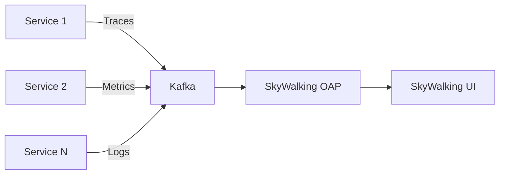

# SkyWalking Kafka协议集成

## 介绍

Apache SkyWalking 是一个开源的分布式系统监控和追踪工具，支持多种协议与数据源集成。其中，Kafka 协议集成允许 SkyWalking 通过 Kafka 消息队列接收和发送监控数据，适用于高吞吐量场景或需要解耦数据生产与消费的架构。

通过 Kafka 协议集成，SkyWalking 可以将追踪（Tracing）、指标（Metrics）和日志（Logs）数据推送到 Kafka 主题，后续由 SkyWalking OAP（Observability Analysis Platform）服务消费并处理。这种方式特别适合以下场景：
- 需要缓冲或异步处理监控数据的分布式系统。
- 跨多个 SkyWalking 部署共享数据。
- 与其他 Kafka 生态工具（如 Flink、Spark）集成。

## 前置条件

在开始之前，请确保：
1. 已安装并运行 Kafka 集群（单机或分布式）。
2. 已部署 SkyWalking OAP 和 UI 服务。
3. 熟悉 Kafka 的基本概念（如 Topic、Producer、Consumer）。

---

## 配置 SkyWalking 使用 Kafka 协议

### 1. 修改 OAP 配置文件

打开 SkyWalking OAP 的配置文件 `config/application.yml`，找到 `receiver-kafka` 部分，取消注释并配置以下参数：

```yaml
receiver-kafka:
  selector: ${SW_RECEIVER_KAFKA:default}
  default:
    bootstrapServers: ${SW_KAFKA_BOOTSTRAP_SERVERS:localhost:9092}
    # 配置要消费的 Kafka Topic
    topics: ${SW_KAFKA_TOPICS:skywalking-metrics,skywalking-traces,skywalking-logs}
    partitions: ${SW_KAFKA_PARTITIONS:3}
    replicationFactor: ${SW_KAFKA_REPLICATION_FACTOR:2}
```

:::tip
- `bootstrapServers`: Kafka 集群地址（多个地址用逗号分隔）。
- `topics`: SkyWalking 监听的 Kafka Topic，需与数据发送方一致。
:::

### 2. 配置 Agent 或 SDK 发送数据到 Kafka

如果使用 SkyWalking Agent（如 Java Agent），在 `agent.config` 中配置：

```properties
# 启用 Kafka Reporter
plugin.kafka.bootstrap_servers=localhost:9092
plugin.kafka.topic_metrics=skywalking-metrics
plugin.kafka.topic_tracing=skywalking-traces
plugin.kafka.topic_logging=skywalking-logs
```

对于其他语言的 SDK（如 Python、Go），需参考对应 SDK 的文档配置 Kafka Reporter。

---

## 示例：Java 应用集成

### 步骤 1 - 启动 Kafka 服务
确保 Kafka 服务已运行，并创建所需的 Topic：
```bash
# 创建 Topic（示例）
kafka-topics.sh --create --bootstrap-server localhost:9092 \
  --topic skywalking-traces --partitions 3 --replication-factor 1
```

### 步骤 2 - 配置 Java Agent
在应用的启动命令中添加 SkyWalking Agent 参数：
```bash
java -javaagent:/path/to/skywalking-agent.jar \
  -Dskywalking.agent.service_name=your-service \
  -Dplugin.kafka.bootstrap_servers=localhost:9092 \
  -Dplugin.kafka.topic_tracing=skywalking-traces \
  -jar your-app.jar
```

### 步骤 3 - 验证数据
通过 Kafka 控制台消费者检查数据是否正常发送：
```bash
kafka-console-consumer.sh --bootstrap-server localhost:9092 \
  --topic skywalking-traces --from-beginning
```

---

## 实际应用场景

### 场景：微服务架构中的异步监控
在一个由 10 个微服务组成的电商系统中，直接向 SkyWalking OAP 发送数据可能导致网络拥塞。通过 Kafka 集成：
1. 所有服务将监控数据发送到 Kafka。
2. SkyWalking OAP 异步消费并处理数据。
3. 高峰时段的数据积压由 Kafka 缓冲，避免丢失。



---

## 常见问题

### 1. 数据延迟
如果发现 SkyWalking UI 中数据更新延迟，可能是 Kafka 消费速度不足。尝试：
- 增加 OAP 服务的 Kafka 消费者线程数。
- 调整 Kafka Topic 的分区数（需与消费者数匹配）。

### 2. 数据丢失
确保 Kafka 配置了足够的副本和持久化策略：
```yaml
# 在 Kafka 的 server.properties 中
default.replication.factor=2
min.insync.replicas=1
```

---

## 总结

通过 Kafka 协议集成，SkyWalking 能够以高可靠、高吞吐的方式处理监控数据，尤其适合大规模分布式系统。关键步骤包括：
1. 配置 OAP 服务的 Kafka Receiver。
2. 调整 Agent/SDK 将数据发送到 Kafka。
3. 验证数据流和稳定性。

## 扩展练习
1. 尝试在 Kubernetes 中部署 SkyWalking 和 Kafka，模拟生产环境。
2. 使用 Kafka Streams 对 SkyWalking 数据进行实时过滤。

## 附加资源
- [SkyWalking 官方文档 - Kafka Reporter](https://skywalking.apache.org/docs/)
- [Apache Kafka 官方指南](https://kafka.apache.org/documentation/)