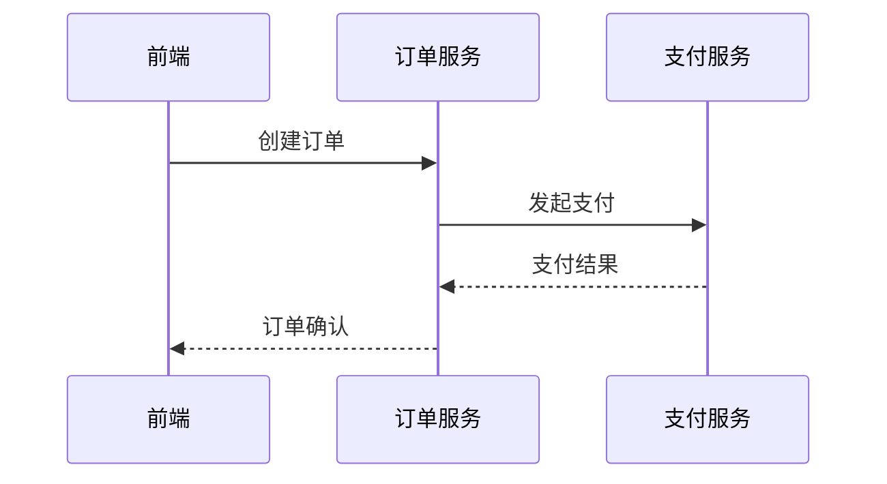

## 介绍

SkyWalking 和 OpenTelemetry 都是现代可观测性领域的重要工具。SkyWalking 是一个开源的 APM（应用性能监控）系统，而 OpenTelemetry 是一个统一的遥测数据收集标准。通过将两者集成，开发者可以充分利用 SkyWalking 的分析能力，同时保持与 OpenTelemetry 生态的兼容性。

:::tip
集成后，你可以使用 OpenTelemetry SDK 收集数据，并通过 SkyWalking 的后端进行存储和可视化分析。
:::

## 为什么需要集成？

1. **统一数据收集**：OpenTelemetry 提供了跨语言、跨平台的 SDK，方便数据收集。
2. **强大的分析能力**：SkyWalking 提供了丰富的分析功能，如拓扑图、追踪详情等。
3. **生态兼容性**：避免被单一工具锁定，保持灵活性。

## 集成方案

### 方案1：通过 OpenTelemetry Collector 转发数据

这是最常见的集成方式。OpenTelemetry Collector 可以接收来自各种 SDK 的数据，并将其转发到 SkyWalking 的 OAP 服务器。


#### 配置示例

1. **配置 OpenTelemetry Collector**：

   编辑 `otel-collector-config.yaml`：

   ```yaml
   receivers:
     otlp:
       protocols:
         grpc:
         http:
   exporters:
     skywalking:
       endpoint: skywalking-oap:11800
       tls:
         insecure: true
   service:
     pipelines:
       traces:
         receivers: [otlp]
         exporters: [skywalking]
   ```

2. **应用程序中使用 OpenTelemetry SDK**：

   ```python
   from opentelemetry import trace
   from opentelemetry.sdk.trace import TracerProvider
   from opentelemetry.sdk.trace.export import BatchSpanProcessor
   from opentelemetry.exporter.otlp.proto.grpc.trace_exporter import OTLPSpanExporter

   trace.set_tracer_provider(TracerProvider())
   otlp_exporter = OTLPSpanExporter(endpoint="http://otel-collector:4317")
   trace.get_tracer_provider().add_span_processor(BatchSpanProcessor(otlp_exporter))
   ```

### 方案2：直接使用 SkyWalking 的 OpenTelemetry 接收器

SkyWalking 的 OAP 服务器可以直接接收 OpenTelemetry 协议（OTLP）的数据。

1. **启动 SkyWalking OAP 时启用 OTLP 接收器**：

   ```bash
   SW_RECEIVER_OTLP_ENABLED=true \
   SW_RECEIVER_OTLP_PORT=11800 \
   ./bin/oapService.sh
   ```

2. **应用程序直接发送数据到 SkyWalking**：

   ```go
   package main

   import (
       "go.opentelemetry.io/otel"
       "go.opentelemetry.io/otel/exporters/otlp/otlptrace/otlptracegrpc"
       "go.opentelemetry.io/otel/sdk/trace"
   )

   func initTracer() {
       exporter, _ := otlptracegrpc.New(
           otlptracegrpc.WithInsecure(),
           otlptracegrpc.WithEndpoint("skywalking-oap:11800"),
       )
       tp := trace.NewTracerProvider(
           trace.WithBatcher(exporter),
       )
       otel.SetTracerProvider(tp)
   }
   ```

## 实际案例

### 案例：微服务系统监控

假设你有一个由多个服务组成的电商系统：

1. 前端使用 JavaScript（OpenTelemetry JS SDK）
2. 订单服务使用 Java（OpenTelemetry Java SDK）
3. 支付服务使用 Go（OpenTelemetry Go SDK）

通过集成 SkyWalking 和 OpenTelemetry：

1. 所有服务都使用各自语言的 OpenTelemetry SDK
2. 数据统一发送到 OpenTelemetry Collector
3. Collector 将数据转发到 SkyWalking
4. 在 SkyWalking UI 中可以看到完整的调用链：



## 常见问题

:::caution
1. **协议兼容性**：确保 OpenTelemetry Collector 和 SkyWalking 版本兼容。
2. **数据映射**：某些 OpenTelemetry 的标签可能需要特殊映射才能在 SkyWalking 中正确显示。
3. **性能影响**：高流量系统需要考虑 Collector 的性能和扩展性。
:::

## 总结

SkyWalking 与 OpenTelemetry 的集成提供了灵活而强大的可观测性方案。通过这种集成，你可以：

- 使用 OpenTelemetry 的多语言 SDK 收集数据
- 利用 SkyWalking 的强大分析能力
- 保持与云原生生态的兼容性

## 附加资源

1. [SkyWalking 官方文档](https://skywalking.apache.org/docs/)
2. [OpenTelemetry 官方文档](https://opentelemetry.io/docs/)
3. 练习：尝试在本地搭建一个包含 Collector 和 SkyWalking 的演示环境。

:::note
下一步学习：了解 SkyWalking 的告警功能，或探索 OpenTelemetry 的更高级特性。
:::