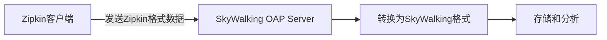
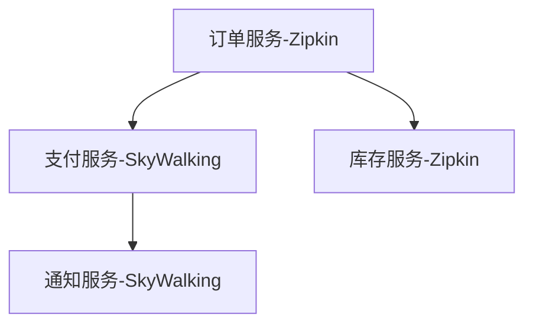

# SkyWalking 与Zipkin集成

## 介绍

SkyWalking和Zipkin都是流行的分布式链路追踪系统。虽然它们使用不同的数据格式和协议，但通过集成可以实现数据互通。这对于以下场景特别有用：

- 当你的系统同时使用两种技术栈时
- 需要将旧有Zipkin系统迁移到SkyWalking时
- 希望利用SkyWalking的分析能力处理Zipkin数据时

## 集成原理

SkyWalking通过接收器(receiver)机制支持多种协议。对于Zipkin数据，SkyWalking提供了`receiver-zipkin`模块，可以将Zipkin格式的span数据转换为SkyWalking原生格式。



## 配置步骤

### 1. 启用Zipkin接收器

修改SkyWalking OAP服务器的`application.yml`配置文件：

```yaml
receiver-zipkin:
  selector: ${SW_RECEIVER_ZIPKIN:default}
  default:
    host: ${SW_RECEIVER_ZIPKIN_HOST:0.0.0.0}
    port: ${SW_RECEIVER_ZIPKIN_PORT:9411}
    contextPath: ${SW_RECEIVER_ZIPKIN_CONTEXT_PATH:/}
```

:::note
默认情况下，SkyWalking会监听9411端口接收Zipkin数据，这与Zipkin的默认端口一致。
:::

### 2. 配置Zipkin客户端

在你的应用中，配置Zipkin客户端指向SkyWalking OAP服务器：

```java
@Bean
public SpanExporter zipkinSpanExporter() {
    return ZipkinSpanExporter.builder()
            .setEndpoint("http://skywalking-oap:9411/api/v2/spans")
            .build();
}
```

### 3. 验证集成

发送一些请求后，你可以通过以下方式验证集成是否成功：

1. 检查SkyWalking UI中是否出现了来自Zipkin的追踪数据
2. 查询SkyWalking的日志，查看是否有Zipkin数据接收记录

## 数据转换细节

SkyWalking会将Zipkin数据转换为自己的模型：

| Zipkin概念 | SkyWalking对应概念 |
|------------|--------------------|
| Trace ID   | Trace ID           |
| Span ID    | Segment ID         |
| Parent ID  | Parent Span ID     |
| Annotation | Log                |
| Tag        | Tag                |

:::tip
虽然大多数字段可以一一对应，但某些Zipkin特有的字段可能会被忽略或转换不完全。
:::

## 实际案例

假设你有一个微服务架构，其中部分服务使用Zipkin，部分使用SkyWalking：



通过集成，你可以在SkyWalking UI中查看完整的调用链路，即使部分服务使用的是Zipkin。

## 常见问题

### 数据不一致问题

如果同时向Zipkin和SkyWalking发送数据，可能会出现重复或冲突。建议：

1. 只将数据发送到SkyWalking
2. 或者配置SkyWalking将数据转发到Zipkin

### 性能考虑

大量Zipkin数据转换可能会影响OAP服务器性能。可以通过以下方式优化：

```yaml
receiver-zipkin:
  default:
    # 限制并发处理线程数
    threads: ${SW_RECEIVER_ZIPKIN_THREADS:4} 
    # 最大消息队列长度
    maxMessageSize: ${SW_RECEIVER_ZIPKIN_MAX_MESSAGE_SIZE:1048576}
```

## 总结

通过SkyWalking与Zipkin的集成，你可以：

- 统一查看不同技术栈的追踪数据
- 逐步迁移到SkyWalking而不丢失历史数据
- 利用SkyWalking强大的分析能力处理Zipkin数据

## 进一步学习

1. 尝试配置一个同时使用Zipkin和SkyWalking的微服务环境
2. 比较两种系统收集的相同请求的追踪数据差异
3. 研究SkyWalking对Zipkin扩展字段的支持情况

:::warning
在生产环境部署前，务必测试集成方案的性能和数据一致性。
:::