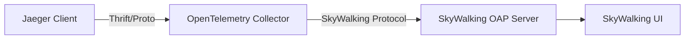
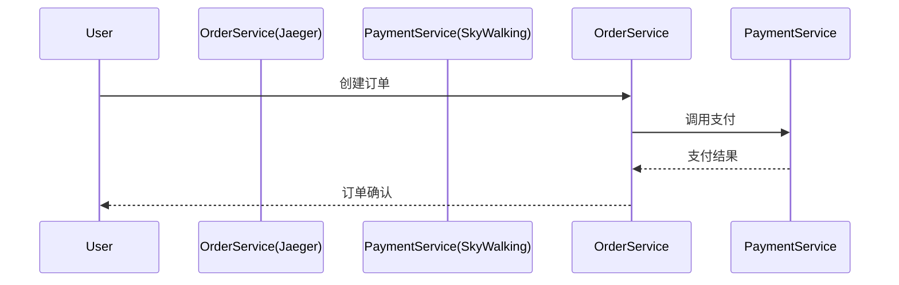

## 介绍

在现代分布式系统中，**SkyWalking** 和 **Jaeger** 是两个广泛使用的开源分布式追踪工具。SkyWalking 提供全栈的 APM（应用性能监控）能力，而 Jaeger 专注于分布式请求追踪。通过将两者集成，可以实现以下优势：

- **数据互通**：在混合技术栈环境中共享追踪数据
- **工具互补**：结合 SkyWalking 的拓扑分析能力和 Jaeger 的细粒度追踪
- **平滑迁移**：逐步从 Jaeger 迁移到 SkyWalking 的过渡方案

## 集成原理

SkyWalking 与 Jaeger 的集成主要通过以下两种方式实现：

1. **协议转换**：将 Jaeger 的 Thrift/Proto 格式转换为 SkyWalking 的格式
2. **数据转发**：通过 OpenTelemetry Collector 作为中间件进行协议转换



## 配置步骤

### 1. 通过 OpenTelemetry Collector 集成

这是推荐的生产环境集成方式，使用 OpenTelemetry Collector 作为协议转换中间件。

#### 安装 OpenTelemetry Collector

首先下载并安装 OpenTelemetry Collector：

```bash
wget https://github.com/open-telemetry/opentelemetry-collector-releases/releases/download/v0.60.0/otelcol-contrib_0.60.0_linux_amd64.tar.gz
tar -xvf otelcol-contrib_0.60.0_linux_amd64.tar.gz
```

#### 配置 Collector

创建配置文件 `otel-collector-config.yaml`：

```yaml
receivers:
  jaeger:
    protocols:
      thrift_compact:
      thrift_binary:
      thrift_http:
      grpc:

processors:
  batch:

exporters:
  skywalking:
    endpoint: "skywalking-oap:11800" # SkyWalking OAP 服务地址
    tls:
      insecure: true

service:
  pipelines:
    traces:
      receivers: [jaeger]
      processors: [batch]
      exporters: [skywalking]
```

#### 启动 Collector

```bash
./otelcol-contrib --config=otel-collector-config.yaml
```

:::tip
生产环境中建议将 Collector 作为服务运行，并配置适当的资源限制和监控。
:::

### 2. 直接使用 SkyWalking 的 Jaeger Receiver

SkyWalking OAP 服务器内置了 Jaeger Receiver，可以直接接收 Jaeger 格式的数据。

#### 配置 SkyWalking OAP

修改 SkyWalking 的 `application.yml` 文件：

```yaml
receiver-jaeger:
  default:
    gRPCHost: 0.0.0.0
    gRPCPort: 14250
    httpHost: 0.0.0.0
    httpPort: 14268
```

#### 客户端配置

在 Jaeger 客户端中，将上报地址指向 SkyWalking OAP：

```go
cfg := jaegercfg.Configuration{
    ServiceName: "your-service",
    Sampler: &jaegercfg.SamplerConfig{
        Type:  jaeger.SamplerTypeConst,
        Param: 1,
    },
    Reporter: &jaegercfg.ReporterConfig{
        LocalAgentHostPort: "skywalking-oap:14250", # 使用 gRPC 上报
    },
}
```

## 实际案例

### 电商微服务系统集成

假设我们有一个电商系统，部分服务使用 Jaeger 进行追踪，其他服务使用 SkyWalking。通过集成可以实现：

1. **订单服务**（使用 Jaeger）和 **支付服务**（使用 SkyWalking）的调用链路关联
2. 在 SkyWalking UI 中查看完整的跨系统调用链路
3. 统一分析系统性能指标



## 验证集成

集成完成后，可以通过以下方式验证：

1. 在 Jaeger 客户端生成追踪数据
2. 在 SkyWalking UI 中检查是否能看到对应的追踪数据
3. 检查链路是否完整，包括跨系统的调用关系

```bash
# 生成测试追踪数据
curl -X POST http://localhost:14268/api/traces \
  -H 'Content-Type: application/json' \
  -d '{
        "process": {
          "serviceName": "jaeger-test-service"
        },
        "tags": [
          {
            "key": "example",
            "value": "jaeger-to-skywalking"
          }
        ]
      }'
```

## 常见问题解决

:::caution
如果集成后看不到数据，请检查：
1. 网络连通性（防火墙、端口等）
2. 协议版本兼容性
3. 服务是否正常运行
:::

## 总结

通过将 SkyWalking 与 Jaeger 集成，可以实现：

- 混合追踪系统的统一视图
- 平滑的技术栈迁移路径
- 结合两者的优势功能

## 扩展学习

- [SkyWalking 官方文档 - Jaeger Receiver](https://skywalking.apache.org/docs/main/latest/en/setup/backend/backend-receivers/)
- [Jaeger 与 OpenTelemetry 集成指南](https://www.jaegertracing.io/docs/1.35/opentelemetry/)
- [OpenTelemetry Collector 配置参考](https://opentelemetry.io/docs/collector/configuration/)

## 练习

1. 尝试在本地环境中部署 SkyWalking 和 Jaeger，并配置集成
2. 编写一个简单的微服务应用，部分服务使用 Jaeger，部分使用 SkyWalking，观察完整链路
3. 比较集成前后在追踪数据可视化方面的差异