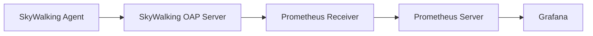

# SkyWalking 与Prometheus集成

## 介绍

SkyWalking是一个开源的APM（应用性能监控）系统，而Prometheus是一个流行的监控和告警工具。将两者集成可以实现更全面的监控能力：SkyWalking专注于分布式追踪和应用性能指标，而Prometheus擅长基础设施和系统级监控。通过集成，我们可以将SkyWalking的指标数据导出到Prometheus，实现统一的可视化和告警。

:::tip 为什么需要集成？
- 统一监控平台：避免在多个系统间切换
- 利用Prometheus强大的告警功能
- 结合两者的优势指标（应用性能+系统资源）
:::

## 前置条件

在开始集成前，请确保：
1. 已安装并运行SkyWalking OAP Server
2. 已安装并运行Prometheus
3. 了解基本的Prometheus配置

## 集成步骤

### 1. 配置SkyWalking OAP Server

修改SkyWalking OAP Server的配置文件 `config/application.yml`，启用Prometheus接收器：

```yaml
receiver-prometheus:
  selector: ${SW_RECEIVER_PROMETHEUS:default}
  default:
    enabledHandlers: ${SW_RECEIVER_PROMETHEUS_HANDLER:""}
    host: ${SW_RECEIVER_PROMETHEUS_HOST:0.0.0.0}
    port: ${SW_RECEIVER_PROMETHEUS_PORT:1234}
```

重启OAP Server使配置生效。

### 2. 配置Prometheus抓取

在Prometheus的配置文件 `prometheus.yml` 中添加以下job：

```yaml
scrape_configs:
  - job_name: 'skywalking'
    static_configs:
      - targets: ['skywalking-oap-server:1234']
    metrics_path: '/metrics'
    honor_labels: true
```

### 3. 验证集成

重启Prometheus后，可以通过以下方式验证集成是否成功：

1. 访问Prometheus的Web界面（通常为 `http://localhost:9090`）
2. 在表达式输入框中输入 `up{job="skywalking"}` 
3. 如果返回值为1，表示集成成功

## 数据流示意图



## 实际应用案例

假设我们有一个电商应用，需要监控以下指标：
- 订单服务的响应时间（来自SkyWalking）
- 服务器的CPU使用率（来自Prometheus）

通过集成后，我们可以在Grafana中创建统一的仪表盘：

```sql
# SkyWalking 指标
sum(rate(service_resp_time_sum{service="order-service"}[5m])) by (service)

# Prometheus指标
100 - (avg by (instance) (irate(node_cpu_seconds_total{mode="idle"}[5m])) * 100)
```

## 常见问题解决

:::caution 可能遇到的问题
1. **连接失败**：检查SkyWalking OAP Server和Prometheus之间的网络连通性
2. **无数据**：确认SkyWalking Agent已正确配置并发送数据
3. **指标名称冲突**：使用 `honor_labels: true` 避免标签冲突
:::

## 总结

通过将SkyWalking与Prometheus集成，我们能够：
- 集中管理应用性能和系统指标
- 利用Prometheus的告警功能监控SkyWalking数据
- 在Grafana中创建统一的监控仪表盘

## 扩展学习

1. 尝试在Grafana中创建结合两者的仪表盘
2. 探索Prometheus的告警规则，为SkyWalking指标设置告警
3. 研究SkyWalking的其他导出器，如OpenTelemetry导出器

:::note 练习
1. 配置一个简单的Spring Boot应用，使用SkyWalking Agent
2. 将SkyWalking指标导出到Prometheus
3. 在Prometheus中查询应用的响应时间指标
:::