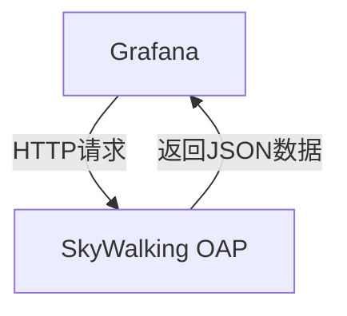
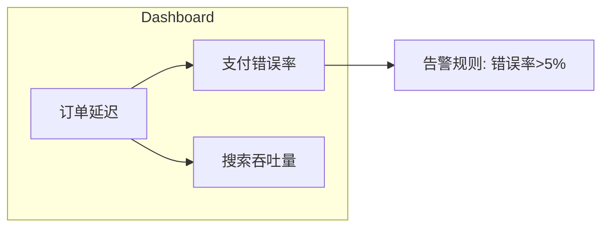

## 概述

SkyWalking作为分布式系统的APM（应用性能监控）工具，通过收集、分析和聚合遥测数据帮助开发者理解系统行为。而Grafana是一个开源的可视化平台，擅长将时序数据转换为直观的图表。两者的集成可以让用户通过Grafana的丰富仪表盘展示SkyWalking的监控指标。

:::tip 为什么需要集成？
- **可视化增强**：Grafana提供比SkyWalking UI更灵活的图表定制能力
- **统一视图**：可将SkyWalking数据与其他数据源（如Prometheus）合并展示
- **告警集成**：利用Grafana Alerting实现跨平台告警
:::

## 前置条件

在开始前请确保：
1. 已安装并运行SkyWalking OAP服务（v9.0.0+）
2. 已部署Grafana（v8.0+）
3. SkyWalking OAP服务地址可被Grafana访问

## 配置步骤

### 1. 安装Grafana插件

SkyWalking通过Grafana插件提供数据源支持：

```bash
grafana-cli plugins install apache-skywalking-datasource
```

重启Grafana服务使插件生效。

### 2. 添加SkyWalking数据源

1. 登录Grafana控制台
2. 导航到 `Configuration > Data Sources`
3. 点击 `Add data source`，搜索选择 `SkyWalking`
4. 填写基础配置：
   - URL: `http://<skywalking-oap-server>:12800`（默认端口）
   - Auth: 如需认证填写对应信息



### 3. 创建仪表盘

#### 示例：创建服务响应时间面板

1. 新建Dashboard，选择 `Add panel`
2. 在数据源中选择刚添加的SkyWalking源
3. 配置指标查询：
   - **Metric**: `service_resp_time`
   - **Service**: 选择目标服务（如`order-service`）
   - **Label**: `avg`（平均值）

```json
// 示例查询结构
{
  "metrics": ["service_resp_time"],
  "service": "order-service",
  "label": "avg",
  "range": "last_15m"
}
```

4. 设置可视化类型为 `Time series`

## 实际案例

### 电商系统监控场景

假设我们需要监控以下指标：
- 订单服务的P99延迟
- 支付服务的错误率
- 商品搜索服务的吞吐量

可以创建组合仪表盘：



配置步骤：
1. 为每个指标创建独立面板
2. 使用Grafana的 `Row` 功能分组相关指标
3. 设置共享时间范围控制

## 高级技巧

### 变量模板化

在Dashboard设置中添加变量实现动态过滤：

1. 定义 `$service` 变量：
   ```sql
   // 查询所有服务名称
   query=find_services
   ```
2. 在面板查询中使用变量：
   ```json
   {
     "service": "$service"
   }
   ```

### 混合数据源

结合Prometheus和SkyWalking数据：
1. 添加Prometheus数据源
2. 创建面板时选择 `Mixed` 数据源
3. 分别编写不同数据源的查询

## 常见问题

:::caution 问题排查
1. **无数据返回**：
   - 检查OAP服务日志是否有错误
   - 验证网络连通性（`curl http://oap:12800/graphql`）
2. **认证失败**：
   - 确认SkyWalking的`application.yml`中auth配置
   - Grafana数据源配置填写正确的token
:::

## 总结

通过SkyWalking与Grafana的集成，我们可以：
- 利用Grafana强大的可视化能力增强监控表现
- 实现多数据源的统一观测视图
- 构建符合业务需求的定制化仪表盘

## 延伸学习

1. 官方文档：
   - [SkyWalking Grafana插件](https://skywalking.apache.org/docs/main/latest/en/ui/readme/)
   - [Grafana Dashboard模板库](https://grafana.com/grafana/dashboards/?dataSource=skywalking)

2. 实践建议：
   - 尝试导入官方示例仪表盘（ID: 12870）
   - 创建包含3个关键业务指标的自定义面板