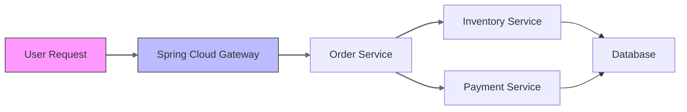

## 介绍

Apache SkyWalking 是一款开源的分布式系统监控工具，特别适合微服务架构的可观测性需求。与Spring Cloud集成后，可以实现对微服务调用链路的自动追踪、性能指标收集和可视化分析。本指南将带领初学者完成完整的集成流程。

## 前置条件

在开始之前，请确保：
- 已部署SkyWalking OAP Server和UI（版本9.x+）
- 拥有Spring Boot 2.x+项目（基于Spring Cloud Hoxton或更高版本）
- 熟悉基础Spring Cloud组件（如Spring Cloud Gateway、OpenFeign等）

## 基础集成步骤

### 1. 添加依赖

在Spring Boot项目的`pom.xml`中添加SkyWalking客户端依赖：

```xml
<dependency>
    <groupId>org.apache.skywalking</groupId>
    <artifactId>apm-toolkit-trace</artifactId>
    <version>8.16.0</version>
</dependency>
```

### 2. 配置Agent

下载对应版本的[SkyWalking Java Agent](https://skywalking.apache.org/downloads/)，启动应用时添加JVM参数：

```bash
-javaagent:/path/to/skywalking-agent.jar
-DSW_AGENT_NAME=your-service-name 
-DSW_AGENT_COLLECTOR_BACKEND_SERVICES=127.0.0.1:11800
```

:::tip
对于生产环境，建议通过环境变量配置Agent参数而非硬编码在启动脚本中。
:::

## 高级集成配置

### 1. 自定义追踪

通过`@Trace`注解手动标记需要追踪的方法：

```java
import org.apache.skywalking.apm.toolkit.trace.Trace;

@Service
public class OrderService {
    
    @Trace
    public Order createOrder(OrderRequest request) {
        // 业务逻辑
    }
}
```

### 2. 跨进程传播

在Feign客户端集成追踪上下文：

```java
@FeignClient(name = "inventory-service")
public interface InventoryClient {
    
    @GetMapping("/api/inventory/{itemId}")
    Inventory checkStock(@PathVariable String itemId, 
                       @RequestHeader(value = "sw8") String traceContext);
}
```

## 架构示意图



## 实际案例：电商系统监控

假设我们有一个包含以下服务的电商系统：
- `gateway-service`：Spring Cloud Gateway
- `order-service`：处理订单
- `inventory-service`：库存管理

集成SkyWalking后，可以在UI中看到：
1. 完整的请求链路：用户下单 → 库存检查 → 支付处理
2. 每个服务的响应时间百分位图
3. 跨服务的依赖关系图

:::note 性能优化建议
对于高频调用的服务，可以在`agent.config`中调整采样率：
```
agent.sample_n_per_3_secs=10 # 每3秒最多采样10次
```
:::

## 常见问题排查

1. **无数据展示**：
   - 检查OAP服务是否正常运行
   - 验证Agent与Collector的网络连通性
   - 确认服务名称在UI中可见

2. **链路不完整**：
   - 确保所有服务都配置了相同的SkyWalking版本
   - 检查跨服务调用的Header传播

## 总结

通过本文，你已经学会了：
- 将SkyWalking Agent集成到Spring Cloud应用的基本方法
- 使用注解自定义追踪点
- 处理跨服务调用的上下文传播
- 解读监控数据的基本技巧

## 扩展学习

推荐进一步探索：
- [SkyWalking官方文档](https://skywalking.apache.org/docs/)
- Spring Cloud Sleuth与SkyWalking的对比
- 使用SkyWalking Alarm实现自动告警

练习任务：
1. 在本地启动一个双服务的Spring Cloud项目并集成SkyWalking
2. 尝试在UI中分析一个包含错误的调用链路
3. 为关键业务方法添加自定义Tag