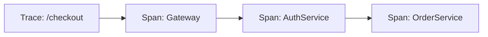

# Zipkin 简介

## 什么是Zipkin？

Zipkin是一款开源的**分布式追踪系统**，由Twitter开发并捐赠给开源社区。它帮助开发者收集和分析微服务架构中请求的延迟数据，从而定位性能瓶颈或故障点。在复杂的分布式系统中，一个用户请求可能涉及多个服务的协作，Zipkin通过可视化这些调用链路，让问题排查变得直观。

:::note 分布式追踪是什么？
分布式追踪是一种记录请求在多个服务间流转路径的技术。例如，电商下单操作可能依次调用订单服务、库存服务和支付服务。
:::

## 核心概念

### 1. 追踪（Trace）
表示一个完整的请求链路，包含从发起到结束的所有操作。例如，一次API调用经过网关、认证服务和业务服务的过程。

### 2. 跨度（Span）
Trace的基本组成单位，代表一个服务内的操作。每个Span包含：
- 开始时间、持续时间
- 标签（如HTTP方法、路径）
- 父子关系（构成调用链）



### 3. 数据上报
服务通过以下方式将追踪数据发送到Zipkin：
- **HTTP/Kafka**：直接上报
- **中间件集成**：如Spring Cloud Sleuth

## 工作原理

1. **Instrumentation**：应用代码植入追踪逻辑（自动或手动）。
2. **Transport**：收集的Span数据发送到Zipkin服务端。
3. **Storage**：数据存储（支持内存、MySQL、Elasticsearch等）。
4. **UI展示**：通过Zipkin的Web界面可视化调用链。

## 实际案例

假设一个用户请求`/payment`的调用链如下：
1. 请求到达API网关（耗时50ms）
2. 调用用户服务验证权限（耗时120ms）
3. 调用支付服务处理（耗时300ms）

在Zipkin UI中会显示为层级结构，并标出支付服务是延迟的主要来源。

:::tip 为什么需要Zipkin？
当你的应用从单体架构转向微服务时，传统日志难以关联跨服务的请求。Zipkin通过全局ID（Trace ID）串联所有相关日志。
:::

## 快速体验

以下是一个使用Spring Boot和Sleuth上报数据到Zipkin的示例：

```java
// 1. 添加依赖（build.gradle）
dependencies {
    implementation 'org.springframework.cloud:spring-cloud-starter-sleuth'
    implementation 'org.springframework.cloud:spring-cloud-sleuth-zipkin'
}

// 2. 配置Zipkin地址（application.yml）
spring:
  zipkin:
    base-url: http://localhost:9411
  sleuth:
    sampler:
      probability: 1.0 # 100%采样率（仅开发环境）
```

启动应用后，访问`http://localhost:9411`即可查看追踪数据。

## 总结

- Zipkin通过**Trace/Span模型**记录分布式调用链路。
- 支持多种存储后端和上报方式。
- 与Spring Cloud、Kubernetes等生态集成良好。

## 下一步学习

- 部署Zipkin服务端（Docker或原生方式）
- 学习Spring Cloud Sleuth的进阶配置
- 探索与Prometheus/Grafana的集成

:::caution 生产环境注意
采样率（sampler.probability）过高会影响性能，通常建议设置为0.1（10%）。
:::