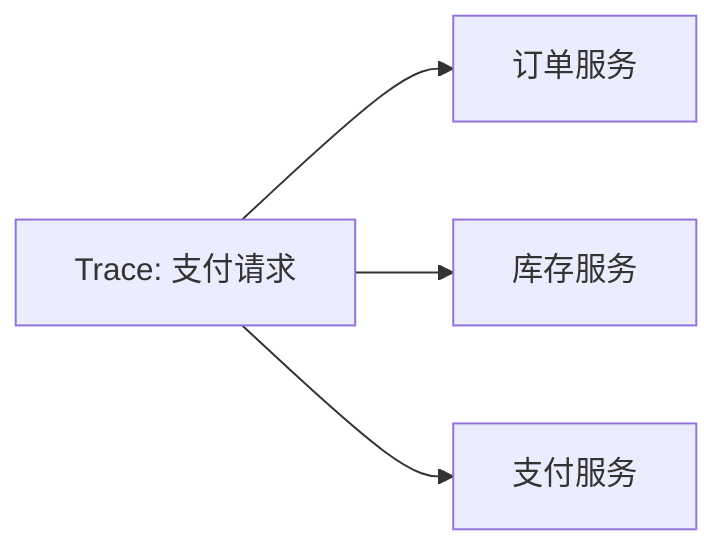
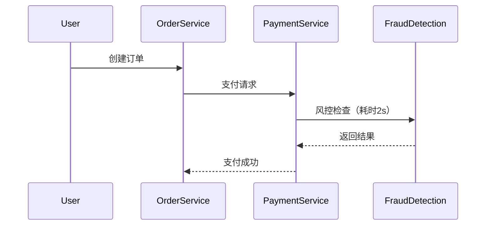

# 分布式追踪概念

## 介绍

在微服务架构中，一个用户请求可能涉及多个服务的协作。例如，电商平台的“下单”操作可能依次调用订单服务、库存服务和支付服务。**分布式追踪**（Distributed Tracing）是一种技术，用于记录请求在分布式系统中的完整流转路径，帮助开发者：

1. 定位性能瓶颈（如慢查询）
2. 分析跨服务错误
3. 可视化服务依赖关系

## 核心概念

### 1. 追踪（Trace）
表示一个完整的请求生命周期。例如，从用户点击“支付”按钮到收到支付结果的过程。



### 2. 跨度（Span）
Trace中的基本单元，代表一个服务内部的操作。每个Span包含：
- 开始时间/结束时间
- 标签（如HTTP状态码）
- 父子关系（体现调用层级）

:::note 示例
一个HTTP请求的Span可能记录：
- 服务名：`payment-service`
- 操作名：`processCreditCard`
- 耗时：`150ms`
:::

### 3. 上下文传播（Context Propagation）
跨服务传递追踪信息的机制，通常通过HTTP头实现：

```java
// 客户端代码示例（Java + Spring）
@GetMapping("/order")
public String createOrder() {
    // 自动注入的Tracer对象
    Span span = tracer.spanBuilder("processOrder").start();
    try (Scope scope = span.makeCurrent()) {
        // 请求下游服务时传递Trace上下文
        HttpHeaders headers = new HttpHeaders();
        headers.set("X-B3-TraceId", span.context().traceId());
        restTemplate.postForEntity("http://inventory-service/", headers, String.class);
    } finally {
        span.end();
    }
}
```

## 实际案例

### 问题场景
用户反馈“支付超时”，但日志显示各服务均无异常。

### 使用分布式追踪分析
1. 发现`payment-service`调用`fraud-detection-service`耗时2秒
2. 进一步查看`fraud-detection-service`的数据库查询Span，发现慢SQL
3. 优化查询后，整体耗时降至200ms



## 总结

分布式追踪的核心价值在于：
- **可视化**：将不可见的跨服务调用转化为时序图
- **可观测性**：量化每个服务的性能影响
- **故障排查**：快速定位跨服务问题根源

## 延伸学习

1. **练习**：在本地启动两个Spring Boot服务，使用`spring-cloud-sleuth`实现简单的链路追踪
2. **进一步阅读**：
   - [OpenTelemetry官方文档](https://opentelemetry.io/docs/)
   - 《分布式服务架构：原理、设计与实战》第7章

:::tip 学习建议
动手实践时，先关注TraceID的传递和基础Span创建，再逐步研究更复杂的标签和日志关联。
:::