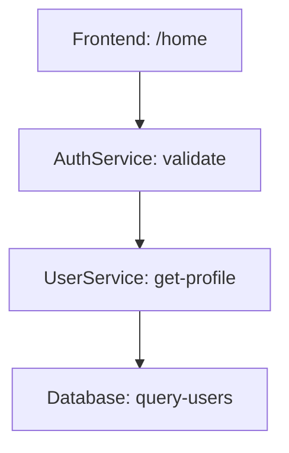

# Zipkin 数据模型

## 介绍

Zipkin是一个开源的分布式追踪系统，用于收集、存储和可视化微服务架构中的请求链路数据。其核心是**数据模型**，它定义了如何表示和存储追踪信息。理解这些模型是使用Zipkin的基础。

Zipkin数据模型主要由以下几个关键部分组成：
- **Span**：基本工作单元
- **Trace**：关联Span的调用树
- **Annotation**和**Tag**：附加的上下文信息

## Span：追踪的基本单元

一个Span代表系统中一个独立的工作单元，例如一次RPC调用或数据库查询。每个Span包含以下关键字段：

```json
{
  "id": "123456",
  "traceId": "abcdef",
  "name": "get-user-data",
  "parentId": "654321",
  "timestamp": 1620000000000,
  "duration": 15000,
  "kind": "SERVER",
  "localEndpoint": {
    "serviceName": "user-service",
    "ipv4": "192.168.1.1"
  }
}
```

:::note 字段说明
- `id`：Span的唯一标识符
- `traceId`：所属Trace的唯一ID
- `name`：操作名称（如HTTP路由）
- `parentId`：父Span的ID（根Span没有此字段）
- `timestamp`：开始时间戳（微秒）
- `duration`：持续时间（微秒）
- `kind`：Span类型（CLIENT/SERVER/PRODUCER/CONSUMER）
:::

## Trace：调用链视图

Trace是由多个Span组成的调用树，表示一个完整请求的端到端路径。例如：



上图中每个节点都是一个Span，箭头表示调用关系。Zipkin会自动将这些Span组装成完整的Trace视图。

## Annotation与Tag

### Annotation（时间点事件）
记录Span生命周期中的特定时刻，例如：

```json
{
  "timestamp": 1620000000500,
  "value": "sr",
  "endpoint": {
    "serviceName": "user-service",
    "ipv4": "192.168.1.1"
  }
}
```

常见值：
- `cs`：Client Send（客户端发起请求）
- `sr`：Server Receive（服务端收到请求）
- `ss`：Server Send（服务端发送响应）
- `cr`：Client Receive（客户端收到响应）

### Tag（键值对元数据）
附加的业务上下文信息，例如：

```json
{
  "key": "http.status_code",
  "value": "200"
}
```

## 实际案例

假设一个电商系统的下单流程涉及三个服务：

1. **Order Service** 接收请求
2. 调用 **Inventory Service** 检查库存
3. 调用 **Payment Service** 处理支付

对应的Zipkin数据可能如下：

```json
[
  {
    "traceId": "abc123",
    "id": "span1",
    "name": "POST /orders",
    "kind": "SERVER",
    "timestamp": 1620000000000,
    "duration": 50000,
    "localEndpoint": {"serviceName": "order-service"},
    "tags": {"http.method": "POST", "http.path": "/orders"}
  },
  {
    "traceId": "abc123",
    "id": "span2",
    "parentId": "span1",
    "name": "GET /inventory",
    "kind": "CLIENT",
    "timestamp": 1620000001000,
    "duration": 10000,
    "localEndpoint": {"serviceName": "order-service"},
    "tags": {"http.method": "GET"}
  }
]
```

:::tip 实际应用场景
- **性能分析**：通过Span持续时间识别慢请求
- **错误诊断**：通过Tag中的`error=true`定位故障点
- **依赖分析**：通过Trace可视化发现服务依赖关系
:::

## 总结

Zipkin数据模型的核心要点：
1. **Span**是基本单元，包含操作详情和时间信息
2. **Trace**通过父子关系组织Span，形成完整调用链
3. **Annotation**标记关键时间点，**Tag**添加业务上下文

## 扩展练习

1. 尝试手动构造一个包含3个Span的Trace JSON
2. 在你的开发环境中安装Zipkin，并发送示例数据
3. 比较Zipkin数据模型与其他追踪系统（如Jaeger）的差异

## 附加资源

- [Zipkin官方数据模型文档](https://zipkin.io/pages/data_model.html)
- [OpenTracing数据标准](https://opentracing.io/specification/)