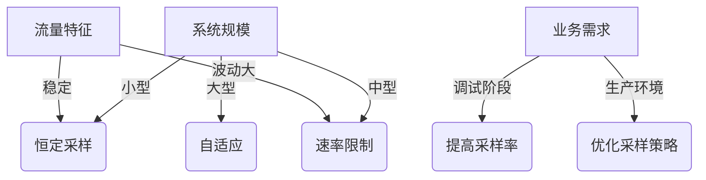

# Zipkin 采样策略

## 介绍

在分布式系统中，Zipkin作为一款流行的追踪工具，通过收集请求链路数据帮助开发者分析性能瓶颈。然而，全量采集所有请求的追踪数据会产生巨大的存储和计算开销。**采样策略**正是为了解决这一问题而设计的——它决定哪些请求的追踪数据需要被记录和分析。

采样策略的核心目标是：
- 降低系统资源消耗（CPU、网络、存储）
- 保留有代表性的追踪数据
- 平衡开销与数据完整性的需求

## 采样策略类型

### 1. 恒定采样（Constant Sampling）
最简单的策略，以固定概率决定是否采样。例如设置采样率为0.1（10%）。

```java
// Java示例：使用Tracing.Builder配置恒定采样
Sampler sampler = Sampler.create(0.1); // 10%采样率
tracingBuilder.sampler(sampler);
```

**特点**：
- 配置简单，适合中小规模系统
- 可能导致高流量时仍产生大量数据

### 2. 速率限制采样（Rate Limiting Sampling）
控制单位时间内的最大采样数量，例如每秒最多采样100个请求。

```python
# Python示例：使用速率限制采样
from py_zipkin.sampling import RateLimiterSampler

sampler = RateLimiterSampler(100)  # 每秒100个
```

**特点**：
- 有效控制突发流量下的数据量
- 需要根据系统吞吐量调整参数

### 3. 自适应采样（Adaptive Sampling）
动态调整采样率，基于系统负载或业务指标自动优化。

:::tip 生产环境建议
自适应采样适合大型分布式系统，但需要更复杂的监控体系支持。
:::

## 采样配置实战

### Spring Cloud Sleuth集成示例
在Spring Boot应用中，可通过`application.yml`配置采样率：

```yaml
spring:
  sleuth:
    sampler:
      probability: 0.2 # 20%的采样率
```

### 动态采样实现
通过实现`Sampler`接口可创建自定义逻辑：

```java
public class BusinessImportanceSampler implements Sampler {
    @Override
    public boolean isSampled(long traceId) {
        // 根据业务逻辑决定是否采样
        return checkBusinessImportance();
    }
}
```

## 采样策略选择指南



## 真实案例

**电商平台场景**：
- 关键路径（支付流程）：100%采样
- 常规查询API：10%采样
- 内部健康检查：0%采样

通过组合策略实现：
```java
Sampler paymentSampler = Sampler.ALWAYS_SAMPLE;
Sampler querySampler = Sampler.create(0.1);
Sampler healthCheckSampler = Sampler.NEVER_SAMPLE;
```

## 总结与练习

### 关键要点
- 采样策略显著影响系统性能和数据分析能力
- 不同场景需要采用不同的采样策略组合
- 生产环境建议从低采样率开始逐步调整

### 动手练习
1. 在本地Zipkin中尝试配置50%的恒定采样率
2. 观察高频请求下不同采样率对存储空间的影响
3. 实现一个基于HTTP方法（GET/POST）的差异化采样器

### 扩展阅读
- Zipkin官方文档：Sampling Configuration
- 《分布式系统观测》第三章：追踪数据优化
- OpenTelemetry采样规范（与Zipkin兼容）