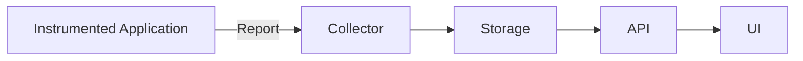
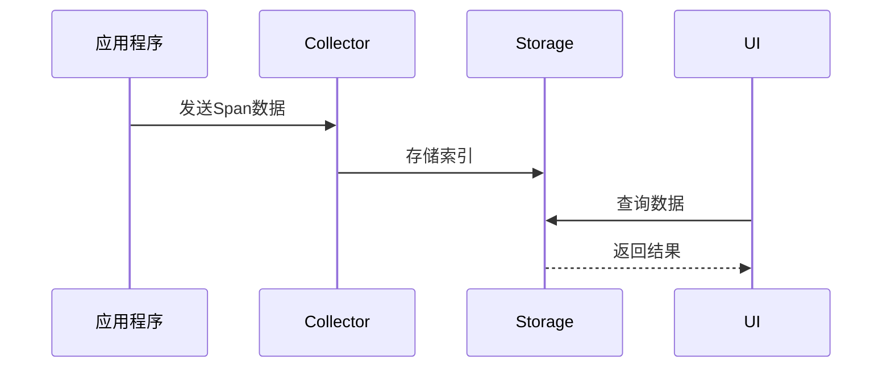

## 介绍

Zipkin是一个开源的分布式追踪系统，用于收集和分析微服务架构中的延迟问题。其架构设计遵循了典型的收集-存储-查询模式，通过轻量级的组件协作实现全链路追踪。对于初学者而言，理解Zipkin架构是掌握分布式追踪技术的基础。

## 核心组件

Zipkin由四个主要组件构成，它们协同工作完成追踪数据的生命周期管理：



### 1. Reporter（报告器）
内嵌在应用程序中的库，负责生成和发送追踪数据（spans）。常见实现包括：
- Brave（Java）
- zipkin-js（JavaScript）
- zipkin-ruby（Ruby）

示例Java代码使用Brave报告数据：
```java
Tracing tracing = Tracing.newBuilder()
    .localServiceName("my-service")
    .spanReporter(AsyncReporter.create(URLConnectionSender.create("http://localhost:9411/api/v2/spans")))
    .build();
```

### 2. Collector（收集器）
接收来自各服务的追踪数据，进行验证和索引，然后存储。支持多种传输协议：
- HTTP（默认9411端口）
- Kafka
- gRPC

### 3. Storage（存储）
持久化追踪数据，支持多种后端：
- 内存（仅用于测试）
- MySQL
- Elasticsearch
- Cassandra

### 4. UI（用户界面）
基于浏览器的可视化界面（默认9411端口），提供：
- 服务依赖图
- 追踪链查询
- 延迟分析

## 数据流转流程

完整的追踪数据生命周期包含以下步骤：

1. **生成Span**：应用代码通过Tracer创建span记录操作
2. **传输数据**：通过HTTP/Kafka等协议发送到Collector
3. **存储索引**：数据被持久化并建立索引关系
4. **查询展示**：通过UI查询和可视化追踪链



## 架构特点

:::note 关键设计原则
- **低侵入性**：通过库集成而非代码改造
- **可扩展性**：各组件可独立扩展
- **多语言支持**：提供多种语言的客户端库
:::

### 传输层解耦
Zipkin允许通过不同协议传输数据：
```properties
# 示例：使用Kafka传输配置
zipkin.collector.kafka.bootstrap-servers=localhost:9092
```

### 存储可插拔
通过简单配置切换存储后端：
```yaml
# 使用Elasticsearch存储示例
zipkin:
  storage:
    type: elasticsearch
    elasticsearch:
      hosts: http://localhost:9200
```

## 实际应用案例

**电商系统故障排查场景**：
1. 用户下单请求超时
2. 通过Zipkin查询该请求的完整追踪链
3. 发现卡顿发生在支付服务调用库存服务阶段
4. 进一步检查显示数据库响应延迟异常
5. 最终定位到数据库索引缺失问题

:::tip 最佳实践
生产环境建议：
- 使用Elasticsearch作为存储后端
- 对高流量系统启用采样率配置
- 结合服务网格(如Istio)实现自动埋点
:::

## 总结

Zipkin的架构设计体现了分布式追踪系统的典型模式：
- 通过轻量级客户端库实现数据采集
- 使用中间收集器缓冲处理数据
- 支持多种存储后端保证灵活性
- 提供可视化界面降低使用门槛

## 扩展学习

**推荐练习**：
1. 使用Docker快速搭建Zipkin服务
```bash
docker run -d -p 9411:9411 openzipkin/zipkin
```
2. 在Spring Boot应用中集成Brave客户端
3. 模拟微服务调用并观察追踪数据

**深入学习方向**：
- 追踪数据采样策略
- 与Prometheus/Grafana的集成
- OpenTelemetry兼容层实现