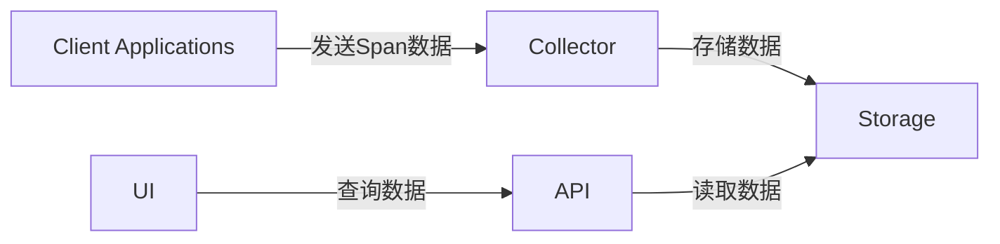
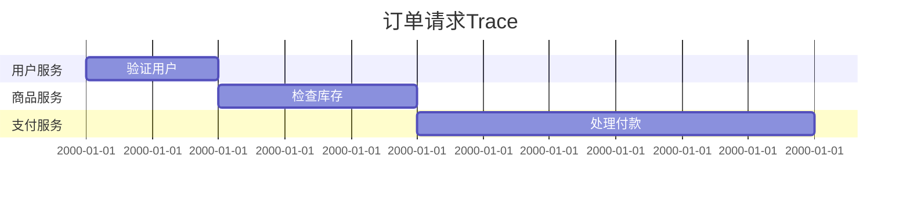

# Zipkin 组件

Zipkin是一个开源的分布式追踪系统，用于收集、存储和可视化微服务架构中的请求链路数据。它的核心组件协同工作，帮助开发者诊断延迟问题或依赖关系异常。本文将详细介绍Zipkin的四大核心组件及其交互方式。

## 核心组件概述

Zipkin的架构由以下四个主要组件构成：

1. **Collector（收集器）**：接收跟踪数据并验证。
2. **Storage（存储）**：持久化跟踪数据（如MySQL、Elasticsearch）。
3. **API（查询接口）**：提供数据检索的RESTful接口。
4. **UI（可视化界面）**：展示追踪结果的Web界面。



## 组件详解

### 1. Collector（收集器）

Collector是Zipkin的数据入口，负责接收应用程序通过HTTP或Kafka等传输的Span数据（即单个请求的追踪单元）。它会验证数据格式并存储到后端。

:::note
Span数据通常以JSON格式发送，例如：
```json
{
  "traceId": "abc123",
  "id": "def456",
  "name": "get-user-data",
  "timestamp": 1620000000000,
  "duration": 2000,
  "localEndpoint": {"serviceName": "user-service"}
}
```
:::

### 2. Storage（存储）

Zipkin支持多种存储后端，默认使用内存存储（仅适用于测试）。生产环境常用选项：

- **Elasticsearch**：适合大规模数据和高性能查询。
- **MySQL**：关系型数据库，易于设置但性能较低。

配置示例（通过环境变量指定存储）：
```bash
STORAGE_TYPE=elasticsearch ES_HOSTS=http://localhost:9200
```

### 3. API（查询接口）

提供基于HTTP的接口用于查询追踪数据，例如：
- `GET /traces`：按服务名和时间范围查询。
- `GET /trace/{traceId}`：获取特定Trace的详情。

:::tip
尝试用curl测试API：
```bash
curl "http://localhost:9411/api/v2/traces?serviceName=user-service"
```
:::

### 4. UI（可视化界面）

UI组件通过图形化展示Trace的调用链和耗时。关键功能包括：
- 依赖关系图
- 延迟热力图
- 单个请求的详细时间线

## 实际案例：电商系统追踪

假设一个订单请求流程：
1. 用户服务 → 2. 商品服务 → 3. 支付服务

在Zipkin UI中会显示如下结构：


## 总结

- **Collector** 是数据入口，**Storage** 决定扩展性。
- **API** 和 **UI** 使得诊断问题更直观。
- 生产环境建议使用Elasticsearch作为存储。

## 延伸练习

1. 使用Docker快速启动Zipkin服务：
```bash
docker run -d -p 9411:9411 openzipkin/zipkin
```
2. 发送示例Span数据到Collector（可用Postman或curl）。

## 附加资源

- [官方文档](https://zipkin.io/)
- 推荐阅读：《分布式服务追踪技术实践》