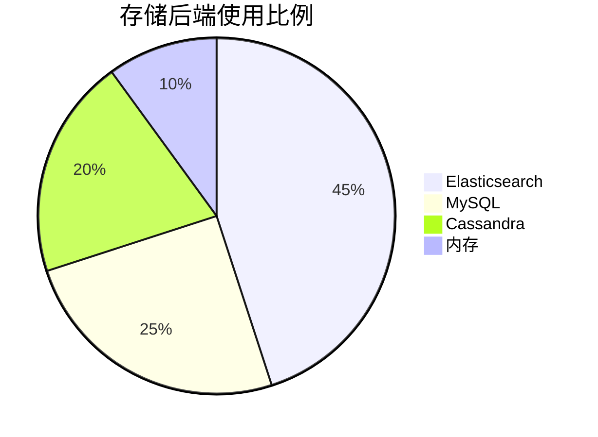

# Zipkin 安装部署

## 介绍

Zipkin是一个开源的分布式追踪系统，用于收集、存储和可视化微服务架构中的请求链路数据。它帮助开发者理解请求在多个服务间的流转路径和性能瓶颈。本文将指导你完成Zipkin的安装和基础部署流程。

---

## 环境准备

Zipkin支持多种部署方式，包括：
- **独立运行**（适合本地开发）
- **Docker容器化部署**
- **Kubernetes集群部署**
- **与Spring Boot集成**

### 系统要求
- Java 11+（如果使用JAR包运行）
- Docker（如果使用容器化部署）
- 至少2GB可用内存

---

## 安装方法

### 方法1：使用JAR包独立运行（开发环境）

1. 下载最新版Zipkin的JAR文件：
   ```bash
   curl -sSL https://zipkin.io/quickstart.sh | bash -s
   ```

2. 启动Zipkin服务（默认端口9411）：
   ```bash
   java -jar zipkin.jar
   ```

3. 访问控制台：
   ```
   http://localhost:9411/zipkin/
   ```

:::tip
生产环境建议添加存储后端（如Elasticsearch）：
```bash
STORAGE_TYPE=elasticsearch ES_HOSTS=http://elastic:9200 java -jar zipkin.jar
```
:::

### 方法2：Docker部署

```bash
docker run -d -p 9411:9411 openzipkin/zipkin
```

支持的环境变量配置：
```bash
docker run -d -p 9411:9411 \
  -e STORAGE_TYPE=elasticsearch \
  -e ES_HOSTS=elasticsearch:9200 \
  openzipkin/zipkin
```

---

## 存储配置

Zipkin默认使用内存存储（重启后数据丢失），生产环境需配置持久化存储：

### 支持的存储类型


#### Elasticsearch示例配置
```bash
java -jar zipkin.jar \
  --STORAGE_TYPE=elasticsearch \
  --ES_HOSTS=host1:9200,host2:9200
```

#### MySQL示例配置
1. 创建数据库表结构（[schema.sql](https://github.com/openzipkin/zipkin/blob/master/zipkin-storage/mysql-v1/src/main/resources/mysql.sql)）
2. 启动时指定参数：
   ```bash
   java -jar zipkin.jar \
     --STORAGE_TYPE=mysql \
     --MYSQL_HOST=localhost \
     --MYSQL_USER=zipkin \
     --MYSQL_PASS=zipkin
   ```

---

## 实际案例：Spring Boot集成

1. 添加依赖到`pom.xml`：
   ```xml
   <dependency>
     <groupId>org.springframework.cloud</groupId>
     <artifactId>spring-cloud-starter-zipkin</artifactId>
   </dependency>
   ```

2. 配置`application.yml`：
   ```yaml
   spring:
     zipkin:
       base-url: http://localhost:9411
     sleuth:
       sampler:
         probability: 1.0 # 采样率100%
   ```

3. 启动应用后，请求链路会自动上报到Zipkin。

---

## 生产环境建议

:::warning 重要提示
生产环境必须配置：
- 持久化存储
- 访问控制（如通过Nginx添加Basic Auth）
- 合理的采样率（建议初始值0.1）
:::

### Kubernetes部署示例
```yaml
apiVersion: apps/v1
kind: Deployment
metadata:
  name: zipkin
spec:
  template:
    spec:
      containers:
      - name: zipkin
        image: openzipkin/zipkin
        env:
        - name: STORAGE_TYPE
          value: elasticsearch
        - name: ES_HOSTS
          value: "http://elasticsearch:9200"
```

---

## 总结

通过本文你学会了：
- Zipkin的多种安装方式
- 不同存储后端的配置方法
- 与Spring Boot的集成
- 生产环境部署建议

### 后续练习
1. 在本地Docker环境中部署Zipkin+Elasticsearch
2. 创建一个Spring Boot微服务并上报追踪数据
3. 在Zipkin UI中分析请求链路

### 扩展阅读
- [Zipkin官方文档](https://zipkin.io/)
- [Brave（Java客户端）高级配置](https://github.com/openzipkin/brave)