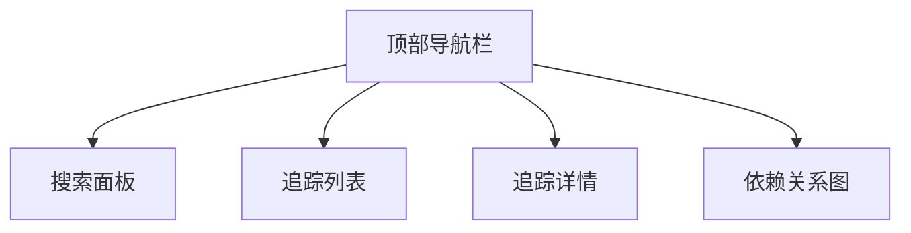

# Zipkin 界面导航

## 介绍

Zipkin是一个开源的分布式追踪系统，其Web界面提供了直观的可视化工具，用于分析和诊断微服务架构中的延迟问题。本章将带你逐步探索Zipkin界面的核心功能区域，帮助你快速定位追踪数据并理解其含义。

## 主界面概览

Zipkin界面主要分为以下功能区域：



### 1. 顶部导航栏
包含以下关键元素：
- **服务下拉菜单**：选择要查看的微服务
- **时间范围选择器**：设置要查询的追踪时间窗口
- **查找按钮**：执行搜索操作

### 2. 搜索面板
用于筛选追踪数据的核心工具，支持以下条件：
- **服务名称**：`serviceName=frontend`
- **跨度名称**：`spanName=/api/users`
- **标签过滤**：`http.status_code=200`
- **持续时间**：`duration>=100ms`

:::tip
使用`+`按钮可以添加多个过滤条件，实现精确查询。
:::

## 追踪列表视图

执行搜索后，结果会以时间线形式展示：

```json
// 示例追踪条目
{
  "traceId": "4b8a9c3d2e1f5a7b",
  "duration": 156,
  "services": ["frontend", "auth", "database"],
  "timestamp": "2023-05-15T08:12:34Z"
}
```

每行代表一个追踪(Trace)，包含：
1. 追踪ID（可点击查看详情）
2. 总持续时间（毫秒）
3. 涉及的服务数量
4. 开始时间戳

## 追踪详情视图

点击任意追踪ID会进入详情页面，展示：

### 时间线图表

```mermaid
gantt
    title 请求在微服务间的流转
    dateFormat  X
    axisFormat %s
    section frontend
    浏览器请求 : 0, 50
    section auth
    认证检查 : 50, 80
    section database
    查询用户数据 : 80, 130
```


### 跨度(Span)树形结构
```
Trace (root)
├── Span 1: frontend HTTP接收
│   ├── Span 2: auth验证调用
│   │   └── Span 3: 数据库查询
└── Span 4: 响应组装
```

每个跨度包含：
- 开始和结束时间
- 标签（如HTTP方法、状态码）
- 可能的错误信息

:::caution
红色标记的跨度表示执行失败，需要特别关注。
:::

## 依赖关系图

通过顶部导航栏可访问`Dependencies`视图，展示：


图表显示：
- 服务间的调用方向
- 请求频率（线宽）
- 平均延迟（颜色深浅）

## 实际案例

假设我们遇到API响应慢的问题：

1. 在搜索栏设置：
   - `serviceName=api-gateway`
   - `duration>=1000ms`
   - 时间范围：最近1小时

2. 在结果列表中找到慢追踪
3. 通过时间线发现瓶颈出现在：
   ```plaintext
   |-- 支付服务调用 (1200ms)
       |-- 银行接口 (1150ms)
   ```

4. 检查支付服务的标签发现：
   ```http
   http.url=https://bank-api.com/process
   http.status_code=200
   ```

结论：第三方银行接口是性能瓶颈。

## 总结

Zipkin界面导航要点：
- 使用搜索面板精确过滤追踪数据
- 通过时间线快速识别性能瓶颈
- 利用跨度标签获取上下文信息
- 依赖图帮助理解系统架构

## 延伸练习

1. 在你的本地Zipkin实例中：
   - 尝试组合多个过滤条件查询数据
   - 找出一个包含错误的追踪并分析原因

2. 高级功能探索：
   - 使用`JSON API`导出追踪数据
   - 尝试通过`/api/v2/trace/{traceId}`接口直接访问特定追踪

## 附加资源

- [Zipkin官方UI文档](https://zipkin.io/zipkin-ui/)
- [Brave库的追踪标记指南](https://github.com/openzipkin/brave/tree/master/brave#defining-spans)