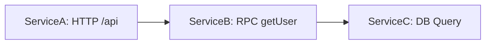

# Zipkin 术语解析

Zipkin是一个开源的分布式追踪系统，用于收集和分析微服务架构中的请求链路数据。理解Zipkin的核心术语是掌握其工作原理的第一步。本章将详细介绍Zipkin中的关键概念，并通过实际案例帮助你快速入门。

## 介绍

在微服务架构中，一个请求可能涉及多个服务的调用。Zipkin通过记录这些调用的时间和元数据，帮助你分析系统性能瓶颈和故障点。以下是Zipkin中最常用的术语及其解释：

---

## 核心术语

### 1. Span（跨度）

**Span** 是Zipkin中最基本的工作单元，代表一个独立的操作或任务。例如：
- 一次HTTP请求
- 一次数据库查询
- 一个方法调用

每个Span包含以下关键信息：
- `traceId`：所属的追踪ID
- `spanId`：当前Span的唯一ID
- `parentId`：父Span的ID（如果是根Span则为空）
- `name`：操作名称（如API端点名称）
- `timestamp`：开始时间戳
- `duration`：持续时间（毫秒）
- `tags`：键值对形式的元数据（如`http.method=GET`）

:::tip
Span可以是嵌套的。例如：一个HTTP请求（父Span）可能包含一个数据库查询（子Span）。
:::

### 2. Trace（追踪）

**Trace** 是由一组Span组成的调用链，代表一个完整的请求流程。所有共享相同`traceId`的Span属于同一个Trace。例如：



上图中，`ServiceA`调用`ServiceB`，`ServiceB`又调用`ServiceC`，这三个操作属于同一个Trace。

### 3. Annotation（注解）

**Annotation** 是Span时间轴上的标记点，用于记录关键事件的时间戳。常见的注解类型包括：
- `cs`（Client Send）：客户端发起请求
- `sr`（Server Receive）：服务端收到请求
- `ss`（Server Send）：服务端完成处理
- `cr`（Client Receive）：客户端收到响应

示例（JSON格式）：
```json
{
  "annotations": [
    {"timestamp": 1620000000000, "value": "cs"},
    {"timestamp": 1620000001000, "value": "cr"}
  ]
}
```

### 4. BinaryAnnotation（二进制注解）

（注：Zipkin v2已弃用此术语，改用`tags`）

在旧版Zipkin中，`BinaryAnnotation`用于记录附加的键值对数据，如：
- `http.status_code=200`
- `error=true`

新版Zipkin中直接使用`tags`字段：
```json
{
  "tags": {
    "http.method": "GET",
    "http.path": "/api/users"
  }
}
```

---

## 实际案例

假设有一个用户查询请求，流程如下：
1. 前端调用`UserService`的`/users/{id}`接口
2. `UserService`调用`AuthService`验证权限
3. `UserService`查询数据库

对应的Zipkin数据模型如下：
```json
// Trace顶层Span（前端→UserService）
{
  "traceId": "abc123",
  "spanId": "span1",
  "name": "GET /users/123",
  "timestamp": 1620000000000,
  "duration": 150,
  "tags": {"http.method": "GET"}
}

// 子Span（UserService→AuthService）
{
  "traceId": "abc123",
  "spanId": "span2",
  "parentId": "span1",
  "name": "auth.check",
  "timestamp": 1620000000050,
  "duration": 30
}

// 子Span（UserService→DB）
{
  "traceId": "abc123",
  "spanId": "span3",
  "parentId": "span1",
  "name": "db.users.select",
  "timestamp": 1620000000100,
  "duration": 70,
  "tags": {"db.query": "SELECT * FROM users WHERE id=123"}
}
```

---

## 总结

- **Span**：基本操作单元，包含时间、元数据和父子关系
- **Trace**：一组关联Span构成的完整请求链路
- **Annotation/Tags**：用于记录关键事件和附加信息

理解这些术语后，你将能更高效地：
- 分析Zipkin收集的追踪数据
- 定位跨服务调用的性能问题
- 设计合理的服务监控策略

---

## 延伸学习

1. 官方文档：[Zipkin Architecture](https://zipkin.io/pages/architecture.html)
2. 实践练习：部署Zipkin服务器并发送示例Span数据
3. 进阶概念：了解`采样率（Sampling）`和`追踪上下文传播（Trace Context Propagation）`