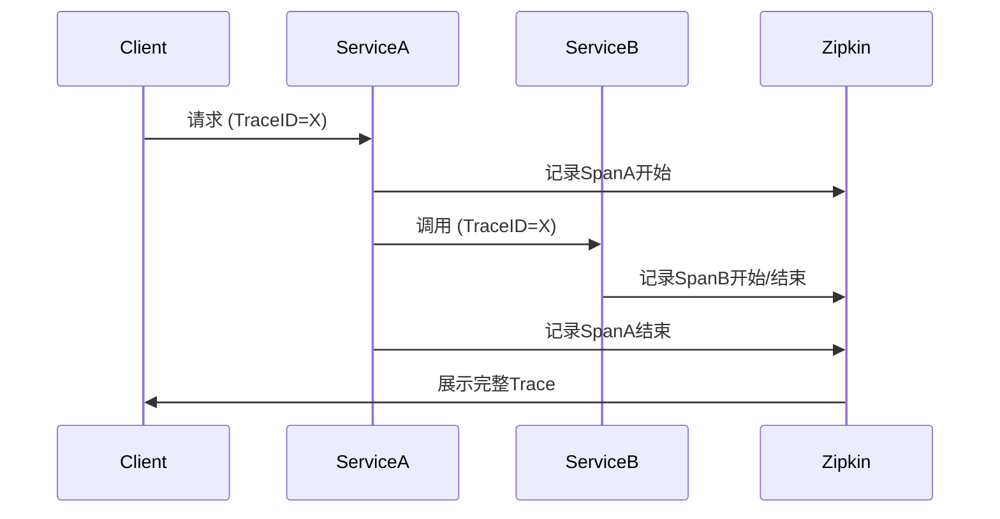

# Zipkin 与微服务

## 介绍

在微服务架构中，一个用户请求可能涉及多个服务的协同处理。当出现性能问题或错误时，传统的单体应用调试方法不再适用，因为问题可能分散在多个服务中。**Zipkin** 是一个开源的分布式追踪系统，它通过收集、存储和可视化请求在微服务间的流转路径，帮助开发者快速定位问题。

:::note 关键术语
- **Span**：代表一个独立的工作单元（如一次API调用）。
- **Trace**：由多个Span组成的调用链，代表完整的请求生命周期。
- **采样率**：控制收集多少追踪数据以平衡性能开销。
:::

## 为什么微服务需要Zipkin？

微服务的分布式特性带来了以下挑战：
1. **调用链复杂**：请求可能跨越数十个服务。
2. **故障定位困难**：错误可能发生在任何服务或网络通信中。
3. **性能分析瓶颈**：难以确定哪个服务导致延迟。

Zipkin通过以下方式解决这些问题：
- 记录每个服务的入口/出口时间戳
- 可视化服务间的依赖关系
- 提供延迟统计和错误标记

## 核心工作原理



1. **数据收集**：服务通过拦截器（如Spring Cloud Sleuth）自动上报Span数据。
2. **存储**：支持MySQL、Elasticsearch等后端存储。
3. **查询**：通过TraceID或时间范围检索记录。
4. **可视化**：展示瀑布图形式的调用时序。

## 实际代码示例

以下是一个Spring Boot服务的配置示例：

```java
// 添加依赖（build.gradle）
implementation 'org.springframework.cloud:spring-cloud-starter-sleuth'
implementation 'org.springframework.cloud:spring-cloud-sleuth-zipkin'

// 配置示例（application.yml）
spring:
  zipkin:
    base-url: http://localhost:9411
  sleuth:
    sampler:
      probability: 1.0 # 100%采样率（仅开发环境）
```

当服务发起HTTP调用时，Sleuth会自动：
- 生成TraceID和SpanID
- 添加`X-B3-TraceId`等HTTP头
- 定时批量发送数据到Zipkin

## 真实应用场景

**案例：电商订单超时分析**
1. 用户提交订单（3000ms超时）
2. 通过Zipkin发现：
   - 订单服务耗时200ms
   - 支付服务耗时2500ms
   - 库存服务耗时200ms
3. 结论：支付服务是瓶颈，需优化第三方支付接口调用

:::tip 最佳实践
- 生产环境设置0.1-0.5的采样率
- 为关键服务添加自定义Span标签（如用户ID）
- 结合日志系统（如ELK）进行联合分析
:::

## 总结

Zipkin为微服务提供了：
- **全链路可见性**：直观展示跨服务调用
- **精准故障定位**：快速识别问题服务
- **性能优化依据**：量化各环节耗时

## 扩展资源

1. [官方文档](https://zipkin.io/)
2. 练习：部署Zipkin服务器并追踪两个Spring Boot服务间的调用
3. 进阶：尝试集成OpenTelemetry替代Sleuth

:::caution 注意
分布式追踪会带来约5-10%的性能开销，需根据业务需求调整采样策略。
:::