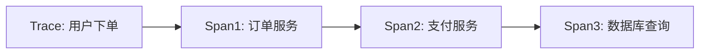

# Zipkin 与可观测性

## 介绍

在现代分布式系统中，尤其是微服务架构中，一个用户请求可能会跨越多个服务。这种复杂性使得定位性能瓶颈或故障变得异常困难。**可观测性（Observability）** 是指通过系统的外部输出（如日志、指标、追踪）来理解其内部状态的能力。Zipkin 是一个开源的分布式追踪系统，它通过收集、存储和可视化请求在服务间的流转路径，显著提升了系统的可观测性。

## 可观测性的三大支柱

可观测性通常由以下三大支柱构成：
1. **日志（Logs）**：记录离散事件（如错误信息）。
2. **指标（Metrics）**：聚合的数值数据（如请求速率）。
3. **追踪（Traces）**：请求在分布式系统中的完整路径。

Zipkin 专注于 **追踪**，通过可视化请求的调用链（如服务A → 服务B → 数据库），帮助开发者快速定位延迟或错误。

:::note
**为什么需要分布式追踪？**  
当服务数量增加时，传统的日志和指标无法清晰展示跨服务的因果关系。Zipkin 的追踪数据填补了这一空白。
:::

## Zipkin 的核心概念

### 1. 追踪（Trace）
一个 **Trace** 代表一个完整的请求生命周期。例如，用户访问电商网站时，从下单到支付的所有服务调用属于同一个 Trace。

### 2. 跨度（Span）
每个 **Span** 是 Trace 中的一个独立操作单元，包含：
- 开始时间和持续时间。
- 操作名称（如 `HTTP GET /orders`）。
- 上下文信息（如服务名称、IP地址）。



### 3. 上下文传播（Context Propagation）
Zipkin 通过唯一ID（如 `traceId` 和 `spanId`）将跨服务的 Span 关联起来。这些ID通常通过HTTP头（如 `X-B3-TraceId`）传递。

## 实际案例：电商系统

假设一个电商系统的下单流程涉及以下服务：
1. **订单服务**：创建订单。
2. **库存服务**：扣减库存。
3. **支付服务**：处理支付。

使用 Zipkin 后，开发者可以清晰地看到：
- 哪个服务耗时最长（如支付服务延迟高）。
- 是否存在调用失败（如库存服务超时）。

:::tip
**诊断延迟问题**  
如果 Zipkin 显示 `支付服务` 的 Span 耗时 2秒，而其他服务均在 200ms 内，则可优先优化支付服务。
:::

## 代码示例：集成 Zipkin

以下是一个简单的 Spring Boot 服务集成 Zipkin 的示例：

1. 添加依赖（`pom.xml`）：
```xml
<dependency>
  <groupId>org.springframework.cloud</groupId>
  <artifactId>spring-cloud-starter-zipkin</artifactId>
</dependency>
```

2. 配置 Zipkin 服务器地址（`application.yml`）：
```yaml
spring:
  zipkin:
    base-url: http://localhost:9411
  sleuth:
    sampler:
      probability: 1.0  # 100%采样率（仅用于开发）
```

3. 发起一个跨服务调用：
```java
@RestController
public class OrderController {
  @Autowired
  private RestTemplate restTemplate;

  @GetMapping("/order")
  public String createOrder() {
    // 请求会自动携带 TraceID 和 SpanID
    String paymentResponse = restTemplate.getForObject(
      "http://payment-service/pay", String.class);
    return "Order created -> " + paymentResponse;
  }
}
```

## 总结

- Zipkin 通过 **分布式追踪** 增强了系统的可观测性，帮助开发者理解请求的完整路径。
- 核心概念包括 **Trace**、**Span** 和 **上下文传播**。
- 实际应用中，Zipkin 能快速定位延迟或故障的服务节点。

## 延伸学习

1. **练习**：部署一个本地 Zipkin 服务器（[官方指南](https://zipkin.io/pages/quickstart.html)），并追踪两个微服务间的调用。
2. **进阶**：结合日志（如 ELK）和指标（如 Prometheus）构建完整的可观测性方案。
