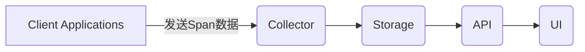
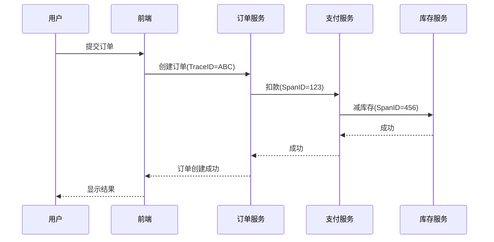

# Zipkin 工作原理

## 介绍

Zipkin是一个开源的**分布式追踪系统**，用于帮助开发者监控和排查微服务架构中的延迟问题。它通过收集、存储和可视化服务间的调用链路数据，让你能够清晰地看到请求在系统中的流转路径以及各环节的耗时情况。

对于初学者来说，理解Zipkin的工作原理是掌握分布式追踪的第一步。本文将逐步拆解Zipkin的核心工作流程，并通过实际案例帮助你建立直观认知。

---

## 核心组件

Zipkin由四个主要组件构成：

1. **Collector（收集器）**：接收追踪数据并验证/存储
2. **Storage（存储）**：持久化追踪数据（支持内存、MySQL、Elasticsearch等）
3. **API（查询接口）**：提供数据检索能力
4. **UI（界面）**：可视化展示调用链路



---

## 工作流程详解

### 1. 数据生成阶段

在微服务系统中，每个服务通过**instrumentation（埋点）**生成追踪数据。常见的埋点方式包括：

- 自动埋点（通过Java的Spring Cloud Sleuth等框架）
- 手动埋点（调用Zipkin的SDK）

```java
// 示例：Spring Boot中自动生成的Trace ID和Span ID
@RestController
public class DemoController {
    @GetMapping("/hello")
    public String sayHello() {
        // 自动注入追踪上下文
        return "Hello from " + System.currentTimeMillis();
    }
}
```

### 2. 数据传输阶段

生成的追踪数据（称为**Span**）通过以下方式传输到Zipkin服务器：

- **HTTP**：直接POST到Zipkin的API端点
- **Kafka/RabbitMQ**：通过消息队列异步传输
- **gRPC**：高性能二进制协议

:::tip 数据格式
每个Span通常包含：
- Trace ID（全局唯一标识）
- Span ID（当前操作标识）
- 父Span ID（关联上级操作）
- 时间戳和持续时间
- 标签（Key-Value形式的元数据）
:::

### 3. 数据存储阶段

Zipkin支持多种存储后端：

| 存储类型 | 适用场景 |
|----------|----------|
| 内存（默认） | 快速测试 |
| MySQL | 小规模生产环境 |
| Elasticsearch | 大规模分布式系统 |

### 4. 数据可视化阶段

UI界面展示的关键元素：

1. **依赖图**：服务间的调用关系
2. **时间轴**：请求在各服务的耗时分布
3. **错误标记**：红色高亮显示失败请求

---

## 实际案例：电商订单流程

假设一个用户下单请求流经以下服务：
`前端 → 订单服务 → 支付服务 → 库存服务`



在Zipkin UI中，你可以：
1. 通过TraceID(ABC)查询完整调用链
2. 发现支付服务耗时异常（比如超过500ms）
3. 查看该Span的详细标签和日志

---

## 总结

关键要点：
- Zipkin通过**Trace/Span模型**记录分布式调用
- 数据经过**收集→存储→查询→展示**四个阶段
- 支持多种**传输协议**和**存储后端**
- 可视化界面帮助快速定位性能瓶颈

## 延伸学习

推荐练习：
1. 使用Docker快速启动Zipkin服务
   ```bash
   docker run -d -p 9411:9411 openzipkin/zipkin
   ```
2. 在Spring Boot应用中集成Spring Cloud Sleuth
3. 尝试在UI中分析一个包含错误请求的调用链

附加资源：
- [Zipkin官方文档](https://zipkin.io/)
- [Brave（Zipkin的Java客户端）](https://github.com/openzipkin/brave)